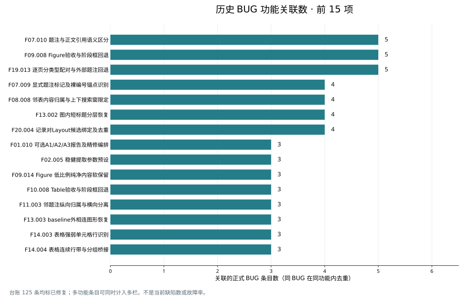

# BUG 历史记录与功能编号归属分析

按正式 BUG 表逐条核对，报告关联最多的功能是：**[F07.010](PDF功能模块全集与编号-20260930.md#f07-010)「题注与正文引用语义区分」5 条；[F09.008](PDF功能模块全集与编号-20260930.md#f09-008)「Figure验收与阶段框回退」5 条；[F19.013](PDF功能模块全集与编号-20260930.md#f19-013)「逐页分类型配对与外部题注回退」5 条**。按当前实现承接历史问题统计，函数最多的是：**[skills/pdf-markdown-summary/scripts/lib/extract_figures.py::extract_figures（L101）](../../skills/pdf-markdown-summary/scripts/lib/extract_figures.py) 12 条**。完整降序排名及每条 BUG 的归属见下文。

> 分析时点 2026-09-30（快照）；台账其后已继续增长（如 2026-10-07 已达 148 条），本文计数不随之更新，历史归属分析结论仍可参考。

台账共有 **125 条标准 BUG 记录，状态均为已修复**；其中 123 条可关联当前叶功能编号，2 条没有当前直接叶编号。覆盖 128 项功能、121 个当前函数/方法。另发现 2 条重号日志和 2 条非标准 BUG-A/B 记录，全部逐项补充分析。

**纳入这 4 条补充日志后，具名记录共 129 条：`extract_figures()` 仍最多（12），`extract_tables()` 为 11；F14 功能域为 23。三个最高叶功能仍各 5 条。**下文同时给出标准表与全部具名记录的完整降序排名，补充条目使用报告内局部 key，不修改原台账 ID。

## 统计口径

- 标准口径统计 `task-list.md` 标准表中的 BUG-001 至 BUG-125。综合口径再计入重号日志中的两个独立问题与 BUG-A/B；相同问题的修复日志、测试日志和引用不重复计数；CHK/TST/DOC 及未标 BUG 身份的小问题不自动变成新的 BUG。
- 一个 BUG 条目可能合并多个缺陷。明确涉及多项功能时分别归属；每个“BUG ID × 功能编号”只计一次，每个“BUG ID × 文件 × 函数名”也只计一次。不同条目即便来自同一根因或回归，仍是不同报告记录。
- 主功能排行只使用直接缺陷职责；普通调用影响、验证测试、相关阅读标为“关联”，不进入主榜。功能域和文件统计重新按 BUG ID 去重，不能把其子功能或函数数量相加。
- 函数排行是“当前缺陷实现及历史职责承接函数”的关联数。历史 `refine.py` / Markdown 实现迁移到当前专责模块；修复新增的补偿助手也可能承接原流程问题。这不是原始引入 BUG 的函数、提交或作者排名。类定义与 `<module>` 不进入函数榜；后者表示常量/导出/文件级缺陷。
- “明确”指台账点名且当前实现职责吻合；“历史承接”指旧实现已迁移或修复逻辑由当前函数承接；“职责推断”指原条目不足以唯一定位、按已描述职责映射；“未定位”保留缺口。推断数单独列出，排行允许据后续证据修订。
- 记录范围为 2026-06-05 至 2026-09-29；编号依据 2026-09-30 的 394 项功能全集。修复状态沿用台账，本次没有重新复现历史问题。频次受合并记录、代码体量、测试覆盖和审查密度影响，不能等同于当前故障率或代码质量。

主归属共 217 个 BUG×功能关联、234 个 BUG×函数关联；因多归属，关联总数可以大于 125。另有 266 项功能未关联这些历史 BUG，表示本台账未报告到，不代表无缺陷。

## 功能域排名（域内按 BUG 去重）

| 名次 | 功能域 | 职责 | BUG 条目数 | 占 125 条的比例 |
| --- | --- | --- | --- | --- |
| 1 | F14 | Table 专项边界 | 21 | 16.8% |
| 2 | F11 | 通用边界与文字保护 | 13 | 10.4% |
| 2 | F26 | 测试保障与批次诊断 | 13 | 10.4% |
| 4 | F09 | Figure 提取编排 | 12 | 9.6% |
| 5 | F19 | 页面关系与全页配对 | 11 | 8.8% |
| 5 | F20 | 可选 Layout 后精修 | 11 | 8.8% |
| 7 | F01 | 入口与业务编排 | 10 | 8.0% |
| 7 | F07 | 题注与编号 | 10 | 8.0% |
| 7 | F10 | Table 提取编排 | 10 | 8.0% |
| 10 | F08 | 裁剪方向判断 | 9 | 7.2% |
| 10 | F13 | Figure 专项补全 | 9 | 7.2% |
| 12 | F16 | 精裁验收与质量 | 7 | 5.6% |
| 13 | F12 | 对象与像素精裁 | 5 | 4.0% |
| 13 | F21 | Markdown 构建与渲染 | 5 | 4.0% |
| 15 | F02 | 参数与配置 | 4 | 3.2% |
| 15 | F23 | 日志与调试 | 4 | 3.2% |
| 17 | F06 | 基础版式与栏位 | 3 | 2.4% |
| 17 | F17 | 题注清单对账 | 3 | 2.4% |
| 17 | F22 | 资产输出与图表上下文 | 3 | 2.4% |
| 20 | F04 | 共享数据契约 | 2 | 1.6% |
| 20 | F05 | 文本提取与结构化 | 2 | 1.6% |
| 20 | F18 | 语义 Layout 后端 | 2 | 1.6% |
| 23 | F03 | PDF 适配与资源管理 | 1 | 0.8% |
| 23 | F24 | 兼容导出与包契约 | 1 | 0.8% |
| 23 | F25 | 标注与版本化评测 | 1 | 0.8% |
| 26 | F15 | 无题注续表 | 0 | 0.0% |

同一 BUG 可落在多个功能域，因此比例不相加为 100%。

## 叶功能编号完整降序排名

仅展示关联数大于零的功能；全部 394 项（含零值）保存在配套 JSON。并列名次相同，同分按编号排序。

| 名次 | 功能编号 | 功能职责 | BUG 条目数 | 其中职责推断 | 对应 BUG |
| --- | --- | --- | --- | --- | --- |
| 1 | [F07.010](PDF功能模块全集与编号-20260930.md#f07-010) | 题注与正文引用语义区分 | 5 | 0 | [BUG-014](#bug-014)、[BUG-015](#bug-015)、[BUG-077](#bug-077)、[BUG-088](#bug-088)、[BUG-107](#bug-107) |
| 1 | [F09.008](PDF功能模块全集与编号-20260930.md#f09-008) | Figure验收与阶段框回退 | 5 | 0 | [BUG-002](#bug-002)、[BUG-047](#bug-047)、[BUG-048](#bug-048)、[BUG-079](#bug-079)、[BUG-095](#bug-095) |
| 1 | [F19.013](PDF功能模块全集与编号-20260930.md#f19-013) | 逐页分类型配对与外部题注回退 | 5 | 0 | [BUG-053](#bug-053)、[BUG-059](#bug-059)、[BUG-061](#bug-061)、[BUG-111](#bug-111)、[BUG-114](#bug-114) |
| 4 | [F07.009](PDF功能模块全集与编号-20260930.md#f07-009) | 显式题注标记及裸编号锚点识别 | 4 | 0 | [BUG-077](#bug-077)、[BUG-087](#bug-087)、[BUG-107](#bug-107)、[BUG-122](#bug-122) |
| 4 | [F08.008](PDF功能模块全集与编号-20260930.md#f08-008) | 邻表内容归属与上下搜索窗限定 | 4 | 0 | [BUG-013](#bug-013)、[BUG-034](#bug-034)、[BUG-078](#bug-078)、[BUG-108](#bug-108) |
| 4 | [F13.002](PDF功能模块全集与编号-20260930.md#f13-002) | 图内短标题分层恢复 | 4 | 0 | [BUG-028](#bug-028)、[BUG-029](#bug-029)、[BUG-031](#bug-031)、[BUG-040](#bug-040) |
| 4 | [F20.004](PDF功能模块全集与编号-20260930.md#f20-004) | 记录对Layout候选绑定及去重 | 4 | 0 | [BUG-053](#bug-053)、[BUG-057](#bug-057)、[BUG-112](#bug-112)、[BUG-115](#bug-115) |
| 8 | [F01.010](PDF功能模块全集与编号-20260930.md#f01-010) | 可选A1/A2/A3报告及精修编排 | 3 | 0 | [BUG-053](#bug-053)、[BUG-054](#bug-054)、[BUG-063](#bug-063) |
| 8 | [F02.005](PDF功能模块全集与编号-20260930.md#f02-005) | 稳健提取参数预设 | 3 | 0 | [BUG-049](#bug-049)、[BUG-070](#bug-070)、[BUG-073](#bug-073) |
| 8 | [F09.014](PDF功能模块全集与编号-20260930.md#f09-014) | Figure 低比例纯净内容软保留 | 3 | 0 | [BUG-005](#bug-005)、[BUG-079](#bug-079)、[BUG-085](#bug-085) |
| 8 | [F10.008](PDF功能模块全集与编号-20260930.md#f10-008) | Table验收与阶段框回退 | 3 | 0 | [BUG-002](#bug-002)、[BUG-047](#bug-047)、[BUG-048](#bug-048) |
| 8 | [F11.003](PDF功能模块全集与编号-20260930.md#f11-003) | 邻题注纵向归属与横向分离 | 3 | 0 | [BUG-004](#bug-004)、[BUG-080](#bug-080)、[BUG-109](#bug-109) |
| 8 | [F13.003](PDF功能模块全集与编号-20260930.md#f13-003) | baseline外相连图形恢复 | 3 | 0 | [BUG-082](#bug-082)、[BUG-101](#bug-101)、[BUG-109](#bug-109) |
| 8 | [F14.003](PDF功能模块全集与编号-20260930.md#f14-003) | 表格强弱单元格行识别 | 3 | 0 | [BUG-011](#bug-011)、[BUG-012](#bug-012)、[BUG-016](#bug-016) |
| 8 | [F14.004](PDF功能模块全集与编号-20260930.md#f14-004) | 表格连续行带与分组桥接 | 3 | 0 | [BUG-010](#bug-010)、[BUG-016](#bug-016)、[BUG-018](#bug-018) |
| 8 | [F14.014](PDF功能模块全集与编号-20260930.md#f14-014) | 连接表头表尾与同排peer补全 | 3 | 0 | [BUG-034](#bug-034)、[BUG-039](#bug-039)、[BUG-040](#bug-040) |
| 8 | [F14.015](PDF功能模块全集与编号-20260930.md#f14-015) | final正文前缀排除 | 3 | 0 | [BUG-035](#bug-035)、[BUG-039](#bug-039)、[BUG-040](#bug-040) |
| 8 | [F14.021](PDF功能模块全集与编号-20260930.md#f14-021) | 章节标题与误分类数据末行仲裁 | 3 | 0 | [BUG-036](#bug-036)、[BUG-037](#bug-037)、[BUG-039](#bug-039) |
| 8 | [F16.014](PDF功能模块全集与编号-20260930.md#f16-014) | Layout对象与整体候选覆盖截断 | 3 | 0 | [BUG-055](#bug-055)、[BUG-089](#bug-089)、[BUG-113](#bug-113) |
| 8 | [F19.012](PDF功能模块全集与编号-20260930.md#f19-012) | 多面板归组与独立图表所有权保护 | 3 | 0 | [BUG-058](#bug-058)、[BUG-110](#bug-110)、[BUG-118](#bug-118) |
| 8 | [F20.008](PDF功能模块全集与编号-20260930.md#f20-008) | A3重渲染及元数据事务回退 | 3 | 0 | [BUG-053](#bug-053)、[BUG-056](#bug-056)、[BUG-064](#bug-064) |
| 8 | [F26.004](PDF功能模块全集与编号-20260930.md#f26-004) | 统一回归入口与最终判定 | 3 | 0 | [BUG-052](#bug-052)、[BUG-072](#bug-072)、[BUG-093](#bug-093) |
| 8 | [F26.006](PDF功能模块全集与编号-20260930.md#f26-006) | Golden 零覆盖失败门及调试豁免 | 3 | 0 | [BUG-052](#bug-052)、[BUG-117](#bug-117)、[BUG-121](#bug-121) |
| 8 | [F26.018](PDF功能模块全集与编号-20260930.md#f26-018) | 编号正则与标识一致性回归保障 | 3 | 0 | [BUG-053](#bug-053)、[BUG-054](#bug-054)、[BUG-062](#bug-062) |
| 25 | [F01.008](PDF功能模块全集与编号-20260930.md#f01-008) | 默认图表提取分派 | 2 | 0 | [BUG-042](#bug-042)、[BUG-074](#bug-074) |
| 25 | [F01.011](PDF功能模块全集与编号-20260930.md#f01-011) | 题注全量对账与最终输出编排 | 2 | 0 | [BUG-091](#bug-091)、[BUG-105](#bug-105) |
| 25 | [F02.004](PDF功能模块全集与编号-20260930.md#f02-004) | 显式命令行参数与别名保护 | 2 | 0 | [BUG-073](#bug-073)、[BUG-097](#bug-097) |
| 25 | [F06.011](PDF功能模块全集与编号-20260930.md#f06-011) | 基础 Layout 双栏峰值与栏间距估计 | 2 | 0 | [BUG-032](#bug-032)、[BUG-084](#bug-084) |
| 25 | [F07.003](PDF功能模块全集与编号-20260930.md#f07-003) | 多格式图表题注编号提取 | 2 | 0 | [BUG-019](#bug-019)、[BUG-083](#bug-083) |
| 25 | [F08.007](PDF功能模块全集与编号-20260930.md#f08-007) | 无规则线表格的文本行结构方向 | 2 | 0 | [BUG-008](#bug-008)、[BUG-013](#bug-013) |
| 25 | [F08.010](PDF功能模块全集与编号-20260930.md#f08-010) | 局部对象密度方向与零证据置信度 | 2 | 0 | [BUG-078](#bug-078)、[BUG-086](#bug-086) |
| 25 | [F09.006](PDF功能模块全集与编号-20260930.md#f09-006) | Figure分阶段精裁执行 | 2 | 0 | [BUG-022](#bug-022)、[BUG-027](#bug-027) |
| 25 | [F09.009](PDF功能模块全集与编号-20260930.md#f09-009) | FigurePNG与评估记录导出 | 2 | 0 | [BUG-007](#bug-007)、[BUG-054](#bug-054) |
| 25 | [F10.009](PDF功能模块全集与编号-20260930.md#f10-009) | TablePNG与评估记录导出 | 2 | 0 | [BUG-007](#bug-007)、[BUG-054](#bug-054) |
| 25 | [F11.001](PDF功能模块全集与编号-20260930.md#f11-001) | 远端正文与标题 baseline 阻断 | 2 | 1 | [BUG-009](#bug-009)、[BUG-018](#bug-018) |
| 25 | [F11.002](PDF功能模块全集与编号-20260930.md#f11-002) | 图内标签与表格 blocker 豁免 | 2 | 0 | [BUG-017](#bug-017)、[BUG-024](#bug-024) |
| 25 | [F11.004](PDF功能模块全集与编号-20260930.md#f11-004) | 可信版式栏位 X 裁剪 | 2 | 0 | [BUG-003](#bug-003)、[BUG-032](#bug-032) |
| 25 | [F11.009](PDF功能模块全集与编号-20260930.md#f11-009) | 实体对象前残余正文清理与保护 | 2 | 0 | [BUG-079](#bug-079)、[BUG-080](#bug-080) |
| 25 | [F11.017](PDF功能模块全集与编号-20260930.md#f11-017) | Autocrop后轻量正文清理 | 2 | 0 | [BUG-020](#bug-020)、[BUG-040](#bug-040) |
| 25 | [F12.003](PDF功能模块全集与编号-20260930.md#f12-003) | 小图形与竖排文字带保护 | 2 | 0 | [BUG-021](#bug-021)、[BUG-022](#bug-022) |
| 25 | [F13.001](PDF功能模块全集与编号-20260930.md#f13-001) | 主体前孤立页眉噪声裁除 | 2 | 0 | [BUG-024](#bug-024)、[BUG-100](#bug-100) |
| 25 | [F14.012](PDF功能模块全集与编号-20260930.md#f14-012) | 多行表头与题注擦边守卫 | 2 | 0 | [BUG-033](#bug-033)、[BUG-081](#bug-081) |
| 25 | [F14.017](PDF功能模块全集与编号-20260930.md#f14-017) | 尾注完整恢复与题注隔离 | 2 | 0 | [BUG-098](#bug-098)、[BUG-099](#bug-099) |
| 25 | [F16.006](PDF功能模块全集与编号-20260930.md#f16-006) | 紧凑表与多单元格文字识别 | 2 | 0 | [BUG-010](#bug-010)、[BUG-012](#bug-012) |
| 25 | [F19.010](PDF功能模块全集与编号-20260930.md#f19-010) | 单页贪心一对一与孤儿保留 | 2 | 0 | [BUG-053](#bug-053)、[BUG-061](#bug-061) |
| 25 | [F19.011](PDF功能模块全集与编号-20260930.md#f19-011) | 题注类型隔离及几何去重 | 2 | 0 | [BUG-111](#bug-111)、[BUG-120](#bug-120) |
| 25 | [F20.003](PDF功能模块全集与编号-20260930.md#f20-003) | A3字典序全局最优分配 | 2 | 0 | [BUG-119](#bug-119)、[BUG-125](#bug-125) |
| 25 | [F21.005](PDF功能模块全集与编号-20260930.md#f21-005) | Markdown资产提取调用及索引读取 | 2 | 0 | [BUG-006](#bug-006)、[BUG-074](#bug-074) |
| 25 | [F21.012](PDF功能模块全集与编号-20260930.md#f21-012) | 转换报告质量和失败传播 | 2 | 0 | [BUG-071](#bug-071)、[BUG-075](#bug-075) |
| 25 | [F23.008](PDF功能模块全集与编号-20260930.md#f23-008) | 调试阶段统一颜色和描述 | 2 | 0 | [BUG-007](#bug-007)、[BUG-047](#bug-047) |
| 25 | [F23.011](PDF功能模块全集与编号-20260930.md#f23-011) | 多阶段叠图和运行隔离输出 | 2 | 0 | [BUG-007](#bug-007)、[BUG-041](#bug-041) |
| 25 | [F26.001](PDF功能模块全集与编号-20260930.md#f26-001) | 测试命令运行与超时隔离 | 2 | 0 | [BUG-076](#bug-076)、[BUG-121](#bug-121) |
| 25 | [F26.005](PDF功能模块全集与编号-20260930.md#f26-005) | Golden 收集与运行期跳过监测 | 2 | 0 | [BUG-052](#bug-052)、[BUG-117](#bug-117) |
| 25 | [F26.013](PDF功能模块全集与编号-20260930.md#f26-013) | Golden 缺产物重提取与基准更新 | 2 | 0 | [BUG-052](#bug-052)、[BUG-104](#bug-104) |
| 25 | [F26.015](PDF功能模块全集与编号-20260930.md#f26-015) | 阶段图例与精裁变化解析 | 2 | 0 | [BUG-047](#bug-047)、[BUG-106](#bug-106) |
| 56 | [F01.001](PDF功能模块全集与编号-20260930.md#f01-001) | 资产入口参数与解析契约 | 1 | 0 | [BUG-074](#bug-074) |
| 56 | [F01.003](PDF功能模块全集与编号-20260930.md#f01-003) | 预设应用和输入存在性门禁 | 1 | 0 | [BUG-073](#bug-073) |
| 56 | [F01.012](PDF功能模块全集与编号-20260930.md#f01-012) | 组合处理参数与顺序控制 | 1 | 0 | [BUG-019](#bug-019) |
| 56 | [F01.016](PDF功能模块全集与编号-20260930.md#f01-016) | 摘要材料复用来源与版本检查 | 1 | 0 | [BUG-096](#bug-096) |
| 56 | [F03.003](PDF功能模块全集与编号-20260930.md#f03-003) | PDF 生命周期与注入管理 | 1 | 0 | [BUG-019](#bug-019) |
| 56 | [F04.003](PDF功能模块全集与编号-20260930.md#f04-003) | 图表资产与验收数据契约 | 1 | 0 | [BUG-054](#bug-054) |
| 56 | [F04.006](PDF功能模块全集与编号-20260930.md#f04-006) | 全文题注索引契约 | 1 | 0 | [BUG-001](#bug-001) |
| 56 | [F05.001](PDF功能模块全集与编号-20260930.md#f05-001) | PDF 输入存在性、可打开性与元信息预检 | 1 | 0 | [BUG-019](#bug-019) |
| 56 | [F05.009](PDF功能模块全集与编号-20260930.md#f05-009) | 中英章节标题识别与伪标题排除 | 1 | 0 | [BUG-124](#bug-124) |
| 56 | [F06.002](PDF功能模块全集与编号-20260930.md#f06-002) | 矢量绘图框与方向证据收集 | 1 | 0 | [BUG-019](#bug-019) |
| 56 | [F07.001](PDF功能模块全集与编号-20260930.md#f07-001) | 跨进程稳定调试编号 | 1 | 0 | [BUG-019](#bug-019) |
| 56 | [F07.012](PDF功能模块全集与编号-20260930.md#f07-012) | 题注位置证据评分 | 1 | 0 | [BUG-019](#bug-019) |
| 56 | [F07.016](PDF功能模块全集与编号-20260930.md#f07-016) | 全文图表题注索引预建 | 1 | 0 | [BUG-001](#bug-001) |
| 56 | [F08.004](PDF功能模块全集与编号-20260930.md#f08-004) | 全文原生对象方向锚点统计 | 1 | 0 | [BUG-090](#bug-090) |
| 56 | [F08.006](PDF功能模块全集与编号-20260930.md#f08-006) | 邻题注同栏参与门控 | 1 | 0 | [BUG-108](#bug-108) |
| 56 | [F08.009](PDF功能模块全集与编号-20260930.md#f08-009) | 双侧表格文本冲突解消 | 1 | 0 | [BUG-034](#bug-034) |
| 56 | [F08.011](PDF功能模块全集与编号-20260930.md#f08-011) | 裸标签及显式图题的邻图吸附纠正 | 1 | 0 | [BUG-038](#bug-038) |
| 56 | [F08.013](PDF功能模块全集与编号-20260930.md#f08-013) | 局部全局位置与默认方向仲裁 | 1 | 0 | [BUG-043](#bug-043) |
| 56 | [F09.002](PDF功能模块全集与编号-20260930.md#f09-002) | Figure逐页证据与题注扫描 | 1 | 0 | [BUG-019](#bug-019) |
| 56 | [F10.002](PDF功能模块全集与编号-20260930.md#f10-002) | Table逐页证据与题注扫描 | 1 | 0 | [BUG-014](#bug-014) |
| 56 | [F10.004](PDF功能模块全集与编号-20260930.md#f10-004) | Table方向与基础窗口构造 | 1 | 0 | [BUG-081](#bug-081) |
| 56 | [F10.007](PDF功能模块全集与编号-20260930.md#f10-007) | Table掩码autocrop与最终后处理 | 1 | 0 | [BUG-034](#bug-034) |
| 56 | [F10.013](PDF功能模块全集与编号-20260930.md#f10-013) | Table 尾注与正文清理顺序 | 1 | 0 | [BUG-098](#bug-098) |
| 56 | [F10.015](PDF功能模块全集与编号-20260930.md#f10-015) | Table 结构化文字低比例软保留 | 1 | 0 | [BUG-010](#bug-010) |
| 56 | [F11.011](PDF功能模块全集与编号-20260930.md#f11-011) | 精确N行文字带检测 | 1 | 0 | [BUG-027](#bug-027) |
| 56 | [F11.015](PDF功能模块全集与编号-20260930.md#f11-015) | 文字裁切退化守卫与标签恢复 | 1 | 0 | [BUG-080](#bug-080) |
| 56 | [F11.016](PDF功能模块全集与编号-20260930.md#f11-016) | 远端正文证据与像素扩边约束 | 1 | 0 | [BUG-020](#bug-020) |
| 56 | [F12.004](PDF功能模块全集与编号-20260930.md#f12-004) | 近题注子图说明局部保护 | 1 | 0 | [BUG-030](#bug-030) |
| 56 | [F12.005](PDF功能模块全集与编号-20260930.md#f12-005) | 对象邻近轴题与短标签恢复 | 1 | 0 | [BUG-031](#bug-031) |
| 56 | [F12.006](PDF功能模块全集与编号-20260930.md#f12-006) | 位图子采样墨迹密度 | 1 | 0 | [BUG-044](#bug-044) |
| 56 | [F14.002](PDF功能模块全集与编号-20260930.md#f14-002) | 近题注渲染横线补回 | 1 | 0 | [BUG-023](#bug-023) |
| 56 | [F14.006](PDF功能模块全集与编号-20260930.md#f14-006) | 折行正文与跨栏短单元格区分 | 1 | 0 | [BUG-123](#bug-123) |
| 56 | [F14.010](PDF功能模块全集与编号-20260930.md#f14-010) | 可靠表格丢失列宽恢复 | 1 | 0 | [BUG-012](#bug-012) |
| 56 | [F14.011](PDF功能模块全集与编号-20260930.md#f14-011) | 版式误裁表格尾部恢复 | 1 | 0 | [BUG-025](#bug-025) |
| 56 | [F14.013](PDF功能模块全集与编号-20260930.md#f14-013) | 表格final字形安全补边 | 1 | 0 | [BUG-026](#bug-026) |
| 56 | [F14.018](PDF功能模块全集与编号-20260930.md#f14-018) | 边框字形重叠修正 | 1 | 0 | [BUG-094](#bug-094) |
| 56 | [F14.019](PDF功能模块全集与编号-20260930.md#f14-019) | 最终外框线完整纳入 | 1 | 0 | [BUG-094](#bug-094) |
| 56 | [F14.020](PDF功能模块全集与编号-20260930.md#f14-020) | 表格远端完整正文剔除 | 1 | 0 | [BUG-082](#bug-082) |
| 56 | [F16.004](PDF功能模块全集与编号-20260930.md#f16-004) | 正文污染结构判别 | 1 | 0 | [BUG-002](#bug-002) |
| 56 | [F16.012](PDF功能模块全集与编号-20260930.md#f16-012) | 部分字形跨框检测 | 1 | 0 | [BUG-095](#bug-095) |
| 56 | [F17.007](PDF功能模块全集与编号-20260930.md#f17-007) | 同页跨类型互相吞没复核 | 1 | 0 | [BUG-103](#bug-103) |
| 56 | [F17.008](PDF功能模块全集与编号-20260930.md#f17-008) | 对账类型与图号范围控制 | 1 | 0 | [BUG-091](#bug-091) |
| 56 | [F17.010](PDF功能模块全集与编号-20260930.md#f17-010) | 补裁后统计与最终可观测性 | 1 | 0 | [BUG-092](#bug-092) |
| 56 | [F18.003](PDF功能模块全集与编号-20260930.md#f18-003) | 语义框空间关系运算 | 1 | 0 | [BUG-067](#bug-067) |
| 56 | [F18.011](PDF功能模块全集与编号-20260930.md#f18-011) | 语义Layout缓存优先提取 | 1 | 0 | [BUG-066](#bug-066) |
| 56 | [F19.004](PDF功能模块全集与编号-20260930.md#f19-004) | Layout辅助题注正文引用筛查 | 1 | 0 | [BUG-068](#bug-068) |
| 56 | [F19.007](PDF功能模块全集与编号-20260930.md#f19-007) | Layout内容遗漏冲突检测 | 1 | 0 | [BUG-065](#bug-065) |
| 56 | [F20.002](PDF功能模块全集与编号-20260930.md#f20-002) | A3几何比较和题注身份证据 | 1 | 0 | [BUG-115](#bug-115) |
| 56 | [F20.005](PDF功能模块全集与编号-20260930.md#f20-005) | A3排除列表与可用性回退 | 1 | 0 | [BUG-116](#bug-116) |
| 56 | [F20.006](PDF功能模块全集与编号-20260930.md#f20-006) | A3真实页面精修上下文与方向 | 1 | 0 | [BUG-054](#bug-054) |
| 56 | [F20.007](PDF功能模块全集与编号-20260930.md#f20-007) | A3质量与几何覆盖门禁 | 1 | 0 | [BUG-056](#bug-056) |
| 56 | [F20.015](PDF功能模块全集与编号-20260930.md#f20-015) | 图可选精修组合与真实质量评估 | 1 | 0 | [BUG-055](#bug-055) |
| 56 | [F20.019](PDF功能模块全集与编号-20260930.md#f20-019) | 表可选精修组合与真实质量评估 | 1 | 0 | [BUG-055](#bug-055) |
| 56 | [F21.002](PDF功能模块全集与编号-20260930.md#f21-002) | Markdown产物位置解析 | 1 | 0 | [BUG-006](#bug-006) |
| 56 | [F21.004](PDF功能模块全集与编号-20260930.md#f21-004) | 图表模式和质量插入门禁 | 1 | 0 | [BUG-074](#bug-074) |
| 56 | [F21.011](PDF功能模块全集与编号-20260930.md#f21-011) | Markdown与块JSON产物写出 | 1 | 0 | [BUG-006](#bug-006) |
| 56 | [F21.018](PDF功能模块全集与编号-20260930.md#f21-018) | 分页注释、文档和块集合渲染 | 1 | 0 | [BUG-045](#bug-045) |
| 56 | [F22.002](PDF功能模块全集与编号-20260930.md#f22-002) | 图表多格式正文提及定位 | 1 | 0 | [BUG-019](#bug-019) |
| 56 | [F22.009](PDF功能模块全集与编号-20260930.md#f22-009) | 截图文件名冲突避让 | 1 | 0 | [BUG-019](#bug-019) |
| 56 | [F22.011](PDF功能模块全集与编号-20260930.md#f22-011) | index资产几何及质量序列化 | 1 | 0 | [BUG-054](#bug-054) |
| 56 | [F22.012](PDF功能模块全集与编号-20260930.md#f22-012) | index来源追踪与版式验证元数据 | 1 | 1 | [BUG-050](#bug-050) |
| 56 | [F23.010](PDF功能模块全集与编号-20260930.md#f23-010) | 候选窗口与最佳窗口诊断图 | 1 | 0 | [BUG-046](#bug-046) |
| 56 | [F24.005](PDF功能模块全集与编号-20260930.md#f24-005) | 精裁历史API再导出层 | 1 | 0 | [BUG-044](#bug-044) |
| 56 | [F25.005](PDF功能模块全集与编号-20260930.md#f25-005) | 预测格式与无框条目规范化 | 1 | 0 | [BUG-051](#bug-051) |
| 56 | [F25.017](PDF功能模块全集与编号-20260930.md#f25-017) | 多面板与跨页标注组织 | 1 | 0 | [BUG-051](#bug-051) |
| 56 | [F25.019](PDF功能模块全集与编号-20260930.md#f25-019) | GT 与预测文件发现 | 1 | 0 | [BUG-051](#bug-051) |
| 56 | [F25.020](PDF功能模块全集与编号-20260930.md#f25-020) | GT 与多种预测 JSON 加载 | 1 | 0 | [BUG-051](#bug-051) |
| 56 | [F26.003](PDF功能模块全集与编号-20260930.md#f26-003) | 测试套件登记完整性检查 | 1 | 0 | [BUG-093](#bug-093) |
| 56 | [F26.007](PDF功能模块全集与编号-20260930.md#f26-007) | Golden 正式代码指纹与复用校验 | 1 | 0 | [BUG-052](#bug-052) |
| 56 | [F26.008](PDF功能模块全集与编号-20260930.md#f26-008) | Golden 独立批次与路径选择 | 1 | 0 | [BUG-060](#bug-060) |
| 56 | [F26.012](PDF功能模块全集与编号-20260930.md#f26-012) | Golden 自比较拒绝 | 1 | 0 | [BUG-104](#bug-104) |
| 56 | [F26.014](PDF功能模块全集与编号-20260930.md#f26-014) | Golden 实际覆盖元断言 | 1 | 0 | [BUG-060](#bug-060) |
| 56 | [F26.016](PDF功能模块全集与编号-20260930.md#f26-016) | 批次回退日志与调参信号汇总 | 1 | 0 | [BUG-047](#bug-047) |

## 当前函数/方法承接历史 BUG 的完整降序排名

同名不同文件分别统计。一个长编排函数承接多个叶功能时，函数侧仍按独立 BUG ID 去重。

| 名次 | 当前源码函数/方法 | BUG 条目数 | 其中职责推断 | 涉及叶功能 | 对应 BUG |
| --- | --- | --- | --- | --- | --- |
| 1 | [skills/pdf-markdown-summary/scripts/lib/extract_figures.py::extract_figures（L101）](../../skills/pdf-markdown-summary/scripts/lib/extract_figures.py) | 12 | 0 | [F09.002](PDF功能模块全集与编号-20260930.md#f09-002)、[F09.006](PDF功能模块全集与编号-20260930.md#f09-006)、[F09.008](PDF功能模块全集与编号-20260930.md#f09-008)、[F09.009](PDF功能模块全集与编号-20260930.md#f09-009)、[F09.014](PDF功能模块全集与编号-20260930.md#f09-014) | [BUG-002](#bug-002)、[BUG-005](#bug-005)、[BUG-007](#bug-007)、[BUG-019](#bug-019)、[BUG-022](#bug-022)、[BUG-027](#bug-027)、[BUG-047](#bug-047)、[BUG-048](#bug-048)、[BUG-054](#bug-054)、[BUG-079](#bug-079)、[BUG-085](#bug-085)、[BUG-095](#bug-095) |
| 2 | [skills/pdf-markdown-summary/scripts/lib/extract_tables.py::extract_tables（L106）](../../skills/pdf-markdown-summary/scripts/lib/extract_tables.py) | 10 | 0 | [F10.002](PDF功能模块全集与编号-20260930.md#f10-002)、[F10.004](PDF功能模块全集与编号-20260930.md#f10-004)、[F10.007](PDF功能模块全集与编号-20260930.md#f10-007)、[F10.008](PDF功能模块全集与编号-20260930.md#f10-008)、[F10.009](PDF功能模块全集与编号-20260930.md#f10-009)、[F10.013](PDF功能模块全集与编号-20260930.md#f10-013)、[F10.015](PDF功能模块全集与编号-20260930.md#f10-015) | [BUG-002](#bug-002)、[BUG-007](#bug-007)、[BUG-010](#bug-010)、[BUG-014](#bug-014)、[BUG-034](#bug-034)、[BUG-047](#bug-047)、[BUG-048](#bug-048)、[BUG-054](#bug-054)、[BUG-081](#bug-081)、[BUG-098](#bug-098) |
| 3 | [skills/pdf-markdown-summary/scripts/core/extract_pdf_assets.py::main_modular（L242）](../../skills/pdf-markdown-summary/scripts/core/extract_pdf_assets.py) | 6 | 0 | [F01.003](PDF功能模块全集与编号-20260930.md#f01-003)、[F01.008](PDF功能模块全集与编号-20260930.md#f01-008)、[F01.010](PDF功能模块全集与编号-20260930.md#f01-010)、[F01.011](PDF功能模块全集与编号-20260930.md#f01-011) | [BUG-042](#bug-042)、[BUG-054](#bug-054)、[BUG-073](#bug-073)、[BUG-074](#bug-074)、[BUG-091](#bug-091)、[BUG-105](#bug-105) |
| 3 | [skills/pdf-markdown-summary/scripts/lib/direction.py::score_local_direction（L371）](../../skills/pdf-markdown-summary/scripts/lib/direction.py) | 6 | 0 | [F08.007](PDF功能模块全集与编号-20260930.md#f08-007)、[F08.008](PDF功能模块全集与编号-20260930.md#f08-008)、[F08.009](PDF功能模块全集与编号-20260930.md#f08-009)、[F08.010](PDF功能模块全集与编号-20260930.md#f08-010) | [BUG-008](#bug-008)、[BUG-013](#bug-013)、[BUG-034](#bug-034)、[BUG-078](#bug-078)、[BUG-086](#bug-086)、[BUG-108](#bug-108) |
| 5 | [skills/pdf-markdown-summary/scripts/lib/pairing.py::pair_layout_regions（L386）](../../skills/pdf-markdown-summary/scripts/lib/pairing.py) | 5 | 0 | [F19.013](PDF功能模块全集与编号-20260930.md#f19-013) | [BUG-053](#bug-053)、[BUG-059](#bug-059)、[BUG-061](#bug-061)、[BUG-111](#bug-111)、[BUG-114](#bug-114) |
| 5 | [skills/pdf-markdown-summary/scripts/lib/pipeline.py::run_refinement_pipeline（L463）](../../skills/pdf-markdown-summary/scripts/lib/pipeline.py) | 5 | 0 | [F20.005](PDF功能模块全集与编号-20260930.md#f20-005)、[F20.006](PDF功能模块全集与编号-20260930.md#f20-006)、[F20.007](PDF功能模块全集与编号-20260930.md#f20-007)、[F20.008](PDF功能模块全集与编号-20260930.md#f20-008) | [BUG-053](#bug-053)、[BUG-054](#bug-054)、[BUG-056](#bug-056)、[BUG-064](#bug-064)、[BUG-116](#bug-116) |
| 5 | [skills/pdf-markdown-summary/scripts/lib/table_refine.py::expand_table_clip_to_text_bounds（L923）](../../skills/pdf-markdown-summary/scripts/lib/table_refine.py) | 5 | 0 | [F14.013](PDF功能模块全集与编号-20260930.md#f14-013)、[F14.014](PDF功能模块全集与编号-20260930.md#f14-014)、[F14.015](PDF功能模块全集与编号-20260930.md#f14-015) | [BUG-026](#bug-026)、[BUG-034](#bug-034)、[BUG-035](#bug-035)、[BUG-039](#bug-039)、[BUG-040](#bug-040) |
| 5 | [skills/pdf-markdown-summary/scripts/lib/table_refine.py::refine_clip_to_table_band（L159）](../../skills/pdf-markdown-summary/scripts/lib/table_refine.py) | 5 | 0 | [F14.003](PDF功能模块全集与编号-20260930.md#f14-003)、[F14.004](PDF功能模块全集与编号-20260930.md#f14-004) | [BUG-010](#bug-010)、[BUG-011](#bug-011)、[BUG-012](#bug-012)、[BUG-016](#bug-016)、[BUG-018](#bug-018) |
| 9 | [skills/pdf-markdown-summary/scripts/lib/caption_detection.py::is_caption_reference（L829）](../../skills/pdf-markdown-summary/scripts/lib/caption_detection.py) | 4 | 0 | [F07.010](PDF功能模块全集与编号-20260930.md#f07-010) | [BUG-014](#bug-014)、[BUG-015](#bug-015)、[BUG-077](#bug-077)、[BUG-107](#bug-107) |
| 9 | [skills/pdf-markdown-summary/scripts/lib/clip_limit.py::limit_clip_by_text_blocks（L18）](../../skills/pdf-markdown-summary/scripts/lib/clip_limit.py) | 4 | 1 | [F11.001](PDF功能模块全集与编号-20260930.md#f11-001)、[F11.002](PDF功能模块全集与编号-20260930.md#f11-002) | [BUG-009](#bug-009)、[BUG-017](#bug-017)、[BUG-018](#bug-018)、[BUG-024](#bug-024) |
| 9 | [skills/pdf-markdown-summary/scripts/lib/figure_post.py::expand_clip_to_nearby_figure_title（L195）](../../skills/pdf-markdown-summary/scripts/lib/figure_post.py) | 4 | 0 | [F13.002](PDF功能模块全集与编号-20260930.md#f13-002) | [BUG-028](#bug-028)、[BUG-029](#bug-029)、[BUG-031](#bug-031)、[BUG-040](#bug-040) |
| 9 | [skills/pdf-markdown-summary/scripts/lib/pipeline.py::_match_records_to_candidates（L258）](../../skills/pdf-markdown-summary/scripts/lib/pipeline.py) | 4 | 0 | [F20.004](PDF功能模块全集与编号-20260930.md#f20-004) | [BUG-053](#bug-053)、[BUG-057](#bug-057)、[BUG-112](#bug-112)、[BUG-115](#bug-115) |
| 13 | [skills/pdf-markdown-summary/scripts/core/extract_pdf_assets.py::main_modular._caption_candidates_for_pairing（L440）](../../skills/pdf-markdown-summary/scripts/core/extract_pdf_assets.py) | 3 | 0 | [F01.010](PDF功能模块全集与编号-20260930.md#f01-010) | [BUG-053](#bug-053)、[BUG-054](#bug-054)、[BUG-063](#bug-063) |
| 13 | [skills/pdf-markdown-summary/scripts/core/pdf_to_markdown.py::main（L330）](../../skills/pdf-markdown-summary/scripts/core/pdf_to_markdown.py) | 3 | 0 | [F21.011](PDF功能模块全集与编号-20260930.md#f21-011)、[F21.012](PDF功能模块全集与编号-20260930.md#f21-012) | [BUG-006](#bug-006)、[BUG-071](#bug-071)、[BUG-075](#bug-075) |
| 13 | [skills/pdf-markdown-summary/scripts/lib/clip_limit.py::limit_clip_by_neighbor_captions（L236）](../../skills/pdf-markdown-summary/scripts/lib/clip_limit.py) | 3 | 0 | [F11.003](PDF功能模块全集与编号-20260930.md#f11-003) | [BUG-004](#bug-004)、[BUG-080](#bug-080)、[BUG-109](#bug-109) |
| 13 | [skills/pdf-markdown-summary/scripts/lib/env_priority.py::apply_preset_robust（L316）](../../skills/pdf-markdown-summary/scripts/lib/env_priority.py) | 3 | 0 | [F02.005](PDF功能模块全集与编号-20260930.md#f02-005) | [BUG-049](#bug-049)、[BUG-070](#bug-070)、[BUG-073](#bug-073) |
| 13 | [skills/pdf-markdown-summary/scripts/lib/figure_post.py::expand_clip_to_nearby_figure_objects（L334）](../../skills/pdf-markdown-summary/scripts/lib/figure_post.py) | 3 | 0 | [F13.003](PDF功能模块全集与编号-20260930.md#f13-003) | [BUG-082](#bug-082)、[BUG-101](#bug-101)、[BUG-109](#bug-109) |
| 13 | [skills/pdf-markdown-summary/scripts/lib/pairing.py::_find_multi_frames（L228）](../../skills/pdf-markdown-summary/scripts/lib/pairing.py) | 3 | 0 | [F19.012](PDF功能模块全集与编号-20260930.md#f19-012) | [BUG-058](#bug-058)、[BUG-110](#bug-110)、[BUG-118](#bug-118) |
| 13 | [skills/pdf-markdown-summary/scripts/lib/quality.py::detect_truncation（L127）](../../skills/pdf-markdown-summary/scripts/lib/quality.py) | 3 | 0 | [F16.014](PDF功能模块全集与编号-20260930.md#f16-014) | [BUG-055](#bug-055)、[BUG-089](#bug-089)、[BUG-113](#bug-113) |
| 13 | [skills/pdf-markdown-summary/scripts/lib/table_refine.py::trim_table_far_side_section_heading（L1708）](../../skills/pdf-markdown-summary/scripts/lib/table_refine.py) | 3 | 0 | [F14.021](PDF功能模块全集与编号-20260930.md#f14-021) | [BUG-036](#bug-036)、[BUG-037](#bug-037)、[BUG-039](#bug-039) |
| 13 | [tests/scripts/run_all.py::main（L235）](../../tests/scripts/run_all.py) | 3 | 0 | [F26.004](PDF功能模块全集与编号-20260930.md#f26-004) | [BUG-052](#bug-052)、[BUG-072](#bug-072)、[BUG-093](#bug-093) |
| 13 | [tests/scripts/test_regex_patterns.py::test_edge_cases（L722）](../../tests/scripts/test_regex_patterns.py) | 3 | 0 | [F26.018](PDF功能模块全集与编号-20260930.md#f26-018) | [BUG-053](#bug-053)、[BUG-054](#bug-054)、[BUG-062](#bug-062) |
| 13 | [tests/scripts/test_regex_patterns.py::test_figure_idents（L694）](../../tests/scripts/test_regex_patterns.py) | 3 | 0 | [F26.018](PDF功能模块全集与编号-20260930.md#f26-018) | [BUG-053](#bug-053)、[BUG-054](#bug-054)、[BUG-062](#bug-062) |
| 13 | [tests/scripts/test_regex_patterns.py::test_implementation_consistency（L714）](../../tests/scripts/test_regex_patterns.py) | 3 | 0 | [F26.018](PDF功能模块全集与编号-20260930.md#f26-018) | [BUG-053](#bug-053)、[BUG-054](#bug-054)、[BUG-062](#bug-062) |
| 13 | [tests/scripts/test_regex_patterns.py::test_parse_figure_ident（L706）](../../tests/scripts/test_regex_patterns.py) | 3 | 0 | [F26.018](PDF功能模块全集与编号-20260930.md#f26-018) | [BUG-053](#bug-053)、[BUG-054](#bug-054)、[BUG-062](#bug-062) |
| 13 | [tests/scripts/test_regex_patterns.py::test_qc_categorization（L718）](../../tests/scripts/test_regex_patterns.py) | 3 | 0 | [F26.018](PDF功能模块全集与编号-20260930.md#f26-018) | [BUG-053](#bug-053)、[BUG-054](#bug-054)、[BUG-062](#bug-062) |
| 13 | [tests/scripts/test_regex_patterns.py::test_qc_reference_counting（L710）](../../tests/scripts/test_regex_patterns.py) | 3 | 0 | [F26.018](PDF功能模块全集与编号-20260930.md#f26-018) | [BUG-053](#bug-053)、[BUG-054](#bug-054)、[BUG-062](#bug-062) |
| 13 | [tests/scripts/test_regex_patterns.py::test_roman_numerals（L702）](../../tests/scripts/test_regex_patterns.py) | 3 | 0 | [F26.018](PDF功能模块全集与编号-20260930.md#f26-018) | [BUG-053](#bug-053)、[BUG-054](#bug-054)、[BUG-062](#bug-062) |
| 13 | [tests/scripts/test_regex_patterns.py::test_table_idents（L698）](../../tests/scripts/test_regex_patterns.py) | 3 | 0 | [F26.018](PDF功能模块全集与编号-20260930.md#f26-018) | [BUG-053](#bug-053)、[BUG-054](#bug-054)、[BUG-062](#bug-062) |
| 30 | [skills/pdf-markdown-summary/scripts/core/pdf_to_markdown.py::_run_asset_extraction（L149）](../../skills/pdf-markdown-summary/scripts/core/pdf_to_markdown.py) | 2 | 0 | [F21.005](PDF功能模块全集与编号-20260930.md#f21-005) | [BUG-006](#bug-006)、[BUG-074](#bug-074) |
| 30 | [skills/pdf-markdown-summary/scripts/lib/acceptance.py::looks_like_table_text（L279）](../../skills/pdf-markdown-summary/scripts/lib/acceptance.py) | 2 | 0 | [F16.006](PDF功能模块全集与编号-20260930.md#f16-006) | [BUG-010](#bug-010)、[BUG-012](#bug-012) |
| 30 | [skills/pdf-markdown-summary/scripts/lib/assess.py::finalize_caption_inventory（L502）](../../skills/pdf-markdown-summary/scripts/lib/assess.py) | 2 | 0 | [F17.008](PDF功能模块全集与编号-20260930.md#f17-008)、[F17.010](PDF功能模块全集与编号-20260930.md#f17-010) | [BUG-091](#bug-091)、[BUG-092](#bug-092) |
| 30 | [skills/pdf-markdown-summary/scripts/lib/caption_detection.py::_period_tail_reads_as_body（L216）](../../skills/pdf-markdown-summary/scripts/lib/caption_detection.py) | 2 | 0 | [F07.009](PDF功能模块全集与编号-20260930.md#f07-009) | [BUG-107](#bug-107)、[BUG-122](#bug-122) |
| 30 | [skills/pdf-markdown-summary/scripts/lib/caption_detection.py::is_explicit_caption_format（L225）](../../skills/pdf-markdown-summary/scripts/lib/caption_detection.py) | 2 | 0 | [F07.009](PDF功能模块全集与编号-20260930.md#f07-009) | [BUG-077](#bug-077)、[BUG-107](#bug-107) |
| 30 | [skills/pdf-markdown-summary/scripts/lib/caption_detection.py::is_likely_reference_context（L260）](../../skills/pdf-markdown-summary/scripts/lib/caption_detection.py) | 2 | 0 | [F07.010](PDF功能模块全集与编号-20260930.md#f07-010) | [BUG-077](#bug-077)、[BUG-088](#bug-088) |
| 30 | [skills/pdf-markdown-summary/scripts/lib/clip_limit.py::refine_clip_x_range（L300）](../../skills/pdf-markdown-summary/scripts/lib/clip_limit.py) | 2 | 0 | [F11.004](PDF功能模块全集与编号-20260930.md#f11-004) | [BUG-003](#bug-003)、[BUG-032](#bug-032) |
| 30 | [skills/pdf-markdown-summary/scripts/lib/debug_visual.py::save_debug_visualization（L192）](../../skills/pdf-markdown-summary/scripts/lib/debug_visual.py) | 2 | 0 | [F23.011](PDF功能模块全集与编号-20260930.md#f23-011) | [BUG-007](#bug-007)、[BUG-041](#bug-041) |
| 30 | [skills/pdf-markdown-summary/scripts/lib/env_priority.py::collect_explicit_args（L228）](../../skills/pdf-markdown-summary/scripts/lib/env_priority.py) | 2 | 0 | [F02.004](PDF功能模块全集与编号-20260930.md#f02-004) | [BUG-073](#bug-073)、[BUG-097](#bug-097) |
| 30 | [skills/pdf-markdown-summary/scripts/lib/far_side.py::trim_far_side_text_post_autocrop（L92）](../../skills/pdf-markdown-summary/scripts/lib/far_side.py) | 2 | 0 | [F11.017](PDF功能模块全集与编号-20260930.md#f11-017) | [BUG-020](#bug-020)、[BUG-040](#bug-040) |
| 30 | [skills/pdf-markdown-summary/scripts/lib/figure_post.py::trim_far_side_noise_before_content（L19）](../../skills/pdf-markdown-summary/scripts/lib/figure_post.py) | 2 | 0 | [F13.001](PDF功能模块全集与编号-20260930.md#f13-001) | [BUG-024](#bug-024)、[BUG-100](#bug-100) |
| 30 | [skills/pdf-markdown-summary/scripts/lib/layout_model.py::detect_columns（L173）](../../skills/pdf-markdown-summary/scripts/lib/layout_model.py) | 2 | 0 | [F06.011](PDF功能模块全集与编号-20260930.md#f06-011) | [BUG-032](#bug-032)、[BUG-084](#bug-084) |
| 30 | [skills/pdf-markdown-summary/scripts/lib/output.py::write_index_json（L240）](../../skills/pdf-markdown-summary/scripts/lib/output.py) | 2 | 1 | [F22.011](PDF功能模块全集与编号-20260930.md#f22-011)、[F22.012](PDF功能模块全集与编号-20260930.md#f22-012) | [BUG-050](#bug-050)、[BUG-054](#bug-054) |
| 30 | [skills/pdf-markdown-summary/scripts/lib/pairing.py::_filter_layout_captions_by_kind（L324）](../../skills/pdf-markdown-summary/scripts/lib/pairing.py) | 2 | 0 | [F19.011](PDF功能模块全集与编号-20260930.md#f19-011) | [BUG-111](#bug-111)、[BUG-120](#bug-120) |
| 30 | [skills/pdf-markdown-summary/scripts/lib/pairing.py::pair_page（L69）](../../skills/pdf-markdown-summary/scripts/lib/pairing.py) | 2 | 0 | [F19.010](PDF功能模块全集与编号-20260930.md#f19-010) | [BUG-053](#bug-053)、[BUG-061](#bug-061) |
| 30 | [skills/pdf-markdown-summary/scripts/lib/pipeline.py::_optimal_assignment（L149）](../../skills/pdf-markdown-summary/scripts/lib/pipeline.py) | 2 | 0 | [F20.003](PDF功能模块全集与编号-20260930.md#f20-003) | [BUG-119](#bug-119)、[BUG-125](#bug-125) |
| 30 | [skills/pdf-markdown-summary/scripts/lib/table_refine.py::_table_note_rects（L1382）](../../skills/pdf-markdown-summary/scripts/lib/table_refine.py) | 2 | 0 | [F14.017](PDF功能模块全集与编号-20260930.md#f14-017) | [BUG-098](#bug-098)、[BUG-099](#bug-099) |
| 30 | [skills/pdf-markdown-summary/scripts/lib/table_refine.py::expand_clip_to_nearby_table_header（L788）](../../skills/pdf-markdown-summary/scripts/lib/table_refine.py) | 2 | 0 | [F14.012](PDF功能模块全集与编号-20260930.md#f14-012) | [BUG-033](#bug-033)、[BUG-081](#bug-081) |
| 30 | [tests/scripts/analyze_debug_batch.py::parse_legend（L64）](../../tests/scripts/analyze_debug_batch.py) | 2 | 0 | [F26.015](PDF功能模块全集与编号-20260930.md#f26-015) | [BUG-047](#bug-047)、[BUG-106](#bug-106) |
| 30 | [tests/scripts/conftest.py::pytest_sessionfinish（L113）](../../tests/scripts/conftest.py) | 2 | 0 | [F26.006](PDF功能模块全集与编号-20260930.md#f26-006) | [BUG-052](#bug-052)、[BUG-117](#bug-117) |
| 30 | [tests/scripts/run_all.py::run_pytest_suite（L153）](../../tests/scripts/run_all.py) | 2 | 0 | [F26.001](PDF功能模块全集与编号-20260930.md#f26-001) | [BUG-076](#bug-076)、[BUG-121](#bug-121) |
| 51 | [skills/pdf-markdown-summary/scripts/core/extract_pdf_assets.py::build_parser_modular（L71）](../../skills/pdf-markdown-summary/scripts/core/extract_pdf_assets.py) | 1 | 0 | [F01.001](PDF功能模块全集与编号-20260930.md#f01-001) | [BUG-074](#bug-074) |
| 51 | [skills/pdf-markdown-summary/scripts/core/pdf_to_markdown.py::_filter_assets_by_mode（L103）](../../skills/pdf-markdown-summary/scripts/core/pdf_to_markdown.py) | 1 | 0 | [F21.004](PDF功能模块全集与编号-20260930.md#f21-004) | [BUG-074](#bug-074) |
| 51 | [skills/pdf-markdown-summary/scripts/core/pdf_to_markdown.py::_resolve_outputs（L42）](../../skills/pdf-markdown-summary/scripts/core/pdf_to_markdown.py) | 1 | 0 | [F21.002](PDF功能模块全集与编号-20260930.md#f21-002) | [BUG-006](#bug-006) |
| 51 | [skills/pdf-markdown-summary/scripts/core/process_pdf.py::main（L31）](../../skills/pdf-markdown-summary/scripts/core/process_pdf.py) | 1 | 0 | [F01.012](PDF功能模块全集与编号-20260930.md#f01-012) | [BUG-019](#bug-019) |
| 51 | [skills/pdf-markdown-summary/scripts/core/summarize_pdf.py::main（L37）](../../skills/pdf-markdown-summary/scripts/core/summarize_pdf.py) | 1 | 0 | [F01.016](PDF功能模块全集与编号-20260930.md#f01-016) | [BUG-096](#bug-096) |
| 51 | [skills/pdf-markdown-summary/scripts/lib/acceptance.py::detect_text_pollution（L224）](../../skills/pdf-markdown-summary/scripts/lib/acceptance.py) | 1 | 0 | [F16.004](PDF功能模块全集与编号-20260930.md#f16-004) | [BUG-002](#bug-002) |
| 51 | [skills/pdf-markdown-summary/scripts/lib/assess.py::mark_cross_kind_overlaps（L271）](../../skills/pdf-markdown-summary/scripts/lib/assess.py) | 1 | 0 | [F17.007](PDF功能模块全集与编号-20260930.md#f17-007) | [BUG-103](#bug-103) |
| 51 | [skills/pdf-markdown-summary/scripts/lib/assess.py::text_crosses_clip_boundary（L456）](../../skills/pdf-markdown-summary/scripts/lib/assess.py) | 1 | 0 | [F16.012](PDF功能模块全集与编号-20260930.md#f16-012) | [BUG-095](#bug-095) |
| 51 | [skills/pdf-markdown-summary/scripts/lib/backends/pymupdf_layout.py::PyMuPDFLayoutBackend.extract（L92）](../../skills/pdf-markdown-summary/scripts/lib/backends/pymupdf_layout.py) | 1 | 0 | [F18.011](PDF功能模块全集与编号-20260930.md#f18-011) | [BUG-066](#bug-066) |
| 51 | [skills/pdf-markdown-summary/scripts/lib/caption_detection.py::build_caption_index（L646）](../../skills/pdf-markdown-summary/scripts/lib/caption_detection.py) | 1 | 0 | [F07.016](PDF功能模块全集与编号-20260930.md#f07-016) | [BUG-001](#bug-001) |
| 51 | [skills/pdf-markdown-summary/scripts/lib/caption_detection.py::score_caption_candidate（L414）](../../skills/pdf-markdown-summary/scripts/lib/caption_detection.py) | 1 | 0 | [F07.012](PDF功能模块全集与编号-20260930.md#f07-012) | [BUG-019](#bug-019) |
| 51 | [skills/pdf-markdown-summary/scripts/lib/debug_visual.py::create_debug_stage（L63）](../../skills/pdf-markdown-summary/scripts/lib/debug_visual.py) | 1 | 0 | [F23.008](PDF功能模块全集与编号-20260930.md#f23-008) | [BUG-007](#bug-007) |
| 51 | [skills/pdf-markdown-summary/scripts/lib/debug_visual.py::dump_page_candidates（L135）](../../skills/pdf-markdown-summary/scripts/lib/debug_visual.py) | 1 | 0 | [F23.010](PDF功能模块全集与编号-20260930.md#f23-010) | [BUG-046](#bug-046) |
| 51 | [skills/pdf-markdown-summary/scripts/lib/direction.py::captions_share_column（L343）](../../skills/pdf-markdown-summary/scripts/lib/direction.py) | 1 | 0 | [F08.006](PDF功能模块全集与编号-20260930.md#f08-006) | [BUG-108](#bug-108) |
| 51 | [skills/pdf-markdown-summary/scripts/lib/direction.py::compute_global_anchor（L177）](../../skills/pdf-markdown-summary/scripts/lib/direction.py) | 1 | 0 | [F08.004](PDF功能模块全集与编号-20260930.md#f08-004) | [BUG-090](#bug-090) |
| 51 | [skills/pdf-markdown-summary/scripts/lib/direction.py::correct_bare_figure_caption_direction（L700）](../../skills/pdf-markdown-summary/scripts/lib/direction.py) | 1 | 0 | [F08.011](PDF功能模块全集与编号-20260930.md#f08-011) | [BUG-038](#bug-038) |
| 51 | [skills/pdf-markdown-summary/scripts/lib/direction.py::determine_direction（L787）](../../skills/pdf-markdown-summary/scripts/lib/direction.py) | 1 | 0 | [F08.013](PDF功能模块全集与编号-20260930.md#f08-013) | [BUG-043](#bug-043) |
| 51 | [skills/pdf-markdown-summary/scripts/lib/extract_helpers.py::collect_draw_items（L53）](../../skills/pdf-markdown-summary/scripts/lib/extract_helpers.py) | 1 | 0 | [F06.002](PDF功能模块全集与编号-20260930.md#f06-002) | [BUG-019](#bug-019) |
| 51 | [skills/pdf-markdown-summary/scripts/lib/far_side.py::detect_far_side_text_evidence（L18）](../../skills/pdf-markdown-summary/scripts/lib/far_side.py) | 1 | 0 | [F11.016](PDF功能模块全集与编号-20260930.md#f11-016) | [BUG-020](#bug-020) |
| 51 | [skills/pdf-markdown-summary/scripts/lib/figure_contexts.py::build_figure_contexts（L37）](../../skills/pdf-markdown-summary/scripts/lib/figure_contexts.py) | 1 | 0 | [F22.002](PDF功能模块全集与编号-20260930.md#f22-002) | [BUG-019](#bug-019) |
| 51 | [skills/pdf-markdown-summary/scripts/lib/idents.py::stable_debug_number（L94）](../../skills/pdf-markdown-summary/scripts/lib/idents.py) | 1 | 0 | [F07.001](PDF功能模块全集与编号-20260930.md#f07-001) | [BUG-019](#bug-019) |
| 51 | [skills/pdf-markdown-summary/scripts/lib/layout_integration.py::detect_conflicts（L120）](../../skills/pdf-markdown-summary/scripts/lib/layout_integration.py) | 1 | 0 | [F19.007](PDF功能模块全集与编号-20260930.md#f19-007) | [BUG-065](#bug-065) |
| 51 | [skills/pdf-markdown-summary/scripts/lib/layout_integration.py::filter_text_reference_captions（L51）](../../skills/pdf-markdown-summary/scripts/lib/layout_integration.py) | 1 | 0 | [F19.004](PDF功能模块全集与编号-20260930.md#f19-004) | [BUG-068](#bug-068) |
| 51 | [skills/pdf-markdown-summary/scripts/lib/markdown.py::render_blocks（L82）](../../skills/pdf-markdown-summary/scripts/lib/markdown.py) | 1 | 0 | [F21.018](PDF功能模块全集与编号-20260930.md#f21-018) | [BUG-045](#bug-045) |
| 51 | [skills/pdf-markdown-summary/scripts/lib/models.py::CaptionIndex.get_best_for_page（L220）](../../skills/pdf-markdown-summary/scripts/lib/models.py) | 1 | 0 | [F04.006](PDF功能模块全集与编号-20260930.md#f04-006) | [BUG-001](#bug-001) |
| 51 | [skills/pdf-markdown-summary/scripts/lib/object_refine.py::_has_small_object_band_near_trimmed_edge（L53）](../../skills/pdf-markdown-summary/scripts/lib/object_refine.py) | 1 | 0 | [F12.003](PDF功能模块全集与编号-20260930.md#f12-003) | [BUG-021](#bug-021) |
| 51 | [skills/pdf-markdown-summary/scripts/lib/object_refine.py::_has_text_label_band_near_trimmed_edge（L109）](../../skills/pdf-markdown-summary/scripts/lib/object_refine.py) | 1 | 0 | [F12.003](PDF功能模块全集与编号-20260930.md#f12-003) | [BUG-022](#bug-022) |
| 51 | [skills/pdf-markdown-summary/scripts/lib/object_refine.py::_near_caption_annotation_text_edge（L165）](../../skills/pdf-markdown-summary/scripts/lib/object_refine.py) | 1 | 0 | [F12.004](PDF功能模块全集与编号-20260930.md#f12-004) | [BUG-030](#bug-030) |
| 51 | [skills/pdf-markdown-summary/scripts/lib/object_refine.py::_nearby_short_label_rects（L242）](../../skills/pdf-markdown-summary/scripts/lib/object_refine.py) | 1 | 0 | [F12.005](PDF功能模块全集与编号-20260930.md#f12-005) | [BUG-031](#bug-031) |
| 51 | [skills/pdf-markdown-summary/scripts/lib/object_refine.py::_restore_far_side_short_labels_after_text_trim（L291）](../../skills/pdf-markdown-summary/scripts/lib/object_refine.py) | 1 | 0 | [F12.005](PDF功能模块全集与编号-20260930.md#f12-005) | [BUG-031](#bug-031) |
| 51 | [skills/pdf-markdown-summary/scripts/lib/object_refine.py::refine_clip_by_objects（L351）](../../skills/pdf-markdown-summary/scripts/lib/object_refine.py) | 1 | 0 | [F12.003](PDF功能模块全集与编号-20260930.md#f12-003) | [BUG-022](#bug-022) |
| 51 | [skills/pdf-markdown-summary/scripts/lib/output.py::get_unique_path（L190）](../../skills/pdf-markdown-summary/scripts/lib/output.py) | 1 | 0 | [F22.009](PDF功能模块全集与编号-20260930.md#f22-009) | [BUG-019](#bug-019) |
| 51 | [skills/pdf-markdown-summary/scripts/lib/pairing.py::_region_to_candidate（L363）](../../skills/pdf-markdown-summary/scripts/lib/pairing.py) | 1 | 0 | [F19.010](PDF功能模块全集与编号-20260930.md#f19-010) | [BUG-061](#bug-061) |
| 51 | [skills/pdf-markdown-summary/scripts/lib/pairing.py::_unique_best_content（L199）](../../skills/pdf-markdown-summary/scripts/lib/pairing.py) | 1 | 0 | [F19.012](PDF功能模块全集与编号-20260930.md#f19-012) | [BUG-118](#bug-118) |
| 51 | [skills/pdf-markdown-summary/scripts/lib/pdf_backend.py::PDFDocument.close（L101）](../../skills/pdf-markdown-summary/scripts/lib/pdf_backend.py) | 1 | 0 | [F03.003](PDF功能模块全集与编号-20260930.md#f03-003) | [BUG-019](#bug-019) |
| 51 | [skills/pdf-markdown-summary/scripts/lib/pdf_backend.py::managed_pdf_document（L315）](../../skills/pdf-markdown-summary/scripts/lib/pdf_backend.py) | 1 | 0 | [F03.003](PDF功能模块全集与编号-20260930.md#f03-003) | [BUG-019](#bug-019) |
| 51 | [skills/pdf-markdown-summary/scripts/lib/pipeline.py::_captions_identical（L139）](../../skills/pdf-markdown-summary/scripts/lib/pipeline.py) | 1 | 0 | [F20.002](PDF功能模块全集与编号-20260930.md#f20-002) | [BUG-115](#bug-115) |
| 51 | [skills/pdf-markdown-summary/scripts/lib/pixel_detect.py::estimate_ink_ratio（L15）](../../skills/pdf-markdown-summary/scripts/lib/pixel_detect.py) | 1 | 0 | [F12.006](PDF功能模块全集与编号-20260930.md#f12-006) | [BUG-044](#bug-044) |
| 51 | [skills/pdf-markdown-summary/scripts/lib/refiners/figure.py::FigureRefiner.refine（L319）](../../skills/pdf-markdown-summary/scripts/lib/refiners/figure.py) | 1 | 0 | [F20.015](PDF功能模块全集与编号-20260930.md#f20-015) | [BUG-055](#bug-055) |
| 51 | [skills/pdf-markdown-summary/scripts/lib/refiners/table.py::TableRefiner.refine（L313）](../../skills/pdf-markdown-summary/scripts/lib/refiners/table.py) | 1 | 0 | [F20.019](PDF功能模块全集与编号-20260930.md#f20-019) | [BUG-055](#bug-055) |
| 51 | [skills/pdf-markdown-summary/scripts/lib/regions.py::RegionBBox.vertical_gap（L101）](../../skills/pdf-markdown-summary/scripts/lib/regions.py) | 1 | 0 | [F18.003](PDF功能模块全集与编号-20260930.md#f18-003) | [BUG-067](#bug-067) |
| 51 | [skills/pdf-markdown-summary/scripts/lib/table_refine.py::_fit_border_edge_around_text（L1548）](../../skills/pdf-markdown-summary/scripts/lib/table_refine.py) | 1 | 0 | [F14.018](PDF功能模块全集与编号-20260930.md#f14-018) | [BUG-094](#bug-094) |
| 51 | [skills/pdf-markdown-summary/scripts/lib/table_refine.py::_other_side_line_continues_table（L402）](../../skills/pdf-markdown-summary/scripts/lib/table_refine.py) | 1 | 0 | [F14.006](PDF功能模块全集与编号-20260930.md#f14-006) | [BUG-123](#bug-123) |
| 51 | [skills/pdf-markdown-summary/scripts/lib/table_refine.py::expand_clip_to_rendered_horizontal_rule（L102）](../../skills/pdf-markdown-summary/scripts/lib/table_refine.py) | 1 | 0 | [F14.002](PDF功能模块全集与编号-20260930.md#f14-002) | [BUG-023](#bug-023) |
| 51 | [skills/pdf-markdown-summary/scripts/lib/table_refine.py::expand_clip_to_table_notes（L1435）](../../skills/pdf-markdown-summary/scripts/lib/table_refine.py) | 1 | 0 | [F14.017](PDF功能模块全集与编号-20260930.md#f14-017) | [BUG-098](#bug-098) |
| 51 | [skills/pdf-markdown-summary/scripts/lib/table_refine.py::expand_table_clip_to_border_rules（L1567）](../../skills/pdf-markdown-summary/scripts/lib/table_refine.py) | 1 | 0 | [F14.019](PDF功能模块全集与编号-20260930.md#f14-019) | [BUG-094](#bug-094) |
| 51 | [skills/pdf-markdown-summary/scripts/lib/table_refine.py::restore_table_clip_width（L669）](../../skills/pdf-markdown-summary/scripts/lib/table_refine.py) | 1 | 0 | [F14.010](PDF功能模块全集与编号-20260930.md#f14-010) | [BUG-012](#bug-012) |
| 51 | [skills/pdf-markdown-summary/scripts/lib/table_refine.py::restore_table_tail_after_layout_trim（L717）](../../skills/pdf-markdown-summary/scripts/lib/table_refine.py) | 1 | 0 | [F14.011](PDF功能模块全集与编号-20260930.md#f14-011) | [BUG-025](#bug-025) |
| 51 | [skills/pdf-markdown-summary/scripts/lib/table_refine.py::trim_table_clip_far_side_body（L1637）](../../skills/pdf-markdown-summary/scripts/lib/table_refine.py) | 1 | 0 | [F14.020](PDF功能模块全集与编号-20260930.md#f14-020) | [BUG-082](#bug-082) |
| 51 | [skills/pdf-markdown-summary/scripts/lib/text_extract.py::looks_like_structural_heading（L77）](../../skills/pdf-markdown-summary/scripts/lib/text_extract.py) | 1 | 0 | [F05.009](PDF功能模块全集与编号-20260930.md#f05-009) | [BUG-124](#bug-124) |
| 51 | [skills/pdf-markdown-summary/scripts/lib/text_extract.py::pre_validate_pdf（L160）](../../skills/pdf-markdown-summary/scripts/lib/text_extract.py) | 1 | 0 | [F05.001](PDF功能模块全集与编号-20260930.md#f05-001) | [BUG-019](#bug-019) |
| 51 | [skills/pdf-markdown-summary/scripts/lib/text_trim.py::_protect_object_band_from_text_trim（L170）](../../skills/pdf-markdown-summary/scripts/lib/text_trim.py) | 1 | 0 | [F11.009](PDF功能模块全集与编号-20260930.md#f11-009) | [BUG-080](#bug-080) |
| 51 | [skills/pdf-markdown-summary/scripts/lib/text_trim.py::_trim_lingering_body_before_objects（L68）](../../skills/pdf-markdown-summary/scripts/lib/text_trim.py) | 1 | 0 | [F11.009](PDF功能模块全集与编号-20260930.md#f11-009) | [BUG-079](#bug-079) |
| 51 | [skills/pdf-markdown-summary/scripts/lib/text_trim.py::detect_exact_n_lines_of_text（L248）](../../skills/pdf-markdown-summary/scripts/lib/text_trim.py) | 1 | 0 | [F11.011](PDF功能模块全集与编号-20260930.md#f11-011) | [BUG-027](#bug-027) |
| 51 | [skills/pdf-markdown-summary/scripts/lib/text_trim.py::trim_clip_head_by_text_v2（L431）](../../skills/pdf-markdown-summary/scripts/lib/text_trim.py) | 1 | 0 | [F11.015](PDF功能模块全集与编号-20260930.md#f11-015) | [BUG-080](#bug-080) |
| 51 | [tests/eval/convert_labelme_to_gt.py::convert（L65）](../../tests/eval/convert_labelme_to_gt.py) | 1 | 0 | [F25.017](PDF功能模块全集与编号-20260930.md#f25-017) | [BUG-051](#bug-051) |
| 51 | [tests/eval/keys.py::normalize_prediction（L159）](../../tests/eval/keys.py) | 1 | 0 | [F25.005](PDF功能模块全集与编号-20260930.md#f25-005) | [BUG-051](#bug-051) |
| 51 | [tests/eval/run_eval.py::find_pred_files（L54）](../../tests/eval/run_eval.py) | 1 | 0 | [F25.019](PDF功能模块全集与编号-20260930.md#f25-019) | [BUG-051](#bug-051) |
| 51 | [tests/eval/run_eval.py::load_preds（L79）](../../tests/eval/run_eval.py) | 1 | 0 | [F25.020](PDF功能模块全集与编号-20260930.md#f25-020) | [BUG-051](#bug-051) |
| 51 | [tests/scripts/analyze_debug_batch.py::scan_logs（L145）](../../tests/scripts/analyze_debug_batch.py) | 1 | 0 | [F26.016](PDF功能模块全集与编号-20260930.md#f26-016) | [BUG-047](#bug-047) |
| 51 | [tests/scripts/conftest.py::_selection_covers_golden（L53）](../../tests/scripts/conftest.py) | 1 | 0 | [F26.006](PDF功能模块全集与编号-20260930.md#f26-006) | [BUG-121](#bug-121) |
| 51 | [tests/scripts/conftest.py::pytest_collection_modifyitems（L86）](../../tests/scripts/conftest.py) | 1 | 0 | [F26.005](PDF功能模块全集与编号-20260930.md#f26-005) | [BUG-117](#bug-117) |
| 51 | [tests/scripts/conftest.py::pytest_deselected（L94）](../../tests/scripts/conftest.py) | 1 | 0 | [F26.005](PDF功能模块全集与编号-20260930.md#f26-005) | [BUG-052](#bug-052) |
| 51 | [tests/scripts/run_all.py::find_unregistered_suites（L537）](../../tests/scripts/run_all.py) | 1 | 0 | [F26.003](PDF功能模块全集与编号-20260930.md#f26-003) | [BUG-093](#bug-093) |
| 51 | [tests/scripts/run_all.py::run_script_suite（L205）](../../tests/scripts/run_all.py) | 1 | 0 | [F26.001](PDF功能模块全集与编号-20260930.md#f26-001) | [BUG-076](#bug-076) |
| 51 | [tests/scripts/test_extraction_golden.py::_compute_code_fingerprint（L94）](../../tests/scripts/test_extraction_golden.py) | 1 | 0 | [F26.007](PDF功能模块全集与编号-20260930.md#f26-007) | [BUG-052](#bug-052) |
| 51 | [tests/scripts/test_extraction_golden.py::_resolve_golden_paths（L666）](../../tests/scripts/test_extraction_golden.py) | 1 | 0 | [F26.008](PDF功能模块全集与编号-20260930.md#f26-008) | [BUG-060](#bug-060) |
| 51 | [tests/scripts/test_extraction_golden.py::ensure_extracted_index（L708）](../../tests/scripts/test_extraction_golden.py) | 1 | 0 | [F26.013](PDF功能模块全集与编号-20260930.md#f26-013) | [BUG-052](#bug-052) |
| 51 | [tests/scripts/test_extraction_golden.py::golden_is_self_comparison（L689）](../../tests/scripts/test_extraction_golden.py) | 1 | 0 | [F26.012](PDF功能模块全集与编号-20260930.md#f26-012) | [BUG-104](#bug-104) |
| 51 | [tests/scripts/test_extraction_golden.py::run_golden_tests（L749）](../../tests/scripts/test_extraction_golden.py) | 1 | 0 | [F26.013](PDF功能模块全集与编号-20260930.md#f26-013) | [BUG-104](#bug-104) |
| 51 | [tests/scripts/test_extraction_golden.py::test_golden_baseline_coverage（L987）](../../tests/scripts/test_extraction_golden.py) | 1 | 0 | [F26.014](PDF功能模块全集与编号-20260930.md#f26-014) | [BUG-060](#bug-060) |

## 当前实现文件排名

包括文件级常量/导出定位，同文件多函数或多功能涉及同一 BUG 只计一次。

| 名次 | 当前文件 | BUG 条目数 |
| --- | --- | --- |
| 1 | [skills/pdf-markdown-summary/scripts/lib/table_refine.py](../../skills/pdf-markdown-summary/scripts/lib/table_refine.py) | 21 |
| 2 | [skills/pdf-markdown-summary/scripts/lib/extract_figures.py](../../skills/pdf-markdown-summary/scripts/lib/extract_figures.py) | 12 |
| 3 | [skills/pdf-markdown-summary/scripts/lib/extract_tables.py](../../skills/pdf-markdown-summary/scripts/lib/extract_tables.py) | 10 |
| 3 | [skills/pdf-markdown-summary/scripts/lib/pipeline.py](../../skills/pdf-markdown-summary/scripts/lib/pipeline.py) | 10 |
| 5 | [skills/pdf-markdown-summary/scripts/lib/caption_detection.py](../../skills/pdf-markdown-summary/scripts/lib/caption_detection.py) | 9 |
| 5 | [skills/pdf-markdown-summary/scripts/lib/clip_limit.py](../../skills/pdf-markdown-summary/scripts/lib/clip_limit.py) | 9 |
| 5 | [skills/pdf-markdown-summary/scripts/lib/direction.py](../../skills/pdf-markdown-summary/scripts/lib/direction.py) | 9 |
| 5 | [skills/pdf-markdown-summary/scripts/lib/figure_post.py](../../skills/pdf-markdown-summary/scripts/lib/figure_post.py) | 9 |
| 5 | [skills/pdf-markdown-summary/scripts/lib/pairing.py](../../skills/pdf-markdown-summary/scripts/lib/pairing.py) | 9 |
| 10 | [skills/pdf-markdown-summary/scripts/core/extract_pdf_assets.py](../../skills/pdf-markdown-summary/scripts/core/extract_pdf_assets.py) | 8 |
| 11 | [tests/scripts/run_all.py](../../tests/scripts/run_all.py) | 5 |
| 12 | [skills/pdf-markdown-summary/scripts/core/pdf_to_markdown.py](../../skills/pdf-markdown-summary/scripts/core/pdf_to_markdown.py) | 4 |
| 12 | [skills/pdf-markdown-summary/scripts/lib/assess.py](../../skills/pdf-markdown-summary/scripts/lib/assess.py) | 4 |
| 12 | [skills/pdf-markdown-summary/scripts/lib/debug_visual.py](../../skills/pdf-markdown-summary/scripts/lib/debug_visual.py) | 4 |
| 12 | [skills/pdf-markdown-summary/scripts/lib/env_priority.py](../../skills/pdf-markdown-summary/scripts/lib/env_priority.py) | 4 |
| 12 | [skills/pdf-markdown-summary/scripts/lib/object_refine.py](../../skills/pdf-markdown-summary/scripts/lib/object_refine.py) | 4 |
| 17 | [skills/pdf-markdown-summary/scripts/lib/acceptance.py](../../skills/pdf-markdown-summary/scripts/lib/acceptance.py) | 3 |
| 17 | [skills/pdf-markdown-summary/scripts/lib/output.py](../../skills/pdf-markdown-summary/scripts/lib/output.py) | 3 |
| 17 | [skills/pdf-markdown-summary/scripts/lib/quality.py](../../skills/pdf-markdown-summary/scripts/lib/quality.py) | 3 |
| 17 | [skills/pdf-markdown-summary/scripts/lib/text_trim.py](../../skills/pdf-markdown-summary/scripts/lib/text_trim.py) | 3 |
| 17 | [tests/scripts/conftest.py](../../tests/scripts/conftest.py) | 3 |
| 17 | [tests/scripts/test_extraction_golden.py](../../tests/scripts/test_extraction_golden.py) | 3 |
| 17 | [tests/scripts/test_regex_patterns.py](../../tests/scripts/test_regex_patterns.py) | 3 |
| 24 | [skills/pdf-markdown-summary/scripts/lib/far_side.py](../../skills/pdf-markdown-summary/scripts/lib/far_side.py) | 2 |
| 24 | [skills/pdf-markdown-summary/scripts/lib/idents.py](../../skills/pdf-markdown-summary/scripts/lib/idents.py) | 2 |
| 24 | [skills/pdf-markdown-summary/scripts/lib/layout_integration.py](../../skills/pdf-markdown-summary/scripts/lib/layout_integration.py) | 2 |
| 24 | [skills/pdf-markdown-summary/scripts/lib/layout_model.py](../../skills/pdf-markdown-summary/scripts/lib/layout_model.py) | 2 |
| 24 | [skills/pdf-markdown-summary/scripts/lib/models.py](../../skills/pdf-markdown-summary/scripts/lib/models.py) | 2 |
| 24 | [skills/pdf-markdown-summary/scripts/lib/text_extract.py](../../skills/pdf-markdown-summary/scripts/lib/text_extract.py) | 2 |
| 24 | [tests/scripts/analyze_debug_batch.py](../../tests/scripts/analyze_debug_batch.py) | 2 |
| 31 | [skills/pdf-markdown-summary/scripts/core/process_pdf.py](../../skills/pdf-markdown-summary/scripts/core/process_pdf.py) | 1 |
| 31 | [skills/pdf-markdown-summary/scripts/core/summarize_pdf.py](../../skills/pdf-markdown-summary/scripts/core/summarize_pdf.py) | 1 |
| 31 | [skills/pdf-markdown-summary/scripts/lib/backends/pymupdf_layout.py](../../skills/pdf-markdown-summary/scripts/lib/backends/pymupdf_layout.py) | 1 |
| 31 | [skills/pdf-markdown-summary/scripts/lib/extract_helpers.py](../../skills/pdf-markdown-summary/scripts/lib/extract_helpers.py) | 1 |
| 31 | [skills/pdf-markdown-summary/scripts/lib/figure_contexts.py](../../skills/pdf-markdown-summary/scripts/lib/figure_contexts.py) | 1 |
| 31 | [skills/pdf-markdown-summary/scripts/lib/markdown.py](../../skills/pdf-markdown-summary/scripts/lib/markdown.py) | 1 |
| 31 | [skills/pdf-markdown-summary/scripts/lib/pdf_backend.py](../../skills/pdf-markdown-summary/scripts/lib/pdf_backend.py) | 1 |
| 31 | [skills/pdf-markdown-summary/scripts/lib/pixel_detect.py](../../skills/pdf-markdown-summary/scripts/lib/pixel_detect.py) | 1 |
| 31 | [skills/pdf-markdown-summary/scripts/lib/refine.py](../../skills/pdf-markdown-summary/scripts/lib/refine.py) | 1 |
| 31 | [skills/pdf-markdown-summary/scripts/lib/refiners/figure.py](../../skills/pdf-markdown-summary/scripts/lib/refiners/figure.py) | 1 |
| 31 | [skills/pdf-markdown-summary/scripts/lib/refiners/table.py](../../skills/pdf-markdown-summary/scripts/lib/refiners/table.py) | 1 |
| 31 | [skills/pdf-markdown-summary/scripts/lib/regions.py](../../skills/pdf-markdown-summary/scripts/lib/regions.py) | 1 |
| 31 | [tests/eval/convert_labelme_to_gt.py](../../tests/eval/convert_labelme_to_gt.py) | 1 |
| 31 | [tests/eval/keys.py](../../tests/eval/keys.py) | 1 |
| 31 | [tests/eval/run_eval.py](../../tests/eval/run_eval.py) | 1 |

## 集中出现的问题及其含义

**大函数中集中的是多个职责的历史问题。** `extract_figures()` 的 12 条分布于题注扫描、分阶段精裁调用、验收回退、PNG/元数据导出和低比例保留等 5 个 F09 子功能；其中 F09.008 的 5 条集中在污染、阶段回退和截断口径。函数侧适合检查这些阶段之间的参数和状态传递，叶功能侧用于区分具体失败模式。

**表格边界问题分散在多个恢复与裁除函数。** F14 与 `table_refine.py` 各关联 21 条；行带识别、表头/表尾恢复、正文前缀排除、表注和外框线是不同职责。`refine_clip_to_table_band()` 与 `expand_table_clip_to_text_bounds()` 各承接 5 条。这个分布解释了为什么文件/功能域榜与单函数榜的首位不同。

**配对与精修的问题需要按身份和几何两类证据核对。** F19 与 F20 各关联 11 条。题注池的逐页回退、类型隔离和独立图表所有权保护可分别从 BUG-059/111/114/118 追踪；记录与候选身份绑定、最优分配和渲染回滚可从 BUG-057/064/115/119/125 追踪。它们属于相邻流程，报告按实际职责分配到不同叶编号。

**测试保障也占有明确的历史报告量。** F26 关联 13 条，包含批次诊断以及假绿、套件遗漏、golden 自比较/零收集等问题。BUG-052/062/072/093/104/117/121 表明，后续调整提取逻辑时，测试入口本身的覆盖和基准独立性也需要作为审查对象。

- **[F07.010](PDF功能模块全集与编号-20260930.md#f07-010) 题注与正文引用语义区分：5 条。**代表记录 [BUG-014](#bug-014)、[BUG-015](#bug-015)、[BUG-077](#bug-077)：Gemini 正文句子 `Table 4, we compare...` 被当作图注，真实 Table 4 未提取；Qwen 显式 `Table N:` caption 位于长文本块时被正文引用逻辑误拒绝，导致 Table 9 缺失；visual-review：题注筛选误收正文引用、误拒真实长题注。
- **[F09.008](PDF功能模块全集与编号-20260930.md#f09-008) Figure验收与阶段框回退：5 条。**代表记录 [BUG-002](#bug-002)、[BUG-047](#bug-047)、[BUG-048](#bug-048)：截图正文污染检测失败后回退到 baseline 继续保存错误图片；Debug 批量分析只能靠 legend 几何推断 fallback，且 Figure/Table 精裁拒绝后可能回退到含正文的 baseline；debug legend 缺少 Phase D 可观测阶段；精裁回退选片高度门槛过低，导致短 `phase_a` clip 绕过正文污染检测并把伪表格/伪图导出。
- **[F19.013](PDF功能模块全集与编号-20260930.md#f19-013) 逐页分类型配对与外部题注回退：5 条。**代表记录 [BUG-053](#bug-053)、[BUG-059](#bug-059)、[BUG-061](#bug-061)：未提交代码审查：`test_regex_patterns.py` 经 pytest/`run_all` 假绿（8 个 `test_*` 只 return 不 assert）；`pair_page` 未写入 `AssetCandidate.kind` 导致 A3 表格匹配失败；A1 报告读错 `caption_text` 字段；A3 重渲染失败时元数据回滚不完整；流程说明归档副本未入暂存；Important：外部 caption 只要文档级非空则全页禁用 Layout caption，部分页无外部 caption 时 0 配对+孤立 content；Critical: AssetCandidate.kind 丢失导致 Table 永远匹配不上 A3 候选。
- **[F07.009](PDF功能模块全集与编号-20260930.md#f07-009) 显式题注标记及裸编号锚点识别：4 条。**代表记录 [BUG-077](#bug-077)、[BUG-087](#bug-087)、[BUG-107](#bug-107)：visual-review：题注筛选误收正文引用、误拒真实长题注；子图题注 "Figure 3a:" 不算显式题注（主正则支持 1a/2b 但 `_EXPLICIT_CAPTION_PREFIX_RE` 不支持），inventory reconcile 系统性缺子图；句点题注被误判正文：`_BODY_DISCOURSE_RE`/`_PERIOD_BODY_CITATION_RE` 把句点后的 also/we/this/the/in 一律当正文接续，而 `Figure 1. The proposed architecture`、`Table 2. This comparison…` 是最常见的题注写法——题注既不被提取、也不进 inventory 补裁，**整条资产静默消失**（合成 PDF 复现：修复前输出目录 0 个 PNG，修复后 `Figure_1_The_proposed_architecture_of_our_method.png`）。
- **[F08.008](PDF功能模块全集与编号-20260930.md#f08-008) 邻表内容归属与上下搜索窗限定：4 条。**代表记录 [BUG-013](#bug-013)、[BUG-034](#bug-034)、[BUG-078](#bug-078)：表格方向评分把短数字单元格误当页脚，并被相邻 Figure、下一张表和章节标题干扰；Gemini 2.5 Report 多张 Table 在 final autocrop 后丢表头，且 Table 5 方向误判为下方 Table 6；visual-review：堆叠表把题注上方前一张表当成当前表。

以上分布适合确定后续审查和回归的重点。函数表定位实现集中处，叶功能表区分同一大函数内部的不同职责；应结合现有用例和失败模式决定是否拆分职责或加强测试，不能仅按历史次数决定重写模块。

## 编号冲突、删除函数与定位缺口

### LOG-L1026：日志标识 BUG-091

[台账日志 L1027](../../task-list.md)：run_all.py 模块说明清单漏第17套件且总数仍写16，与实际17不符；纯文档修正。

直接功能：[F26.004](PDF功能模块全集与编号-20260930.md#f26-004)。

当前实现：[tests/scripts/run_all.py::&lt;module&gt;（L1）](../../tests/scripts/run_all.py)。

同ID正式表BUG-091对应inventory开关，根因不同；需作为独立日志问题附加统计。

### LOG-L1027：日志标识 BUG-092

[台账日志 L1028](../../task-list.md)：expand_table_clip_to_border_rules 以 Rect交集 or clip 兜底，空交集对象仍真导致返回畸形框，改显式is_empty。

直接功能：[F14.019](PDF功能模块全集与编号-20260930.md#f14-019)。

当前实现：[skills/pdf-markdown-summary/scripts/lib/table_refine.py::expand_table_clip_to_border_rules（L1567）](../../skills/pdf-markdown-summary/scripts/lib/table_refine.py)。

同ID正式表BUG-092对应inventory统计，根因不同；独立日志防御修正，不能归并补裁payload缺陷。

### LOG-BUG-A：日志标识 BUG-A

[台账日志 L1314](../../task-list.md)：罗马数字/字母编号章节标题被句点正文检查误杀：I. Introduction、IV. Experiments、A. Introduction 等返回非标题。第五轮审查确认并修复，尚未纳入BUG-001..125标准表。

直接功能：[F05.009](PDF功能模块全集与编号-20260930.md#f05-009)。

当前实现：[skills/pdf-markdown-summary/scripts/lib/text_extract.py::looks_like_structural_heading（L77）](../../skills/pdf-markdown-summary/scripts/lib/text_extract.py)。

与标准BUG-124不是同一缺陷：本条为罗马/字母章节标题漏判，BUG-124为本次放行后P.Value等小字号统计表头误判。二者共享功能但方向相反，因此补充日志需独立计一条。

### LOG-BUG-B：日志标识 BUG-B

[台账日志 L1315](../../task-list.md)：表格收窄后恢复依赖Rect自定义属性_pre_caption_column_clip，邻题注限制重建Rect会丢该属性，导致多表页恢复在实际主链失效。第五轮审查确认并修复，尚未纳入BUG-001..125标准表。

直接功能：[F10.012](PDF功能模块全集与编号-20260930.md#f10-012)、[F14.010](PDF功能模块全集与编号-20260930.md#f14-010)。

当前实现：[skills/pdf-markdown-summary/scripts/lib/table_refine.py::restore_table_clip_width（L669）](../../skills/pdf-markdown-summary/scripts/lib/table_refine.py)；[skills/pdf-markdown-summary/scripts/lib/extract_tables.py::extract_tables（L106）](../../skills/pdf-markdown-summary/scripts/lib/extract_tables.py)。

以宽度恢复和主循环的数据传递契约为直接职责。limit_table_clip_to_caption_column是原元数据产生方，limit_clip_by_neighbor_captions正常重建几何框触发属性丢失；两者只作关联，不把正常矩形复制算缺陷。当前代码已进一步演进：不能把台账历史修复的“显式保存并传原框”误写成当前调用现状。该问题与标准BUG-012的恢复判据、BUG-123的同行/正文识别不同，单列补充记录。

LOG-L1026/1027 与正式表同号内容不同；BUG-A/B 没有标准数字 ID。它们未合并进标准口径，但作为四条独立具名记录纳入综合口径。受影响功能/函数的关联数如下：

| 当前功能/函数 | 主榜关联数 | 补充日志数 | 合计 |
| --- | --- | --- | --- |
| [F05.009](PDF功能模块全集与编号-20260930.md#f05-009) | 1 | 1 | 2 |
| [F10.012](PDF功能模块全集与编号-20260930.md#f10-012) | 0 | 1 | 1 |
| [F14.010](PDF功能模块全集与编号-20260930.md#f14-010) | 1 | 1 | 2 |
| [F14.019](PDF功能模块全集与编号-20260930.md#f14-019) | 1 | 1 | 2 |
| [F26.004](PDF功能模块全集与编号-20260930.md#f26-004) | 3 | 1 | 4 |
| [skills/pdf-markdown-summary/scripts/lib/extract_tables.py::extract_tables（L106）](../../skills/pdf-markdown-summary/scripts/lib/extract_tables.py) | 10 | 1 | 11 |
| [skills/pdf-markdown-summary/scripts/lib/table_refine.py::expand_table_clip_to_border_rules（L1567）](../../skills/pdf-markdown-summary/scripts/lib/table_refine.py) | 1 | 1 | 2 |
| [skills/pdf-markdown-summary/scripts/lib/table_refine.py::restore_table_clip_width（L669）](../../skills/pdf-markdown-summary/scripts/lib/table_refine.py) | 1 | 1 | 2 |
| [skills/pdf-markdown-summary/scripts/lib/text_extract.py::looks_like_structural_heading（L77）](../../skills/pdf-markdown-summary/scripts/lib/text_extract.py) | 1 | 1 | 2 |

同一日志段中的“小问题 3”是 run_all 模块说明套件数 19→20 的另一轮文档修正；“小问题 4”是旧匹配版残留死变量清理及误删变量后的即时恢复。它们没有 BUG 身份，不作为新的 BUG 报告记录计入排行；也不能等同于 BUG-093、BUG-112 或 BUG-102。前者关联 F26.004，后者关联 F20.004，仅作为上下文说明。

## 全部具名记录综合降序排名（125 标准 + 4 补充）

同分按编号或源码位置稳定排序；类和文件级声明仍不进入函数榜。每行区分正式表记录和补充日志，便于核对完整范围。

### 综合功能域排名

| 名次 | 功能域 | 职责 | 合计 | 标准表 | 补充日志 |
| --- | --- | --- | --- | --- | --- |
| 1 | F14 | Table 专项边界 | 23 | 21 | 2 |
| 2 | F26 | 测试保障与批次诊断 | 14 | 13 | 1 |
| 3 | F11 | 通用边界与文字保护 | 13 | 13 | 0 |
| 4 | F09 | Figure 提取编排 | 12 | 12 | 0 |
| 5 | F10 | Table 提取编排 | 11 | 10 | 1 |
| 5 | F19 | 页面关系与全页配对 | 11 | 11 | 0 |
| 5 | F20 | 可选 Layout 后精修 | 11 | 11 | 0 |
| 8 | F01 | 入口与业务编排 | 10 | 10 | 0 |
| 8 | F07 | 题注与编号 | 10 | 10 | 0 |
| 10 | F08 | 裁剪方向判断 | 9 | 9 | 0 |
| 10 | F13 | Figure 专项补全 | 9 | 9 | 0 |
| 12 | F16 | 精裁验收与质量 | 7 | 7 | 0 |
| 13 | F12 | 对象与像素精裁 | 5 | 5 | 0 |
| 13 | F21 | Markdown 构建与渲染 | 5 | 5 | 0 |
| 15 | F02 | 参数与配置 | 4 | 4 | 0 |
| 15 | F23 | 日志与调试 | 4 | 4 | 0 |
| 17 | F05 | 文本提取与结构化 | 3 | 2 | 1 |
| 17 | F06 | 基础版式与栏位 | 3 | 3 | 0 |
| 17 | F17 | 题注清单对账 | 3 | 3 | 0 |
| 17 | F22 | 资产输出与图表上下文 | 3 | 3 | 0 |
| 21 | F04 | 共享数据契约 | 2 | 2 | 0 |
| 21 | F18 | 语义 Layout 后端 | 2 | 2 | 0 |
| 23 | F03 | PDF 适配与资源管理 | 1 | 1 | 0 |
| 23 | F24 | 兼容导出与包契约 | 1 | 1 | 0 |
| 23 | F25 | 标注与版本化评测 | 1 | 1 | 0 |
| 26 | F15 | 无题注续表 | 0 | 0 | 0 |

### 综合叶功能完整排名

| 名次 | 功能 | 职责 | 合计 | 标准表 | 补充日志 | 对应记录 |
| --- | --- | --- | --- | --- | --- | --- |
| 1 | [F07.010](PDF功能模块全集与编号-20260930.md#f07-010) | 题注与正文引用语义区分 | 5 | 5 | 0 | [BUG-014](#bug-014)、[BUG-015](#bug-015)、[BUG-077](#bug-077)、[BUG-088](#bug-088)、[BUG-107](#bug-107) |
| 1 | [F09.008](PDF功能模块全集与编号-20260930.md#f09-008) | Figure验收与阶段框回退 | 5 | 5 | 0 | [BUG-002](#bug-002)、[BUG-047](#bug-047)、[BUG-048](#bug-048)、[BUG-079](#bug-079)、[BUG-095](#bug-095) |
| 1 | [F19.013](PDF功能模块全集与编号-20260930.md#f19-013) | 逐页分类型配对与外部题注回退 | 5 | 5 | 0 | [BUG-053](#bug-053)、[BUG-059](#bug-059)、[BUG-061](#bug-061)、[BUG-111](#bug-111)、[BUG-114](#bug-114) |
| 4 | [F07.009](PDF功能模块全集与编号-20260930.md#f07-009) | 显式题注标记及裸编号锚点识别 | 4 | 4 | 0 | [BUG-077](#bug-077)、[BUG-087](#bug-087)、[BUG-107](#bug-107)、[BUG-122](#bug-122) |
| 4 | [F08.008](PDF功能模块全集与编号-20260930.md#f08-008) | 邻表内容归属与上下搜索窗限定 | 4 | 4 | 0 | [BUG-013](#bug-013)、[BUG-034](#bug-034)、[BUG-078](#bug-078)、[BUG-108](#bug-108) |
| 4 | [F13.002](PDF功能模块全集与编号-20260930.md#f13-002) | 图内短标题分层恢复 | 4 | 4 | 0 | [BUG-028](#bug-028)、[BUG-029](#bug-029)、[BUG-031](#bug-031)、[BUG-040](#bug-040) |
| 4 | [F20.004](PDF功能模块全集与编号-20260930.md#f20-004) | 记录对Layout候选绑定及去重 | 4 | 4 | 0 | [BUG-053](#bug-053)、[BUG-057](#bug-057)、[BUG-112](#bug-112)、[BUG-115](#bug-115) |
| 4 | [F26.004](PDF功能模块全集与编号-20260930.md#f26-004) | 统一回归入口与最终判定 | 4 | 3 | 1 | [BUG-052](#bug-052)、[BUG-072](#bug-072)、[BUG-093](#bug-093)、[LOG-L1026](#log-l1026) |
| 9 | [F01.010](PDF功能模块全集与编号-20260930.md#f01-010) | 可选A1/A2/A3报告及精修编排 | 3 | 3 | 0 | [BUG-053](#bug-053)、[BUG-054](#bug-054)、[BUG-063](#bug-063) |
| 9 | [F02.005](PDF功能模块全集与编号-20260930.md#f02-005) | 稳健提取参数预设 | 3 | 3 | 0 | [BUG-049](#bug-049)、[BUG-070](#bug-070)、[BUG-073](#bug-073) |
| 9 | [F09.014](PDF功能模块全集与编号-20260930.md#f09-014) | Figure 低比例纯净内容软保留 | 3 | 3 | 0 | [BUG-005](#bug-005)、[BUG-079](#bug-079)、[BUG-085](#bug-085) |
| 9 | [F10.008](PDF功能模块全集与编号-20260930.md#f10-008) | Table验收与阶段框回退 | 3 | 3 | 0 | [BUG-002](#bug-002)、[BUG-047](#bug-047)、[BUG-048](#bug-048) |
| 9 | [F11.003](PDF功能模块全集与编号-20260930.md#f11-003) | 邻题注纵向归属与横向分离 | 3 | 3 | 0 | [BUG-004](#bug-004)、[BUG-080](#bug-080)、[BUG-109](#bug-109) |
| 9 | [F13.003](PDF功能模块全集与编号-20260930.md#f13-003) | baseline外相连图形恢复 | 3 | 3 | 0 | [BUG-082](#bug-082)、[BUG-101](#bug-101)、[BUG-109](#bug-109) |
| 9 | [F14.003](PDF功能模块全集与编号-20260930.md#f14-003) | 表格强弱单元格行识别 | 3 | 3 | 0 | [BUG-011](#bug-011)、[BUG-012](#bug-012)、[BUG-016](#bug-016) |
| 9 | [F14.004](PDF功能模块全集与编号-20260930.md#f14-004) | 表格连续行带与分组桥接 | 3 | 3 | 0 | [BUG-010](#bug-010)、[BUG-016](#bug-016)、[BUG-018](#bug-018) |
| 9 | [F14.014](PDF功能模块全集与编号-20260930.md#f14-014) | 连接表头表尾与同排peer补全 | 3 | 3 | 0 | [BUG-034](#bug-034)、[BUG-039](#bug-039)、[BUG-040](#bug-040) |
| 9 | [F14.015](PDF功能模块全集与编号-20260930.md#f14-015) | final正文前缀排除 | 3 | 3 | 0 | [BUG-035](#bug-035)、[BUG-039](#bug-039)、[BUG-040](#bug-040) |
| 9 | [F14.021](PDF功能模块全集与编号-20260930.md#f14-021) | 章节标题与误分类数据末行仲裁 | 3 | 3 | 0 | [BUG-036](#bug-036)、[BUG-037](#bug-037)、[BUG-039](#bug-039) |
| 9 | [F16.014](PDF功能模块全集与编号-20260930.md#f16-014) | Layout对象与整体候选覆盖截断 | 3 | 3 | 0 | [BUG-055](#bug-055)、[BUG-089](#bug-089)、[BUG-113](#bug-113) |
| 9 | [F19.012](PDF功能模块全集与编号-20260930.md#f19-012) | 多面板归组与独立图表所有权保护 | 3 | 3 | 0 | [BUG-058](#bug-058)、[BUG-110](#bug-110)、[BUG-118](#bug-118) |
| 9 | [F20.008](PDF功能模块全集与编号-20260930.md#f20-008) | A3重渲染及元数据事务回退 | 3 | 3 | 0 | [BUG-053](#bug-053)、[BUG-056](#bug-056)、[BUG-064](#bug-064) |
| 9 | [F26.006](PDF功能模块全集与编号-20260930.md#f26-006) | Golden 零覆盖失败门及调试豁免 | 3 | 3 | 0 | [BUG-052](#bug-052)、[BUG-117](#bug-117)、[BUG-121](#bug-121) |
| 9 | [F26.018](PDF功能模块全集与编号-20260930.md#f26-018) | 编号正则与标识一致性回归保障 | 3 | 3 | 0 | [BUG-053](#bug-053)、[BUG-054](#bug-054)、[BUG-062](#bug-062) |
| 25 | [F01.008](PDF功能模块全集与编号-20260930.md#f01-008) | 默认图表提取分派 | 2 | 2 | 0 | [BUG-042](#bug-042)、[BUG-074](#bug-074) |
| 25 | [F01.011](PDF功能模块全集与编号-20260930.md#f01-011) | 题注全量对账与最终输出编排 | 2 | 2 | 0 | [BUG-091](#bug-091)、[BUG-105](#bug-105) |
| 25 | [F02.004](PDF功能模块全集与编号-20260930.md#f02-004) | 显式命令行参数与别名保护 | 2 | 2 | 0 | [BUG-073](#bug-073)、[BUG-097](#bug-097) |
| 25 | [F05.009](PDF功能模块全集与编号-20260930.md#f05-009) | 中英章节标题识别与伪标题排除 | 2 | 1 | 1 | [BUG-124](#bug-124)、[LOG-BUG-A](#log-bug-a) |
| 25 | [F06.011](PDF功能模块全集与编号-20260930.md#f06-011) | 基础 Layout 双栏峰值与栏间距估计 | 2 | 2 | 0 | [BUG-032](#bug-032)、[BUG-084](#bug-084) |
| 25 | [F07.003](PDF功能模块全集与编号-20260930.md#f07-003) | 多格式图表题注编号提取 | 2 | 2 | 0 | [BUG-019](#bug-019)、[BUG-083](#bug-083) |
| 25 | [F08.007](PDF功能模块全集与编号-20260930.md#f08-007) | 无规则线表格的文本行结构方向 | 2 | 2 | 0 | [BUG-008](#bug-008)、[BUG-013](#bug-013) |
| 25 | [F08.010](PDF功能模块全集与编号-20260930.md#f08-010) | 局部对象密度方向与零证据置信度 | 2 | 2 | 0 | [BUG-078](#bug-078)、[BUG-086](#bug-086) |
| 25 | [F09.006](PDF功能模块全集与编号-20260930.md#f09-006) | Figure分阶段精裁执行 | 2 | 2 | 0 | [BUG-022](#bug-022)、[BUG-027](#bug-027) |
| 25 | [F09.009](PDF功能模块全集与编号-20260930.md#f09-009) | FigurePNG与评估记录导出 | 2 | 2 | 0 | [BUG-007](#bug-007)、[BUG-054](#bug-054) |
| 25 | [F10.009](PDF功能模块全集与编号-20260930.md#f10-009) | TablePNG与评估记录导出 | 2 | 2 | 0 | [BUG-007](#bug-007)、[BUG-054](#bug-054) |
| 25 | [F11.001](PDF功能模块全集与编号-20260930.md#f11-001) | 远端正文与标题 baseline 阻断 | 2 | 2 | 0 | [BUG-009](#bug-009)、[BUG-018](#bug-018) |
| 25 | [F11.002](PDF功能模块全集与编号-20260930.md#f11-002) | 图内标签与表格 blocker 豁免 | 2 | 2 | 0 | [BUG-017](#bug-017)、[BUG-024](#bug-024) |
| 25 | [F11.004](PDF功能模块全集与编号-20260930.md#f11-004) | 可信版式栏位 X 裁剪 | 2 | 2 | 0 | [BUG-003](#bug-003)、[BUG-032](#bug-032) |
| 25 | [F11.009](PDF功能模块全集与编号-20260930.md#f11-009) | 实体对象前残余正文清理与保护 | 2 | 2 | 0 | [BUG-079](#bug-079)、[BUG-080](#bug-080) |
| 25 | [F11.017](PDF功能模块全集与编号-20260930.md#f11-017) | Autocrop后轻量正文清理 | 2 | 2 | 0 | [BUG-020](#bug-020)、[BUG-040](#bug-040) |
| 25 | [F12.003](PDF功能模块全集与编号-20260930.md#f12-003) | 小图形与竖排文字带保护 | 2 | 2 | 0 | [BUG-021](#bug-021)、[BUG-022](#bug-022) |
| 25 | [F13.001](PDF功能模块全集与编号-20260930.md#f13-001) | 主体前孤立页眉噪声裁除 | 2 | 2 | 0 | [BUG-024](#bug-024)、[BUG-100](#bug-100) |
| 25 | [F14.010](PDF功能模块全集与编号-20260930.md#f14-010) | 可靠表格丢失列宽恢复 | 2 | 1 | 1 | [BUG-012](#bug-012)、[LOG-BUG-B](#log-bug-b) |
| 25 | [F14.012](PDF功能模块全集与编号-20260930.md#f14-012) | 多行表头与题注擦边守卫 | 2 | 2 | 0 | [BUG-033](#bug-033)、[BUG-081](#bug-081) |
| 25 | [F14.017](PDF功能模块全集与编号-20260930.md#f14-017) | 尾注完整恢复与题注隔离 | 2 | 2 | 0 | [BUG-098](#bug-098)、[BUG-099](#bug-099) |
| 25 | [F14.019](PDF功能模块全集与编号-20260930.md#f14-019) | 最终外框线完整纳入 | 2 | 1 | 1 | [BUG-094](#bug-094)、[LOG-L1027](#log-l1027) |
| 25 | [F16.006](PDF功能模块全集与编号-20260930.md#f16-006) | 紧凑表与多单元格文字识别 | 2 | 2 | 0 | [BUG-010](#bug-010)、[BUG-012](#bug-012) |
| 25 | [F19.010](PDF功能模块全集与编号-20260930.md#f19-010) | 单页贪心一对一与孤儿保留 | 2 | 2 | 0 | [BUG-053](#bug-053)、[BUG-061](#bug-061) |
| 25 | [F19.011](PDF功能模块全集与编号-20260930.md#f19-011) | 题注类型隔离及几何去重 | 2 | 2 | 0 | [BUG-111](#bug-111)、[BUG-120](#bug-120) |
| 25 | [F20.003](PDF功能模块全集与编号-20260930.md#f20-003) | A3字典序全局最优分配 | 2 | 2 | 0 | [BUG-119](#bug-119)、[BUG-125](#bug-125) |
| 25 | [F21.005](PDF功能模块全集与编号-20260930.md#f21-005) | Markdown资产提取调用及索引读取 | 2 | 2 | 0 | [BUG-006](#bug-006)、[BUG-074](#bug-074) |
| 25 | [F21.012](PDF功能模块全集与编号-20260930.md#f21-012) | 转换报告质量和失败传播 | 2 | 2 | 0 | [BUG-071](#bug-071)、[BUG-075](#bug-075) |
| 25 | [F23.008](PDF功能模块全集与编号-20260930.md#f23-008) | 调试阶段统一颜色和描述 | 2 | 2 | 0 | [BUG-007](#bug-007)、[BUG-047](#bug-047) |
| 25 | [F23.011](PDF功能模块全集与编号-20260930.md#f23-011) | 多阶段叠图和运行隔离输出 | 2 | 2 | 0 | [BUG-007](#bug-007)、[BUG-041](#bug-041) |
| 25 | [F26.001](PDF功能模块全集与编号-20260930.md#f26-001) | 测试命令运行与超时隔离 | 2 | 2 | 0 | [BUG-076](#bug-076)、[BUG-121](#bug-121) |
| 25 | [F26.005](PDF功能模块全集与编号-20260930.md#f26-005) | Golden 收集与运行期跳过监测 | 2 | 2 | 0 | [BUG-052](#bug-052)、[BUG-117](#bug-117) |
| 25 | [F26.013](PDF功能模块全集与编号-20260930.md#f26-013) | Golden 缺产物重提取与基准更新 | 2 | 2 | 0 | [BUG-052](#bug-052)、[BUG-104](#bug-104) |
| 25 | [F26.015](PDF功能模块全集与编号-20260930.md#f26-015) | 阶段图例与精裁变化解析 | 2 | 2 | 0 | [BUG-047](#bug-047)、[BUG-106](#bug-106) |
| 59 | [F01.001](PDF功能模块全集与编号-20260930.md#f01-001) | 资产入口参数与解析契约 | 1 | 1 | 0 | [BUG-074](#bug-074) |
| 59 | [F01.003](PDF功能模块全集与编号-20260930.md#f01-003) | 预设应用和输入存在性门禁 | 1 | 1 | 0 | [BUG-073](#bug-073) |
| 59 | [F01.012](PDF功能模块全集与编号-20260930.md#f01-012) | 组合处理参数与顺序控制 | 1 | 1 | 0 | [BUG-019](#bug-019) |
| 59 | [F01.016](PDF功能模块全集与编号-20260930.md#f01-016) | 摘要材料复用来源与版本检查 | 1 | 1 | 0 | [BUG-096](#bug-096) |
| 59 | [F03.003](PDF功能模块全集与编号-20260930.md#f03-003) | PDF 生命周期与注入管理 | 1 | 1 | 0 | [BUG-019](#bug-019) |
| 59 | [F04.003](PDF功能模块全集与编号-20260930.md#f04-003) | 图表资产与验收数据契约 | 1 | 1 | 0 | [BUG-054](#bug-054) |
| 59 | [F04.006](PDF功能模块全集与编号-20260930.md#f04-006) | 全文题注索引契约 | 1 | 1 | 0 | [BUG-001](#bug-001) |
| 59 | [F05.001](PDF功能模块全集与编号-20260930.md#f05-001) | PDF 输入存在性、可打开性与元信息预检 | 1 | 1 | 0 | [BUG-019](#bug-019) |
| 59 | [F06.002](PDF功能模块全集与编号-20260930.md#f06-002) | 矢量绘图框与方向证据收集 | 1 | 1 | 0 | [BUG-019](#bug-019) |
| 59 | [F07.001](PDF功能模块全集与编号-20260930.md#f07-001) | 跨进程稳定调试编号 | 1 | 1 | 0 | [BUG-019](#bug-019) |
| 59 | [F07.012](PDF功能模块全集与编号-20260930.md#f07-012) | 题注位置证据评分 | 1 | 1 | 0 | [BUG-019](#bug-019) |
| 59 | [F07.016](PDF功能模块全集与编号-20260930.md#f07-016) | 全文图表题注索引预建 | 1 | 1 | 0 | [BUG-001](#bug-001) |
| 59 | [F08.004](PDF功能模块全集与编号-20260930.md#f08-004) | 全文原生对象方向锚点统计 | 1 | 1 | 0 | [BUG-090](#bug-090) |
| 59 | [F08.006](PDF功能模块全集与编号-20260930.md#f08-006) | 邻题注同栏参与门控 | 1 | 1 | 0 | [BUG-108](#bug-108) |
| 59 | [F08.009](PDF功能模块全集与编号-20260930.md#f08-009) | 双侧表格文本冲突解消 | 1 | 1 | 0 | [BUG-034](#bug-034) |
| 59 | [F08.011](PDF功能模块全集与编号-20260930.md#f08-011) | 裸标签及显式图题的邻图吸附纠正 | 1 | 1 | 0 | [BUG-038](#bug-038) |
| 59 | [F08.013](PDF功能模块全集与编号-20260930.md#f08-013) | 局部全局位置与默认方向仲裁 | 1 | 1 | 0 | [BUG-043](#bug-043) |
| 59 | [F09.002](PDF功能模块全集与编号-20260930.md#f09-002) | Figure逐页证据与题注扫描 | 1 | 1 | 0 | [BUG-019](#bug-019) |
| 59 | [F10.002](PDF功能模块全集与编号-20260930.md#f10-002) | Table逐页证据与题注扫描 | 1 | 1 | 0 | [BUG-014](#bug-014) |
| 59 | [F10.004](PDF功能模块全集与编号-20260930.md#f10-004) | Table方向与基础窗口构造 | 1 | 1 | 0 | [BUG-081](#bug-081) |
| 59 | [F10.007](PDF功能模块全集与编号-20260930.md#f10-007) | Table掩码autocrop与最终后处理 | 1 | 1 | 0 | [BUG-034](#bug-034) |
| 59 | [F10.012](PDF功能模块全集与编号-20260930.md#f10-012) | Table 可靠行带与宽度恢复编排 | 1 | 0 | 1 | [LOG-BUG-B](#log-bug-b) |
| 59 | [F10.013](PDF功能模块全集与编号-20260930.md#f10-013) | Table 尾注与正文清理顺序 | 1 | 1 | 0 | [BUG-098](#bug-098) |
| 59 | [F10.015](PDF功能模块全集与编号-20260930.md#f10-015) | Table 结构化文字低比例软保留 | 1 | 1 | 0 | [BUG-010](#bug-010) |
| 59 | [F11.011](PDF功能模块全集与编号-20260930.md#f11-011) | 精确N行文字带检测 | 1 | 1 | 0 | [BUG-027](#bug-027) |
| 59 | [F11.015](PDF功能模块全集与编号-20260930.md#f11-015) | 文字裁切退化守卫与标签恢复 | 1 | 1 | 0 | [BUG-080](#bug-080) |
| 59 | [F11.016](PDF功能模块全集与编号-20260930.md#f11-016) | 远端正文证据与像素扩边约束 | 1 | 1 | 0 | [BUG-020](#bug-020) |
| 59 | [F12.004](PDF功能模块全集与编号-20260930.md#f12-004) | 近题注子图说明局部保护 | 1 | 1 | 0 | [BUG-030](#bug-030) |
| 59 | [F12.005](PDF功能模块全集与编号-20260930.md#f12-005) | 对象邻近轴题与短标签恢复 | 1 | 1 | 0 | [BUG-031](#bug-031) |
| 59 | [F12.006](PDF功能模块全集与编号-20260930.md#f12-006) | 位图子采样墨迹密度 | 1 | 1 | 0 | [BUG-044](#bug-044) |
| 59 | [F14.002](PDF功能模块全集与编号-20260930.md#f14-002) | 近题注渲染横线补回 | 1 | 1 | 0 | [BUG-023](#bug-023) |
| 59 | [F14.006](PDF功能模块全集与编号-20260930.md#f14-006) | 折行正文与跨栏短单元格区分 | 1 | 1 | 0 | [BUG-123](#bug-123) |
| 59 | [F14.011](PDF功能模块全集与编号-20260930.md#f14-011) | 版式误裁表格尾部恢复 | 1 | 1 | 0 | [BUG-025](#bug-025) |
| 59 | [F14.013](PDF功能模块全集与编号-20260930.md#f14-013) | 表格final字形安全补边 | 1 | 1 | 0 | [BUG-026](#bug-026) |
| 59 | [F14.018](PDF功能模块全集与编号-20260930.md#f14-018) | 边框字形重叠修正 | 1 | 1 | 0 | [BUG-094](#bug-094) |
| 59 | [F14.020](PDF功能模块全集与编号-20260930.md#f14-020) | 表格远端完整正文剔除 | 1 | 1 | 0 | [BUG-082](#bug-082) |
| 59 | [F16.004](PDF功能模块全集与编号-20260930.md#f16-004) | 正文污染结构判别 | 1 | 1 | 0 | [BUG-002](#bug-002) |
| 59 | [F16.012](PDF功能模块全集与编号-20260930.md#f16-012) | 部分字形跨框检测 | 1 | 1 | 0 | [BUG-095](#bug-095) |
| 59 | [F17.007](PDF功能模块全集与编号-20260930.md#f17-007) | 同页跨类型互相吞没复核 | 1 | 1 | 0 | [BUG-103](#bug-103) |
| 59 | [F17.008](PDF功能模块全集与编号-20260930.md#f17-008) | 对账类型与图号范围控制 | 1 | 1 | 0 | [BUG-091](#bug-091) |
| 59 | [F17.010](PDF功能模块全集与编号-20260930.md#f17-010) | 补裁后统计与最终可观测性 | 1 | 1 | 0 | [BUG-092](#bug-092) |
| 59 | [F18.003](PDF功能模块全集与编号-20260930.md#f18-003) | 语义框空间关系运算 | 1 | 1 | 0 | [BUG-067](#bug-067) |
| 59 | [F18.011](PDF功能模块全集与编号-20260930.md#f18-011) | 语义Layout缓存优先提取 | 1 | 1 | 0 | [BUG-066](#bug-066) |
| 59 | [F19.004](PDF功能模块全集与编号-20260930.md#f19-004) | Layout辅助题注正文引用筛查 | 1 | 1 | 0 | [BUG-068](#bug-068) |
| 59 | [F19.007](PDF功能模块全集与编号-20260930.md#f19-007) | Layout内容遗漏冲突检测 | 1 | 1 | 0 | [BUG-065](#bug-065) |
| 59 | [F20.002](PDF功能模块全集与编号-20260930.md#f20-002) | A3几何比较和题注身份证据 | 1 | 1 | 0 | [BUG-115](#bug-115) |
| 59 | [F20.005](PDF功能模块全集与编号-20260930.md#f20-005) | A3排除列表与可用性回退 | 1 | 1 | 0 | [BUG-116](#bug-116) |
| 59 | [F20.006](PDF功能模块全集与编号-20260930.md#f20-006) | A3真实页面精修上下文与方向 | 1 | 1 | 0 | [BUG-054](#bug-054) |
| 59 | [F20.007](PDF功能模块全集与编号-20260930.md#f20-007) | A3质量与几何覆盖门禁 | 1 | 1 | 0 | [BUG-056](#bug-056) |
| 59 | [F20.015](PDF功能模块全集与编号-20260930.md#f20-015) | 图可选精修组合与真实质量评估 | 1 | 1 | 0 | [BUG-055](#bug-055) |
| 59 | [F20.019](PDF功能模块全集与编号-20260930.md#f20-019) | 表可选精修组合与真实质量评估 | 1 | 1 | 0 | [BUG-055](#bug-055) |
| 59 | [F21.002](PDF功能模块全集与编号-20260930.md#f21-002) | Markdown产物位置解析 | 1 | 1 | 0 | [BUG-006](#bug-006) |
| 59 | [F21.004](PDF功能模块全集与编号-20260930.md#f21-004) | 图表模式和质量插入门禁 | 1 | 1 | 0 | [BUG-074](#bug-074) |
| 59 | [F21.011](PDF功能模块全集与编号-20260930.md#f21-011) | Markdown与块JSON产物写出 | 1 | 1 | 0 | [BUG-006](#bug-006) |
| 59 | [F21.018](PDF功能模块全集与编号-20260930.md#f21-018) | 分页注释、文档和块集合渲染 | 1 | 1 | 0 | [BUG-045](#bug-045) |
| 59 | [F22.002](PDF功能模块全集与编号-20260930.md#f22-002) | 图表多格式正文提及定位 | 1 | 1 | 0 | [BUG-019](#bug-019) |
| 59 | [F22.009](PDF功能模块全集与编号-20260930.md#f22-009) | 截图文件名冲突避让 | 1 | 1 | 0 | [BUG-019](#bug-019) |
| 59 | [F22.011](PDF功能模块全集与编号-20260930.md#f22-011) | index资产几何及质量序列化 | 1 | 1 | 0 | [BUG-054](#bug-054) |
| 59 | [F22.012](PDF功能模块全集与编号-20260930.md#f22-012) | index来源追踪与版式验证元数据 | 1 | 1 | 0 | [BUG-050](#bug-050) |
| 59 | [F23.010](PDF功能模块全集与编号-20260930.md#f23-010) | 候选窗口与最佳窗口诊断图 | 1 | 1 | 0 | [BUG-046](#bug-046) |
| 59 | [F24.005](PDF功能模块全集与编号-20260930.md#f24-005) | 精裁历史API再导出层 | 1 | 1 | 0 | [BUG-044](#bug-044) |
| 59 | [F25.005](PDF功能模块全集与编号-20260930.md#f25-005) | 预测格式与无框条目规范化 | 1 | 1 | 0 | [BUG-051](#bug-051) |
| 59 | [F25.017](PDF功能模块全集与编号-20260930.md#f25-017) | 多面板与跨页标注组织 | 1 | 1 | 0 | [BUG-051](#bug-051) |
| 59 | [F25.019](PDF功能模块全集与编号-20260930.md#f25-019) | GT 与预测文件发现 | 1 | 1 | 0 | [BUG-051](#bug-051) |
| 59 | [F25.020](PDF功能模块全集与编号-20260930.md#f25-020) | GT 与多种预测 JSON 加载 | 1 | 1 | 0 | [BUG-051](#bug-051) |
| 59 | [F26.003](PDF功能模块全集与编号-20260930.md#f26-003) | 测试套件登记完整性检查 | 1 | 1 | 0 | [BUG-093](#bug-093) |
| 59 | [F26.007](PDF功能模块全集与编号-20260930.md#f26-007) | Golden 正式代码指纹与复用校验 | 1 | 1 | 0 | [BUG-052](#bug-052) |
| 59 | [F26.008](PDF功能模块全集与编号-20260930.md#f26-008) | Golden 独立批次与路径选择 | 1 | 1 | 0 | [BUG-060](#bug-060) |
| 59 | [F26.012](PDF功能模块全集与编号-20260930.md#f26-012) | Golden 自比较拒绝 | 1 | 1 | 0 | [BUG-104](#bug-104) |
| 59 | [F26.014](PDF功能模块全集与编号-20260930.md#f26-014) | Golden 实际覆盖元断言 | 1 | 1 | 0 | [BUG-060](#bug-060) |
| 59 | [F26.016](PDF功能模块全集与编号-20260930.md#f26-016) | 批次回退日志与调参信号汇总 | 1 | 1 | 0 | [BUG-047](#bug-047) |

### 综合函数/方法完整排名

| 名次 | 当前函数/方法 | 合计 | 标准表 | 补充日志 | 对应记录 |
| --- | --- | --- | --- | --- | --- |
| 1 | [skills/pdf-markdown-summary/scripts/lib/extract_figures.py::extract_figures（L101）](../../skills/pdf-markdown-summary/scripts/lib/extract_figures.py) | 12 | 12 | 0 | [BUG-002](#bug-002)、[BUG-005](#bug-005)、[BUG-007](#bug-007)、[BUG-019](#bug-019)、[BUG-022](#bug-022)、[BUG-027](#bug-027)、[BUG-047](#bug-047)、[BUG-048](#bug-048)、[BUG-054](#bug-054)、[BUG-079](#bug-079)、[BUG-085](#bug-085)、[BUG-095](#bug-095) |
| 2 | [skills/pdf-markdown-summary/scripts/lib/extract_tables.py::extract_tables（L106）](../../skills/pdf-markdown-summary/scripts/lib/extract_tables.py) | 11 | 10 | 1 | [BUG-002](#bug-002)、[BUG-007](#bug-007)、[BUG-010](#bug-010)、[BUG-014](#bug-014)、[BUG-034](#bug-034)、[BUG-047](#bug-047)、[BUG-048](#bug-048)、[BUG-054](#bug-054)、[BUG-081](#bug-081)、[BUG-098](#bug-098)、[LOG-BUG-B](#log-bug-b) |
| 3 | [skills/pdf-markdown-summary/scripts/core/extract_pdf_assets.py::main_modular（L242）](../../skills/pdf-markdown-summary/scripts/core/extract_pdf_assets.py) | 6 | 6 | 0 | [BUG-042](#bug-042)、[BUG-054](#bug-054)、[BUG-073](#bug-073)、[BUG-074](#bug-074)、[BUG-091](#bug-091)、[BUG-105](#bug-105) |
| 3 | [skills/pdf-markdown-summary/scripts/lib/direction.py::score_local_direction（L371）](../../skills/pdf-markdown-summary/scripts/lib/direction.py) | 6 | 6 | 0 | [BUG-008](#bug-008)、[BUG-013](#bug-013)、[BUG-034](#bug-034)、[BUG-078](#bug-078)、[BUG-086](#bug-086)、[BUG-108](#bug-108) |
| 5 | [skills/pdf-markdown-summary/scripts/lib/pairing.py::pair_layout_regions（L386）](../../skills/pdf-markdown-summary/scripts/lib/pairing.py) | 5 | 5 | 0 | [BUG-053](#bug-053)、[BUG-059](#bug-059)、[BUG-061](#bug-061)、[BUG-111](#bug-111)、[BUG-114](#bug-114) |
| 5 | [skills/pdf-markdown-summary/scripts/lib/pipeline.py::run_refinement_pipeline（L463）](../../skills/pdf-markdown-summary/scripts/lib/pipeline.py) | 5 | 5 | 0 | [BUG-053](#bug-053)、[BUG-054](#bug-054)、[BUG-056](#bug-056)、[BUG-064](#bug-064)、[BUG-116](#bug-116) |
| 5 | [skills/pdf-markdown-summary/scripts/lib/table_refine.py::expand_table_clip_to_text_bounds（L923）](../../skills/pdf-markdown-summary/scripts/lib/table_refine.py) | 5 | 5 | 0 | [BUG-026](#bug-026)、[BUG-034](#bug-034)、[BUG-035](#bug-035)、[BUG-039](#bug-039)、[BUG-040](#bug-040) |
| 5 | [skills/pdf-markdown-summary/scripts/lib/table_refine.py::refine_clip_to_table_band（L159）](../../skills/pdf-markdown-summary/scripts/lib/table_refine.py) | 5 | 5 | 0 | [BUG-010](#bug-010)、[BUG-011](#bug-011)、[BUG-012](#bug-012)、[BUG-016](#bug-016)、[BUG-018](#bug-018) |
| 9 | [skills/pdf-markdown-summary/scripts/lib/caption_detection.py::is_caption_reference（L829）](../../skills/pdf-markdown-summary/scripts/lib/caption_detection.py) | 4 | 4 | 0 | [BUG-014](#bug-014)、[BUG-015](#bug-015)、[BUG-077](#bug-077)、[BUG-107](#bug-107) |
| 9 | [skills/pdf-markdown-summary/scripts/lib/clip_limit.py::limit_clip_by_text_blocks（L18）](../../skills/pdf-markdown-summary/scripts/lib/clip_limit.py) | 4 | 4 | 0 | [BUG-009](#bug-009)、[BUG-017](#bug-017)、[BUG-018](#bug-018)、[BUG-024](#bug-024) |
| 9 | [skills/pdf-markdown-summary/scripts/lib/figure_post.py::expand_clip_to_nearby_figure_title（L195）](../../skills/pdf-markdown-summary/scripts/lib/figure_post.py) | 4 | 4 | 0 | [BUG-028](#bug-028)、[BUG-029](#bug-029)、[BUG-031](#bug-031)、[BUG-040](#bug-040) |
| 9 | [skills/pdf-markdown-summary/scripts/lib/pipeline.py::_match_records_to_candidates（L258）](../../skills/pdf-markdown-summary/scripts/lib/pipeline.py) | 4 | 4 | 0 | [BUG-053](#bug-053)、[BUG-057](#bug-057)、[BUG-112](#bug-112)、[BUG-115](#bug-115) |
| 13 | [skills/pdf-markdown-summary/scripts/core/extract_pdf_assets.py::main_modular._caption_candidates_for_pairing（L440）](../../skills/pdf-markdown-summary/scripts/core/extract_pdf_assets.py) | 3 | 3 | 0 | [BUG-053](#bug-053)、[BUG-054](#bug-054)、[BUG-063](#bug-063) |
| 13 | [skills/pdf-markdown-summary/scripts/core/pdf_to_markdown.py::main（L330）](../../skills/pdf-markdown-summary/scripts/core/pdf_to_markdown.py) | 3 | 3 | 0 | [BUG-006](#bug-006)、[BUG-071](#bug-071)、[BUG-075](#bug-075) |
| 13 | [skills/pdf-markdown-summary/scripts/lib/clip_limit.py::limit_clip_by_neighbor_captions（L236）](../../skills/pdf-markdown-summary/scripts/lib/clip_limit.py) | 3 | 3 | 0 | [BUG-004](#bug-004)、[BUG-080](#bug-080)、[BUG-109](#bug-109) |
| 13 | [skills/pdf-markdown-summary/scripts/lib/env_priority.py::apply_preset_robust（L316）](../../skills/pdf-markdown-summary/scripts/lib/env_priority.py) | 3 | 3 | 0 | [BUG-049](#bug-049)、[BUG-070](#bug-070)、[BUG-073](#bug-073) |
| 13 | [skills/pdf-markdown-summary/scripts/lib/figure_post.py::expand_clip_to_nearby_figure_objects（L334）](../../skills/pdf-markdown-summary/scripts/lib/figure_post.py) | 3 | 3 | 0 | [BUG-082](#bug-082)、[BUG-101](#bug-101)、[BUG-109](#bug-109) |
| 13 | [skills/pdf-markdown-summary/scripts/lib/pairing.py::_find_multi_frames（L228）](../../skills/pdf-markdown-summary/scripts/lib/pairing.py) | 3 | 3 | 0 | [BUG-058](#bug-058)、[BUG-110](#bug-110)、[BUG-118](#bug-118) |
| 13 | [skills/pdf-markdown-summary/scripts/lib/quality.py::detect_truncation（L127）](../../skills/pdf-markdown-summary/scripts/lib/quality.py) | 3 | 3 | 0 | [BUG-055](#bug-055)、[BUG-089](#bug-089)、[BUG-113](#bug-113) |
| 13 | [skills/pdf-markdown-summary/scripts/lib/table_refine.py::trim_table_far_side_section_heading（L1708）](../../skills/pdf-markdown-summary/scripts/lib/table_refine.py) | 3 | 3 | 0 | [BUG-036](#bug-036)、[BUG-037](#bug-037)、[BUG-039](#bug-039) |
| 13 | [tests/scripts/run_all.py::main（L235）](../../tests/scripts/run_all.py) | 3 | 3 | 0 | [BUG-052](#bug-052)、[BUG-072](#bug-072)、[BUG-093](#bug-093) |
| 13 | [tests/scripts/test_regex_patterns.py::test_edge_cases（L722）](../../tests/scripts/test_regex_patterns.py) | 3 | 3 | 0 | [BUG-053](#bug-053)、[BUG-054](#bug-054)、[BUG-062](#bug-062) |
| 13 | [tests/scripts/test_regex_patterns.py::test_figure_idents（L694）](../../tests/scripts/test_regex_patterns.py) | 3 | 3 | 0 | [BUG-053](#bug-053)、[BUG-054](#bug-054)、[BUG-062](#bug-062) |
| 13 | [tests/scripts/test_regex_patterns.py::test_implementation_consistency（L714）](../../tests/scripts/test_regex_patterns.py) | 3 | 3 | 0 | [BUG-053](#bug-053)、[BUG-054](#bug-054)、[BUG-062](#bug-062) |
| 13 | [tests/scripts/test_regex_patterns.py::test_parse_figure_ident（L706）](../../tests/scripts/test_regex_patterns.py) | 3 | 3 | 0 | [BUG-053](#bug-053)、[BUG-054](#bug-054)、[BUG-062](#bug-062) |
| 13 | [tests/scripts/test_regex_patterns.py::test_qc_categorization（L718）](../../tests/scripts/test_regex_patterns.py) | 3 | 3 | 0 | [BUG-053](#bug-053)、[BUG-054](#bug-054)、[BUG-062](#bug-062) |
| 13 | [tests/scripts/test_regex_patterns.py::test_qc_reference_counting（L710）](../../tests/scripts/test_regex_patterns.py) | 3 | 3 | 0 | [BUG-053](#bug-053)、[BUG-054](#bug-054)、[BUG-062](#bug-062) |
| 13 | [tests/scripts/test_regex_patterns.py::test_roman_numerals（L702）](../../tests/scripts/test_regex_patterns.py) | 3 | 3 | 0 | [BUG-053](#bug-053)、[BUG-054](#bug-054)、[BUG-062](#bug-062) |
| 13 | [tests/scripts/test_regex_patterns.py::test_table_idents（L698）](../../tests/scripts/test_regex_patterns.py) | 3 | 3 | 0 | [BUG-053](#bug-053)、[BUG-054](#bug-054)、[BUG-062](#bug-062) |
| 30 | [skills/pdf-markdown-summary/scripts/core/pdf_to_markdown.py::_run_asset_extraction（L149）](../../skills/pdf-markdown-summary/scripts/core/pdf_to_markdown.py) | 2 | 2 | 0 | [BUG-006](#bug-006)、[BUG-074](#bug-074) |
| 30 | [skills/pdf-markdown-summary/scripts/lib/acceptance.py::looks_like_table_text（L279）](../../skills/pdf-markdown-summary/scripts/lib/acceptance.py) | 2 | 2 | 0 | [BUG-010](#bug-010)、[BUG-012](#bug-012) |
| 30 | [skills/pdf-markdown-summary/scripts/lib/assess.py::finalize_caption_inventory（L502）](../../skills/pdf-markdown-summary/scripts/lib/assess.py) | 2 | 2 | 0 | [BUG-091](#bug-091)、[BUG-092](#bug-092) |
| 30 | [skills/pdf-markdown-summary/scripts/lib/caption_detection.py::_period_tail_reads_as_body（L216）](../../skills/pdf-markdown-summary/scripts/lib/caption_detection.py) | 2 | 2 | 0 | [BUG-107](#bug-107)、[BUG-122](#bug-122) |
| 30 | [skills/pdf-markdown-summary/scripts/lib/caption_detection.py::is_explicit_caption_format（L225）](../../skills/pdf-markdown-summary/scripts/lib/caption_detection.py) | 2 | 2 | 0 | [BUG-077](#bug-077)、[BUG-107](#bug-107) |
| 30 | [skills/pdf-markdown-summary/scripts/lib/caption_detection.py::is_likely_reference_context（L260）](../../skills/pdf-markdown-summary/scripts/lib/caption_detection.py) | 2 | 2 | 0 | [BUG-077](#bug-077)、[BUG-088](#bug-088) |
| 30 | [skills/pdf-markdown-summary/scripts/lib/clip_limit.py::refine_clip_x_range（L300）](../../skills/pdf-markdown-summary/scripts/lib/clip_limit.py) | 2 | 2 | 0 | [BUG-003](#bug-003)、[BUG-032](#bug-032) |
| 30 | [skills/pdf-markdown-summary/scripts/lib/debug_visual.py::save_debug_visualization（L192）](../../skills/pdf-markdown-summary/scripts/lib/debug_visual.py) | 2 | 2 | 0 | [BUG-007](#bug-007)、[BUG-041](#bug-041) |
| 30 | [skills/pdf-markdown-summary/scripts/lib/env_priority.py::collect_explicit_args（L228）](../../skills/pdf-markdown-summary/scripts/lib/env_priority.py) | 2 | 2 | 0 | [BUG-073](#bug-073)、[BUG-097](#bug-097) |
| 30 | [skills/pdf-markdown-summary/scripts/lib/far_side.py::trim_far_side_text_post_autocrop（L92）](../../skills/pdf-markdown-summary/scripts/lib/far_side.py) | 2 | 2 | 0 | [BUG-020](#bug-020)、[BUG-040](#bug-040) |
| 30 | [skills/pdf-markdown-summary/scripts/lib/figure_post.py::trim_far_side_noise_before_content（L19）](../../skills/pdf-markdown-summary/scripts/lib/figure_post.py) | 2 | 2 | 0 | [BUG-024](#bug-024)、[BUG-100](#bug-100) |
| 30 | [skills/pdf-markdown-summary/scripts/lib/layout_model.py::detect_columns（L173）](../../skills/pdf-markdown-summary/scripts/lib/layout_model.py) | 2 | 2 | 0 | [BUG-032](#bug-032)、[BUG-084](#bug-084) |
| 30 | [skills/pdf-markdown-summary/scripts/lib/output.py::write_index_json（L240）](../../skills/pdf-markdown-summary/scripts/lib/output.py) | 2 | 2 | 0 | [BUG-050](#bug-050)、[BUG-054](#bug-054) |
| 30 | [skills/pdf-markdown-summary/scripts/lib/pairing.py::_filter_layout_captions_by_kind（L324）](../../skills/pdf-markdown-summary/scripts/lib/pairing.py) | 2 | 2 | 0 | [BUG-111](#bug-111)、[BUG-120](#bug-120) |
| 30 | [skills/pdf-markdown-summary/scripts/lib/pairing.py::pair_page（L69）](../../skills/pdf-markdown-summary/scripts/lib/pairing.py) | 2 | 2 | 0 | [BUG-053](#bug-053)、[BUG-061](#bug-061) |
| 30 | [skills/pdf-markdown-summary/scripts/lib/pipeline.py::_optimal_assignment（L149）](../../skills/pdf-markdown-summary/scripts/lib/pipeline.py) | 2 | 2 | 0 | [BUG-119](#bug-119)、[BUG-125](#bug-125) |
| 30 | [skills/pdf-markdown-summary/scripts/lib/table_refine.py::_table_note_rects（L1382）](../../skills/pdf-markdown-summary/scripts/lib/table_refine.py) | 2 | 2 | 0 | [BUG-098](#bug-098)、[BUG-099](#bug-099) |
| 30 | [skills/pdf-markdown-summary/scripts/lib/table_refine.py::expand_clip_to_nearby_table_header（L788）](../../skills/pdf-markdown-summary/scripts/lib/table_refine.py) | 2 | 2 | 0 | [BUG-033](#bug-033)、[BUG-081](#bug-081) |
| 30 | [skills/pdf-markdown-summary/scripts/lib/table_refine.py::expand_table_clip_to_border_rules（L1567）](../../skills/pdf-markdown-summary/scripts/lib/table_refine.py) | 2 | 1 | 1 | [BUG-094](#bug-094)、[LOG-L1027](#log-l1027) |
| 30 | [skills/pdf-markdown-summary/scripts/lib/table_refine.py::restore_table_clip_width（L669）](../../skills/pdf-markdown-summary/scripts/lib/table_refine.py) | 2 | 1 | 1 | [BUG-012](#bug-012)、[LOG-BUG-B](#log-bug-b) |
| 30 | [skills/pdf-markdown-summary/scripts/lib/text_extract.py::looks_like_structural_heading（L77）](../../skills/pdf-markdown-summary/scripts/lib/text_extract.py) | 2 | 1 | 1 | [BUG-124](#bug-124)、[LOG-BUG-A](#log-bug-a) |
| 30 | [tests/scripts/analyze_debug_batch.py::parse_legend（L64）](../../tests/scripts/analyze_debug_batch.py) | 2 | 2 | 0 | [BUG-047](#bug-047)、[BUG-106](#bug-106) |
| 30 | [tests/scripts/conftest.py::pytest_sessionfinish（L113）](../../tests/scripts/conftest.py) | 2 | 2 | 0 | [BUG-052](#bug-052)、[BUG-117](#bug-117) |
| 30 | [tests/scripts/run_all.py::run_pytest_suite（L153）](../../tests/scripts/run_all.py) | 2 | 2 | 0 | [BUG-076](#bug-076)、[BUG-121](#bug-121) |
| 54 | [skills/pdf-markdown-summary/scripts/core/extract_pdf_assets.py::build_parser_modular（L71）](../../skills/pdf-markdown-summary/scripts/core/extract_pdf_assets.py) | 1 | 1 | 0 | [BUG-074](#bug-074) |
| 54 | [skills/pdf-markdown-summary/scripts/core/pdf_to_markdown.py::_filter_assets_by_mode（L103）](../../skills/pdf-markdown-summary/scripts/core/pdf_to_markdown.py) | 1 | 1 | 0 | [BUG-074](#bug-074) |
| 54 | [skills/pdf-markdown-summary/scripts/core/pdf_to_markdown.py::_resolve_outputs（L42）](../../skills/pdf-markdown-summary/scripts/core/pdf_to_markdown.py) | 1 | 1 | 0 | [BUG-006](#bug-006) |
| 54 | [skills/pdf-markdown-summary/scripts/core/process_pdf.py::main（L31）](../../skills/pdf-markdown-summary/scripts/core/process_pdf.py) | 1 | 1 | 0 | [BUG-019](#bug-019) |
| 54 | [skills/pdf-markdown-summary/scripts/core/summarize_pdf.py::main（L37）](../../skills/pdf-markdown-summary/scripts/core/summarize_pdf.py) | 1 | 1 | 0 | [BUG-096](#bug-096) |
| 54 | [skills/pdf-markdown-summary/scripts/lib/acceptance.py::detect_text_pollution（L224）](../../skills/pdf-markdown-summary/scripts/lib/acceptance.py) | 1 | 1 | 0 | [BUG-002](#bug-002) |
| 54 | [skills/pdf-markdown-summary/scripts/lib/assess.py::mark_cross_kind_overlaps（L271）](../../skills/pdf-markdown-summary/scripts/lib/assess.py) | 1 | 1 | 0 | [BUG-103](#bug-103) |
| 54 | [skills/pdf-markdown-summary/scripts/lib/assess.py::text_crosses_clip_boundary（L456）](../../skills/pdf-markdown-summary/scripts/lib/assess.py) | 1 | 1 | 0 | [BUG-095](#bug-095) |
| 54 | [skills/pdf-markdown-summary/scripts/lib/backends/pymupdf_layout.py::PyMuPDFLayoutBackend.extract（L92）](../../skills/pdf-markdown-summary/scripts/lib/backends/pymupdf_layout.py) | 1 | 1 | 0 | [BUG-066](#bug-066) |
| 54 | [skills/pdf-markdown-summary/scripts/lib/caption_detection.py::build_caption_index（L646）](../../skills/pdf-markdown-summary/scripts/lib/caption_detection.py) | 1 | 1 | 0 | [BUG-001](#bug-001) |
| 54 | [skills/pdf-markdown-summary/scripts/lib/caption_detection.py::score_caption_candidate（L414）](../../skills/pdf-markdown-summary/scripts/lib/caption_detection.py) | 1 | 1 | 0 | [BUG-019](#bug-019) |
| 54 | [skills/pdf-markdown-summary/scripts/lib/debug_visual.py::create_debug_stage（L63）](../../skills/pdf-markdown-summary/scripts/lib/debug_visual.py) | 1 | 1 | 0 | [BUG-007](#bug-007) |
| 54 | [skills/pdf-markdown-summary/scripts/lib/debug_visual.py::dump_page_candidates（L135）](../../skills/pdf-markdown-summary/scripts/lib/debug_visual.py) | 1 | 1 | 0 | [BUG-046](#bug-046) |
| 54 | [skills/pdf-markdown-summary/scripts/lib/direction.py::captions_share_column（L343）](../../skills/pdf-markdown-summary/scripts/lib/direction.py) | 1 | 1 | 0 | [BUG-108](#bug-108) |
| 54 | [skills/pdf-markdown-summary/scripts/lib/direction.py::compute_global_anchor（L177）](../../skills/pdf-markdown-summary/scripts/lib/direction.py) | 1 | 1 | 0 | [BUG-090](#bug-090) |
| 54 | [skills/pdf-markdown-summary/scripts/lib/direction.py::correct_bare_figure_caption_direction（L700）](../../skills/pdf-markdown-summary/scripts/lib/direction.py) | 1 | 1 | 0 | [BUG-038](#bug-038) |
| 54 | [skills/pdf-markdown-summary/scripts/lib/direction.py::determine_direction（L787）](../../skills/pdf-markdown-summary/scripts/lib/direction.py) | 1 | 1 | 0 | [BUG-043](#bug-043) |
| 54 | [skills/pdf-markdown-summary/scripts/lib/extract_helpers.py::collect_draw_items（L53）](../../skills/pdf-markdown-summary/scripts/lib/extract_helpers.py) | 1 | 1 | 0 | [BUG-019](#bug-019) |
| 54 | [skills/pdf-markdown-summary/scripts/lib/far_side.py::detect_far_side_text_evidence（L18）](../../skills/pdf-markdown-summary/scripts/lib/far_side.py) | 1 | 1 | 0 | [BUG-020](#bug-020) |
| 54 | [skills/pdf-markdown-summary/scripts/lib/figure_contexts.py::build_figure_contexts（L37）](../../skills/pdf-markdown-summary/scripts/lib/figure_contexts.py) | 1 | 1 | 0 | [BUG-019](#bug-019) |
| 54 | [skills/pdf-markdown-summary/scripts/lib/idents.py::stable_debug_number（L94）](../../skills/pdf-markdown-summary/scripts/lib/idents.py) | 1 | 1 | 0 | [BUG-019](#bug-019) |
| 54 | [skills/pdf-markdown-summary/scripts/lib/layout_integration.py::detect_conflicts（L120）](../../skills/pdf-markdown-summary/scripts/lib/layout_integration.py) | 1 | 1 | 0 | [BUG-065](#bug-065) |
| 54 | [skills/pdf-markdown-summary/scripts/lib/layout_integration.py::filter_text_reference_captions（L51）](../../skills/pdf-markdown-summary/scripts/lib/layout_integration.py) | 1 | 1 | 0 | [BUG-068](#bug-068) |
| 54 | [skills/pdf-markdown-summary/scripts/lib/markdown.py::render_blocks（L82）](../../skills/pdf-markdown-summary/scripts/lib/markdown.py) | 1 | 1 | 0 | [BUG-045](#bug-045) |
| 54 | [skills/pdf-markdown-summary/scripts/lib/models.py::CaptionIndex.get_best_for_page（L220）](../../skills/pdf-markdown-summary/scripts/lib/models.py) | 1 | 1 | 0 | [BUG-001](#bug-001) |
| 54 | [skills/pdf-markdown-summary/scripts/lib/object_refine.py::_has_small_object_band_near_trimmed_edge（L53）](../../skills/pdf-markdown-summary/scripts/lib/object_refine.py) | 1 | 1 | 0 | [BUG-021](#bug-021) |
| 54 | [skills/pdf-markdown-summary/scripts/lib/object_refine.py::_has_text_label_band_near_trimmed_edge（L109）](../../skills/pdf-markdown-summary/scripts/lib/object_refine.py) | 1 | 1 | 0 | [BUG-022](#bug-022) |
| 54 | [skills/pdf-markdown-summary/scripts/lib/object_refine.py::_near_caption_annotation_text_edge（L165）](../../skills/pdf-markdown-summary/scripts/lib/object_refine.py) | 1 | 1 | 0 | [BUG-030](#bug-030) |
| 54 | [skills/pdf-markdown-summary/scripts/lib/object_refine.py::_nearby_short_label_rects（L242）](../../skills/pdf-markdown-summary/scripts/lib/object_refine.py) | 1 | 1 | 0 | [BUG-031](#bug-031) |
| 54 | [skills/pdf-markdown-summary/scripts/lib/object_refine.py::_restore_far_side_short_labels_after_text_trim（L291）](../../skills/pdf-markdown-summary/scripts/lib/object_refine.py) | 1 | 1 | 0 | [BUG-031](#bug-031) |
| 54 | [skills/pdf-markdown-summary/scripts/lib/object_refine.py::refine_clip_by_objects（L351）](../../skills/pdf-markdown-summary/scripts/lib/object_refine.py) | 1 | 1 | 0 | [BUG-022](#bug-022) |
| 54 | [skills/pdf-markdown-summary/scripts/lib/output.py::get_unique_path（L190）](../../skills/pdf-markdown-summary/scripts/lib/output.py) | 1 | 1 | 0 | [BUG-019](#bug-019) |
| 54 | [skills/pdf-markdown-summary/scripts/lib/pairing.py::_region_to_candidate（L363）](../../skills/pdf-markdown-summary/scripts/lib/pairing.py) | 1 | 1 | 0 | [BUG-061](#bug-061) |
| 54 | [skills/pdf-markdown-summary/scripts/lib/pairing.py::_unique_best_content（L199）](../../skills/pdf-markdown-summary/scripts/lib/pairing.py) | 1 | 1 | 0 | [BUG-118](#bug-118) |
| 54 | [skills/pdf-markdown-summary/scripts/lib/pdf_backend.py::PDFDocument.close（L101）](../../skills/pdf-markdown-summary/scripts/lib/pdf_backend.py) | 1 | 1 | 0 | [BUG-019](#bug-019) |
| 54 | [skills/pdf-markdown-summary/scripts/lib/pdf_backend.py::managed_pdf_document（L315）](../../skills/pdf-markdown-summary/scripts/lib/pdf_backend.py) | 1 | 1 | 0 | [BUG-019](#bug-019) |
| 54 | [skills/pdf-markdown-summary/scripts/lib/pipeline.py::_captions_identical（L139）](../../skills/pdf-markdown-summary/scripts/lib/pipeline.py) | 1 | 1 | 0 | [BUG-115](#bug-115) |
| 54 | [skills/pdf-markdown-summary/scripts/lib/pixel_detect.py::estimate_ink_ratio（L15）](../../skills/pdf-markdown-summary/scripts/lib/pixel_detect.py) | 1 | 1 | 0 | [BUG-044](#bug-044) |
| 54 | [skills/pdf-markdown-summary/scripts/lib/refiners/figure.py::FigureRefiner.refine（L319）](../../skills/pdf-markdown-summary/scripts/lib/refiners/figure.py) | 1 | 1 | 0 | [BUG-055](#bug-055) |
| 54 | [skills/pdf-markdown-summary/scripts/lib/refiners/table.py::TableRefiner.refine（L313）](../../skills/pdf-markdown-summary/scripts/lib/refiners/table.py) | 1 | 1 | 0 | [BUG-055](#bug-055) |
| 54 | [skills/pdf-markdown-summary/scripts/lib/regions.py::RegionBBox.vertical_gap（L101）](../../skills/pdf-markdown-summary/scripts/lib/regions.py) | 1 | 1 | 0 | [BUG-067](#bug-067) |
| 54 | [skills/pdf-markdown-summary/scripts/lib/table_refine.py::_fit_border_edge_around_text（L1548）](../../skills/pdf-markdown-summary/scripts/lib/table_refine.py) | 1 | 1 | 0 | [BUG-094](#bug-094) |
| 54 | [skills/pdf-markdown-summary/scripts/lib/table_refine.py::_other_side_line_continues_table（L402）](../../skills/pdf-markdown-summary/scripts/lib/table_refine.py) | 1 | 1 | 0 | [BUG-123](#bug-123) |
| 54 | [skills/pdf-markdown-summary/scripts/lib/table_refine.py::expand_clip_to_rendered_horizontal_rule（L102）](../../skills/pdf-markdown-summary/scripts/lib/table_refine.py) | 1 | 1 | 0 | [BUG-023](#bug-023) |
| 54 | [skills/pdf-markdown-summary/scripts/lib/table_refine.py::expand_clip_to_table_notes（L1435）](../../skills/pdf-markdown-summary/scripts/lib/table_refine.py) | 1 | 1 | 0 | [BUG-098](#bug-098) |
| 54 | [skills/pdf-markdown-summary/scripts/lib/table_refine.py::restore_table_tail_after_layout_trim（L717）](../../skills/pdf-markdown-summary/scripts/lib/table_refine.py) | 1 | 1 | 0 | [BUG-025](#bug-025) |
| 54 | [skills/pdf-markdown-summary/scripts/lib/table_refine.py::trim_table_clip_far_side_body（L1637）](../../skills/pdf-markdown-summary/scripts/lib/table_refine.py) | 1 | 1 | 0 | [BUG-082](#bug-082) |
| 54 | [skills/pdf-markdown-summary/scripts/lib/text_extract.py::pre_validate_pdf（L160）](../../skills/pdf-markdown-summary/scripts/lib/text_extract.py) | 1 | 1 | 0 | [BUG-019](#bug-019) |
| 54 | [skills/pdf-markdown-summary/scripts/lib/text_trim.py::_protect_object_band_from_text_trim（L170）](../../skills/pdf-markdown-summary/scripts/lib/text_trim.py) | 1 | 1 | 0 | [BUG-080](#bug-080) |
| 54 | [skills/pdf-markdown-summary/scripts/lib/text_trim.py::_trim_lingering_body_before_objects（L68）](../../skills/pdf-markdown-summary/scripts/lib/text_trim.py) | 1 | 1 | 0 | [BUG-079](#bug-079) |
| 54 | [skills/pdf-markdown-summary/scripts/lib/text_trim.py::detect_exact_n_lines_of_text（L248）](../../skills/pdf-markdown-summary/scripts/lib/text_trim.py) | 1 | 1 | 0 | [BUG-027](#bug-027) |
| 54 | [skills/pdf-markdown-summary/scripts/lib/text_trim.py::trim_clip_head_by_text_v2（L431）](../../skills/pdf-markdown-summary/scripts/lib/text_trim.py) | 1 | 1 | 0 | [BUG-080](#bug-080) |
| 54 | [tests/eval/convert_labelme_to_gt.py::convert（L65）](../../tests/eval/convert_labelme_to_gt.py) | 1 | 1 | 0 | [BUG-051](#bug-051) |
| 54 | [tests/eval/keys.py::normalize_prediction（L159）](../../tests/eval/keys.py) | 1 | 1 | 0 | [BUG-051](#bug-051) |
| 54 | [tests/eval/run_eval.py::find_pred_files（L54）](../../tests/eval/run_eval.py) | 1 | 1 | 0 | [BUG-051](#bug-051) |
| 54 | [tests/eval/run_eval.py::load_preds（L79）](../../tests/eval/run_eval.py) | 1 | 1 | 0 | [BUG-051](#bug-051) |
| 54 | [tests/scripts/analyze_debug_batch.py::scan_logs（L145）](../../tests/scripts/analyze_debug_batch.py) | 1 | 1 | 0 | [BUG-047](#bug-047) |
| 54 | [tests/scripts/conftest.py::_selection_covers_golden（L53）](../../tests/scripts/conftest.py) | 1 | 1 | 0 | [BUG-121](#bug-121) |
| 54 | [tests/scripts/conftest.py::pytest_collection_modifyitems（L86）](../../tests/scripts/conftest.py) | 1 | 1 | 0 | [BUG-117](#bug-117) |
| 54 | [tests/scripts/conftest.py::pytest_deselected（L94）](../../tests/scripts/conftest.py) | 1 | 1 | 0 | [BUG-052](#bug-052) |
| 54 | [tests/scripts/run_all.py::find_unregistered_suites（L537）](../../tests/scripts/run_all.py) | 1 | 1 | 0 | [BUG-093](#bug-093) |
| 54 | [tests/scripts/run_all.py::run_script_suite（L205）](../../tests/scripts/run_all.py) | 1 | 1 | 0 | [BUG-076](#bug-076) |
| 54 | [tests/scripts/test_extraction_golden.py::_compute_code_fingerprint（L94）](../../tests/scripts/test_extraction_golden.py) | 1 | 1 | 0 | [BUG-052](#bug-052) |
| 54 | [tests/scripts/test_extraction_golden.py::_resolve_golden_paths（L666）](../../tests/scripts/test_extraction_golden.py) | 1 | 1 | 0 | [BUG-060](#bug-060) |
| 54 | [tests/scripts/test_extraction_golden.py::ensure_extracted_index（L708）](../../tests/scripts/test_extraction_golden.py) | 1 | 1 | 0 | [BUG-052](#bug-052) |
| 54 | [tests/scripts/test_extraction_golden.py::golden_is_self_comparison（L689）](../../tests/scripts/test_extraction_golden.py) | 1 | 1 | 0 | [BUG-104](#bug-104) |
| 54 | [tests/scripts/test_extraction_golden.py::run_golden_tests（L749）](../../tests/scripts/test_extraction_golden.py) | 1 | 1 | 0 | [BUG-104](#bug-104) |
| 54 | [tests/scripts/test_extraction_golden.py::test_golden_baseline_coverage（L987）](../../tests/scripts/test_extraction_golden.py) | 1 | 1 | 0 | [BUG-060](#bug-060) |

主表中无直接叶编号或需要职责推断的记录：

| BUG | 判定 | 原因 |
| --- | --- | --- |
| [BUG-009](#bug-009) | 职责推断 / 运行功能 | 章节标题混入源于正文/标题边界和最小高度约束；按职责映射通用 blocker，未机械归入所有图表循环。 |
| [BUG-050](#bug-050) | 职责推断 / 运行功能 | sha256 全文件读入明确映射到 index 来源追踪；另一子项 extract_tables NameError 未记变量/位置，无法选出 F10 的具体叶职责，暂不强行归入任何 F10.001..016。部分 docstring 亦未指名，未扩散归属。 |
| [BUG-069](#bug-069) | 明确 / 文档规则 | 纯SKILL/README使用说明漏记--layout-backend，未记录Python解析器或后端实现错误；只列关联启用功能。 |
| [BUG-102](#bug-102) | 未定位 / 历史未定位 | _table_cells_beyond 全仓0调用且已删除；当前覆盖索引无该声明，也无独立实际能力承接，不为死代码强行复用功能编号。 |

部分合并条目存在局部定位缺口：BUG-019 的删除死变量没有当前能力，裸 except / fitz.open 未指明历史调用点；BUG-050 的 sha256 问题可定位，但同条 Table NameError 未记录变量或分支，无法可靠分配具体 F10 子编号。已保留其余已知归属，没有把整条记录误称为全部子缺陷均定位。

BUG-053 与 BUG-061/062/063/064 部分重复描述同一根因，但属于不同台账条目，按报告记录分别计数。本报告没有足够证据把所有条目统一拆成独立缺陷或追溯同一引入提交。

BUG-124 的备注引用 BUG-097 作为表头/标题问题，但标准表 BUG-097 实为 argparse 缩写被 preset 覆盖，主题不同。本报告按 BUG-124 自身描述定位，不传播这个交叉引用；未改原记录。

## 125 条 BUG 逐项归属与依据

每项保留台账入口、原问题描述、直接叶功能、非计数关联、当前定位及判断依据；配套 JSON 保存原始备注全文。

### BUG-001 · 图表 caption 索引候选未评分，导致最佳 caption 过滤失效并把正文引用当作截图锚点

**原记录：**[task-list.md L14](../../task-list.md)；发现 2026-06-05 00:00，完成 2026-06-05 00:00，状态 已修复。

**直接功能：**[F04.006](PDF功能模块全集与编号-20260930.md#f04-006) 全文题注索引契约；[F07.016](PDF功能模块全集与编号-20260930.md#f07-016) 全文图表题注索引预建。

**判断：**明确；运行功能。候选打分调用遗漏属于索引构建，而不是评分公式本身；跨页阈值属于索引检索方法。

**仅关联、不计主榜：**[F07.014](PDF功能模块全集与编号-20260930.md#f07-014) 题注综合语义评分与可读诊断；[F07.015](PDF功能模块全集与编号-20260930.md#f07-015) 最佳题注页对应评分与门槛选择。

**当前实现定位：**

- [skills/pdf-markdown-summary/scripts/lib/caption_detection.py::build_caption_index（L646）](../../skills/pdf-markdown-summary/scripts/lib/caption_detection.py)：台账明确索引构建遗漏候选评分，当前同名实现负责预建带评分索引。
- [skills/pdf-markdown-summary/scripts/lib/models.py::CaptionIndex.get_best_for_page（L220）](../../skills/pdf-markdown-summary/scripts/lib/models.py)：台账明确跨页兜底未执行最低分限制；当前方法保存该索引检索约束。

### BUG-002 · 截图正文污染检测失败后回退到 baseline 继续保存错误图片

**原记录：**[task-list.md L15](../../task-list.md)；发现 2026-06-05 00:00，完成 2026-06-05 00:00，状态 已修复。

**直接功能：**[F09.008](PDF功能模块全集与编号-20260930.md#f09-008) Figure验收与阶段框回退；[F10.008](PDF功能模块全集与编号-20260930.md#f10-008) Table验收与阶段框回退；[F16.004](PDF功能模块全集与编号-20260930.md#f16-004) 正文污染结构判别。

**判断：**明确；运行功能。污染判别与图、表验收回退均为台账明确修复范围。

**当前实现定位：**

- [skills/pdf-markdown-summary/scripts/lib/acceptance.py::detect_text_pollution（L224）](../../skills/pdf-markdown-summary/scripts/lib/acceptance.py)：修复新增的污染判别实现承接正文污染检测能力；不是历史原始出错函数。
- [skills/pdf-markdown-summary/scripts/lib/extract_figures.py::extract_figures（L101）](../../skills/pdf-markdown-summary/scripts/lib/extract_figures.py)：台账明确 Figure 主循环污染后仍回退 baseline，缺陷在拒绝/回退策略。
- [skills/pdf-markdown-summary/scripts/lib/extract_tables.py::extract_tables（L106）](../../skills/pdf-markdown-summary/scripts/lib/extract_tables.py)：台账明确 Table 主循环同类污染结果回退错误。

### BUG-003 · 双栏右栏 X 方向裁剪把 `margin_right` 当作边距数值使用，导致右栏边界计算错误

**原记录：**[task-list.md L16](../../task-list.md)；发现 2026-06-05 00:00，完成 2026-06-05 00:00，状态 已修复。

**直接功能：**[F11.004](PDF功能模块全集与编号-20260930.md#f11-004) 可信版式栏位 X 裁剪。

**判断：**明确；运行功能。属于可信栏位 X 范围几何计算；没有依据将整个版式检测计为本条缺陷。

**当前实现定位：**

- [skills/pdf-markdown-summary/scripts/lib/clip_limit.py::refine_clip_x_range（L300）](../../skills/pdf-markdown-summary/scripts/lib/clip_limit.py)：台账明确将 margin_right 边界坐标误当边距数值；当前 clip_limit 实现承接旧精裁 API。

**历史名称：**lib/refine.py::refine_clip_x_range。

### BUG-004 · 同页相邻 Figure/Table caption 未限制 baseline 窗口，导致连续图表场景混截上一张或下一张图

**原记录：**[task-list.md L17](../../task-list.md)；发现 2026-06-05 00:00，完成 2026-06-05 00:00，状态 已修复。

**直接功能：**[F11.003](PDF功能模块全集与编号-20260930.md#f11-003) 邻题注纵向归属与横向分离。

**判断：**明确；运行功能。图表混截由同页邻题注纵向边界缺失造成，按补偿实现归属一个共享功能。

**仅关联、不计主榜：**[F09.004](PDF功能模块全集与编号-20260930.md#f09-004) Figure方向与基础窗口构造；[F10.004](PDF功能模块全集与编号-20260930.md#f10-004) Table方向与基础窗口构造。

**当前实现定位：**

- [skills/pdf-markdown-summary/scripts/lib/clip_limit.py::limit_clip_by_neighbor_captions（L236）](../../skills/pdf-markdown-summary/scripts/lib/clip_limit.py)：修复新增邻题注收紧窗口助手，承接原 baseline 缺少邻题注边界的缺陷；不是历史原始出错函数。

### BUG-005 · Figure 精裁结果低于高度/面积比例阈值时被误回退到 baseline，导致正文重新混入截图

**原记录：**[task-list.md L18](../../task-list.md)；发现 2026-06-05 00:00，完成 2026-06-05 00:00，状态 已修复。

**直接功能：**[F09.014](PDF功能模块全集与编号-20260930.md#f09-014) Figure 低比例纯净内容软保留。

**判断：**明确；运行功能。缺陷是 Figure 路径的类型专用保留策略，不是所有通用质量阈值。

**仅关联、不计主榜：**[F10.008](PDF功能模块全集与编号-20260930.md#f10-008) Table验收与阶段框回退；[F16.003](PDF功能模块全集与编号-20260930.md#f16-003) 缩比窄框与内容质量门。

**当前实现定位：**

- [skills/pdf-markdown-summary/scripts/lib/extract_figures.py::extract_figures（L101）](../../skills/pdf-markdown-summary/scripts/lib/extract_figures.py)：台账明确 Figure 比例阈值由硬回退改为低比例纯净内容软保留。

### BUG-006 · PDF-to-Markdown 自定义 `blocks-json/report-json` 父目录未创建，且相对 `asset-dir` 与资产提取文本输出错误落到 PDF 源目录

**原记录：**[task-list.md L19](../../task-list.md)；发现 2026-06-06 00:00，完成 2026-06-06 00:00，状态 已修复。

**直接功能：**[F21.002](PDF功能模块全集与编号-20260930.md#f21-002) Markdown产物位置解析；[F21.005](PDF功能模块全集与编号-20260930.md#f21-005) Markdown资产提取调用及索引读取；[F21.011](PDF功能模块全集与编号-20260930.md#f21-011) Markdown与块JSON产物写出。

**判断：**历史承接；运行功能。此条包含输出路径、JSON 写出目录和子入口参数传递三个直接职责。

**当前实现定位：**

- [skills/pdf-markdown-summary/scripts/core/pdf_to_markdown.py::_resolve_outputs（L42）](../../skills/pdf-markdown-summary/scripts/core/pdf_to_markdown.py)：当前 Markdown 输出位置解析承接相对 asset-dir 资源根错误。
- [skills/pdf-markdown-summary/scripts/core/pdf_to_markdown.py::main（L330）](../../skills/pdf-markdown-summary/scripts/core/pdf_to_markdown.py)：台账明确 blocks/report JSON 父目录未创建，当前产物写出负责建目录。
- [skills/pdf-markdown-summary/scripts/core/pdf_to_markdown.py::_run_asset_extraction（L149）](../../skills/pdf-markdown-summary/scripts/core/pdf_to_markdown.py)：台账明确资产提取调用缺少 --out-text，当前调用实现负责显式文本路径。

**历史名称：**pdf_to_markdown.py::main。

### BUG-007 · `--debug-visual` 因阶段对象字段和 PDF 后端调用不兼容而静默失败，且输出未写入附件记录

**原记录：**[task-list.md L20](../../task-list.md)；发现 2026-06-06 00:00，完成 2026-06-06 00:00，状态 已修复。

**直接功能：**[F09.009](PDF功能模块全集与编号-20260930.md#f09-009) FigurePNG与评估记录导出；[F10.009](PDF功能模块全集与编号-20260930.md#f10-009) TablePNG与评估记录导出；[F23.008](PDF功能模块全集与编号-20260930.md#f23-008) 调试阶段统一颜色和描述；[F23.011](PDF功能模块全集与编号-20260930.md#f23-011) 多阶段叠图和运行隔离输出。

**判断：**明确；运行功能。阶段对象字段、可视化渲染、附件记录接线三个环节均由原修复说明直接支持。

**当前实现定位：**

- [skills/pdf-markdown-summary/scripts/lib/debug_visual.py::create_debug_stage（L63）](../../skills/pdf-markdown-summary/scripts/lib/debug_visual.py)：修复新增的完整阶段对象构造承接字段不兼容问题；不是历史原始出错函数。
- [skills/pdf-markdown-summary/scripts/lib/debug_visual.py::save_debug_visualization（L192）](../../skills/pdf-markdown-summary/scripts/lib/debug_visual.py)：台账明确 PDF 后端渲染调用不兼容；当前叠图输出实现使用兼容渲染 API。
- [skills/pdf-markdown-summary/scripts/lib/extract_figures.py::extract_figures（L101）](../../skills/pdf-markdown-summary/scripts/lib/extract_figures.py)：台账明确 Figure 调试输出未写入附件记录，当前附件导出写入 debug_artifacts。
- [skills/pdf-markdown-summary/scripts/lib/extract_tables.py::extract_tables（L106）](../../skills/pdf-markdown-summary/scripts/lib/extract_tables.py)：台账明确 Table 调试输出未写入附件记录，当前附件导出写入 debug_artifacts。

### BUG-008 · Table caption 位于表格下方时仍默认向下截图，且无矢量线表格缺少方向证据

**原记录：**[task-list.md L21](../../task-list.md)；发现 2026-06-06 00:00，完成 2026-06-06 00:00，状态 已修复。

**直接功能：**[F08.007](PDF功能模块全集与编号-20260930.md#f08-007) 无规则线表格的文本行结构方向。

**判断：**明确；运行功能。缺陷对应无规则线表格的文本结构方向判断。

**当前实现定位：**

- [skills/pdf-markdown-summary/scripts/lib/direction.py::score_local_direction（L371）](../../skills/pdf-markdown-summary/scripts/lib/direction.py)：局部 Table 方向评分补入文本行结构证据，解决下置 caption 和无线表方向。

### BUG-009 · 短图表的固定最小高度和标题宽度门槛导致章节标题混入截图

**原记录：**[task-list.md L22](../../task-list.md)；发现 2026-06-06 00:00，完成 2026-06-06 00:00，状态 已修复。

**直接功能：**[F11.001](PDF功能模块全集与编号-20260930.md#f11-001) 远端正文与标题 baseline 阻断。

**判断：**职责推断；运行功能。章节标题混入源于正文/标题边界和最小高度约束；按职责映射通用 blocker，未机械归入所有图表循环。

**当前实现定位：**

- [skills/pdf-markdown-summary/scripts/lib/clip_limit.py::limit_clip_by_text_blocks（L18）](../../skills/pdf-markdown-summary/scripts/lib/clip_limit.py)：台账描述标题远端边界与短内容最小高度门槛，当前 baseline blocker 实现承接。

### BUG-010 · Table 精裁被通用比例回退和正文污染检测误拒绝，导致 FunAudio 多个表格缺失或混入正文

**原记录：**[task-list.md L23](../../task-list.md)；发现 2026-06-06 00:00，完成 2026-06-06 00:00，状态 已修复。

**直接功能：**[F10.015](PDF功能模块全集与编号-20260930.md#f10-015) Table 结构化文字低比例软保留；[F14.004](PDF功能模块全集与编号-20260930.md#f14-004) 表格连续行带与分组桥接；[F16.006](PDF功能模块全集与编号-20260930.md#f16-006) 紧凑表与多单元格文字识别。

**判断：**明确；运行功能。图表共同阈值不能正确处理表格文字；直接归属表格结构识别、行带和 Table 专用验收策略。

**仅关联、不计主榜：**[F16.003](PDF功能模块全集与编号-20260930.md#f16-003) 缩比窄框与内容质量门；[F16.004](PDF功能模块全集与编号-20260930.md#f16-004) 正文污染结构判别。

**当前实现定位：**

- [skills/pdf-markdown-summary/scripts/lib/acceptance.py::looks_like_table_text（L279）](../../skills/pdf-markdown-summary/scripts/lib/acceptance.py)：修复新增表格文字结构识别，承接通用污染判别误拒表格的补偿能力。
- [skills/pdf-markdown-summary/scripts/lib/table_refine.py::refine_clip_to_table_band（L159）](../../skills/pdf-markdown-summary/scripts/lib/table_refine.py)：修复新增连续表格行带裁剪承接表格缺失/正文混入问题。
- [skills/pdf-markdown-summary/scripts/lib/extract_tables.py::extract_tables（L106）](../../skills/pdf-markdown-summary/scripts/lib/extract_tables.py)：台账明确已确认行带绕过通用高度回退，当前 Table 结构化文字低比例软保留负责此策略。

### BUG-011 · 两单元格小节标题被误识别为表头，导致 FunAudio Table 4 混入章节标题

**原记录：**[task-list.md L24](../../task-list.md)；发现 2026-06-06 00:00，完成 2026-06-06 00:00，状态 已修复。

**直接功能：**[F14.003](PDF功能模块全集与编号-20260930.md#f14-003) 表格强弱单元格行识别。

**判断：**明确；运行功能。两单元格小节标题伪装表头是行分类错误，不扩展计入整个行带流水线。

**当前实现定位：**

- [skills/pdf-markdown-summary/scripts/lib/table_refine.py::refine_clip_to_table_band（L159）](../../skills/pdf-markdown-summary/scripts/lib/table_refine.py)：台账明确两单元格行宽覆盖门槛，当前强弱单元格行识别负责此判据。

### BUG-012 · GPT-5 System Card 的短表、单文本块表格被拒绝，部分表格被对象裁切缩成局部列

**原记录：**[task-list.md L25](../../task-list.md)；发现 2026-06-06 00:00，完成 2026-06-06 00:00，状态 已修复。

**直接功能：**[F14.003](PDF功能模块全集与编号-20260930.md#f14-003) 表格强弱单元格行识别；[F14.010](PDF功能模块全集与编号-20260930.md#f14-010) 可靠表格丢失列宽恢复；[F16.006](PDF功能模块全集与编号-20260930.md#f16-006) 紧凑表与多单元格文字识别。

**判断：**历史承接；运行功能。一个台账条目包含弱表识别、短表验收和列宽恢复三种缺陷。

**当前实现定位：**

- [skills/pdf-markdown-summary/scripts/lib/table_refine.py::refine_clip_to_table_band（L159）](../../skills/pdf-markdown-summary/scripts/lib/table_refine.py)：弱结构模式承接短表、单文本块表格被拒绝问题。
- [skills/pdf-markdown-summary/scripts/lib/acceptance.py::looks_like_table_text（L279）](../../skills/pdf-markdown-summary/scripts/lib/acceptance.py)：三行结构验收承接短表文字结构识别阈值问题。
- [skills/pdf-markdown-summary/scripts/lib/table_refine.py::restore_table_clip_width（L669）](../../skills/pdf-markdown-summary/scripts/lib/table_refine.py)：可靠行带成立但对象裁切宽度异常时恢复 baseline，承接局部列缩窄问题。

### BUG-013 · 表格方向评分把短数字单元格误当页脚，并被相邻 Figure、下一张表和章节标题干扰

**原记录：**[task-list.md L26](../../task-list.md)；发现 2026-06-06 00:00，完成 2026-06-06 00:00，状态 已修复。

**直接功能：**[F08.007](PDF功能模块全集与编号-20260930.md#f08-007) 无规则线表格的文本行结构方向；[F08.008](PDF功能模块全集与编号-20260930.md#f08-008) 邻表内容归属与上下搜索窗限定。

**判断：**明确；运行功能。短数字页脚误判与章节行识别归文本结构方向；相邻图表干扰归邻题注内容归属。

**当前实现定位：**

- [skills/pdf-markdown-summary/scripts/lib/direction.py::score_local_direction（L371）](../../skills/pdf-markdown-summary/scripts/lib/direction.py)：页底限定、最近多单元格行及邻题注归属均在当前局部表格方向评分实现。

### BUG-014 · Gemini 正文句子 `Table 4, we compare...` 被当作图注，真实 Table 4 未提取

**原记录：**[task-list.md L27](../../task-list.md)；发现 2026-06-06 00:00，完成 2026-06-06 00:00，状态 已修复。

**直接功能：**[F07.010](PDF功能模块全集与编号-20260930.md#f07-010) 题注与正文引用语义区分；[F10.002](PDF功能模块全集与编号-20260930.md#f10-002) Table逐页证据与题注扫描。

**判断：**明确；运行功能。语义过滤模式和扫描入口漏调用是两处直接缺陷，均计主归属。

**当前实现定位：**

- [skills/pdf-markdown-summary/scripts/lib/caption_detection.py::is_caption_reference（L829）](../../skills/pdf-markdown-summary/scripts/lib/caption_detection.py)：正文 Table N,we compare 模式过滤由语义区分实现承接。
- [skills/pdf-markdown-summary/scripts/lib/extract_tables.py::extract_tables（L106）](../../skills/pdf-markdown-summary/scripts/lib/extract_tables.py)：台账明确 Table 扫描入口未实际调用引用过滤；是主循环接线缺陷。

### BUG-015 · Qwen 显式 `Table N:` caption 位于长文本块时被正文引用逻辑误拒绝，导致 Table 9 缺失

**原记录：**[task-list.md L28](../../task-list.md)；发现 2026-06-11 00:00，完成 2026-06-11 00:00，状态 已修复。

**直接功能：**[F07.010](PDF功能模块全集与编号-20260930.md#f07-010) 题注与正文引用语义区分。

**判断：**明确；运行功能。针对引用过滤过严，不将题注格式识别本身或整表扫描额外计入主功能。

**仅关联、不计主榜：**[F07.009](PDF功能模块全集与编号-20260930.md#f07-009) 显式题注标记及裸编号锚点识别。

**当前实现定位：**

- [skills/pdf-markdown-summary/scripts/lib/caption_detection.py::is_caption_reference（L829）](../../skills/pdf-markdown-summary/scripts/lib/caption_detection.py)：台账明确显式冒号题注不应仅因文本块长而判正文引用，当前该判别器承接。

### BUG-016 · Qwen 多个表格的分组标题和紧凑数字行未进入连续表格行带，导致 Tables 10 至 13 截断

**原记录：**[task-list.md L29](../../task-list.md)；发现 2026-06-11 00:00，完成 2026-06-11 00:00，状态 已修复。

**直接功能：**[F14.003](PDF功能模块全集与编号-20260930.md#f14-003) 表格强弱单元格行识别；[F14.004](PDF功能模块全集与编号-20260930.md#f14-004) 表格连续行带与分组桥接。

**判断：**明确；运行功能。紧凑数字行漏识别与分组行未连通分别属于行识别、分组桥接职责。

**当前实现定位：**

- [skills/pdf-markdown-summary/scripts/lib/table_refine.py::refine_clip_to_table_band（L159）](../../skills/pdf-markdown-summary/scripts/lib/table_refine.py)：紧凑数字弱行分类及具有后续证据的分组桥接都在当前连续行带实现。

### BUG-017 · 通用正文边界阻断把图内短标签和紧凑数字块误判为正文，放宽后又造成 DeepSeek 回归

**原记录：**[task-list.md L30](../../task-list.md)；发现 2026-06-11 00:00，完成 2026-06-11 00:00，状态 已修复。

**直接功能：**[F11.002](PDF功能模块全集与编号-20260930.md#f11-002) 图内标签与表格 blocker 豁免。

**判断：**明确；运行功能。属于图内/表内内容的 blocker 豁免与守卫。

**当前实现定位：**

- [skills/pdf-markdown-summary/scripts/lib/clip_limit.py::limit_clip_by_text_blocks（L18）](../../skills/pdf-markdown-summary/scripts/lib/clip_limit.py)：台账明确通用正文 blocker 误伤短标签/数字块；当前内容豁免逻辑保护邻近聚类并阻断真正正文。

### BUG-018 · 双栏跨栏标题误终止裁剪 + 强结构表格分组行带被行距上限截断

**原记录：**[task-list.md L31](../../task-list.md)；发现 2026-06-13 00:00，完成 2026-06-13 00:00，状态 已修复。

**直接功能：**[F11.001](PDF功能模块全集与编号-20260930.md#f11-001) 远端正文与标题 baseline 阻断；[F14.004](PDF功能模块全集与编号-20260930.md#f14-004) 表格连续行带与分组桥接。

**判断：**明确；运行功能。本条包含跨栏 blocker 与表格分组桥接两个独立缺陷。

**当前实现定位：**

- [skills/pdf-markdown-summary/scripts/lib/clip_limit.py::limit_clip_by_text_blocks（L18）](../../skills/pdf-markdown-summary/scripts/lib/clip_limit.py)：窄栏 caption 的正文 blocker 按同栏/横向重叠过滤，修复跨栏标题误终止。
- [skills/pdf-markdown-summary/scripts/lib/table_refine.py::refine_clip_to_table_band（L159）](../../skills/pdf-markdown-summary/scripts/lib/table_refine.py)：强结构分组行跨较大间距但限桥接距离，修复行带截断。

### BUG-019 · 复核并修复图表提取资源泄漏、完整流程重复提取、无对象 caption 反向加分、Figure 正文引用漏过滤及低优先级一致性问题

**原记录：**[task-list.md L32](../../task-list.md)；发现 2026-06-13 00:00，完成 2026-06-13 00:00，状态 已修复。

**直接功能：**[F01.012](PDF功能模块全集与编号-20260930.md#f01-012) 组合处理参数与顺序控制；[F03.003](PDF功能模块全集与编号-20260930.md#f03-003) PDF 生命周期与注入管理；[F05.001](PDF功能模块全集与编号-20260930.md#f05-001) PDF 输入存在性、可打开性与元信息预检；[F06.002](PDF功能模块全集与编号-20260930.md#f06-002) 矢量绘图框与方向证据收集；[F07.001](PDF功能模块全集与编号-20260930.md#f07-001) 跨进程稳定调试编号；[F07.003](PDF功能模块全集与编号-20260930.md#f07-003) 多格式图表题注编号提取；[F07.012](PDF功能模块全集与编号-20260930.md#f07-012) 题注位置证据评分；[F09.002](PDF功能模块全集与编号-20260930.md#f09-002) Figure逐页证据与题注扫描；[F22.002](PDF功能模块全集与编号-20260930.md#f22-002) 图表多格式正文提及定位；[F22.009](PDF功能模块全集与编号-20260930.md#f22-009) 截图文件名冲突避让。

**判断：**历史承接；运行功能。12 项合并审查中，将有明确职责和实现证据的生命周期、复用、位置评分、Figure 引用过滤、共享正则、日志、稳定编号、drawing 回退及 Supplementary 提及映射。L2 删除死变量 _SKIP_PATTERN 无当前独立功能；L5 裸 except、L6 fitz.open 的具体旧调用点台账未指明，不为这些横切描述额外虚构函数归属。

**当前实现定位：**

- [skills/pdf-markdown-summary/scripts/lib/pdf_backend.py::managed_pdf_document（L315）](../../skills/pdf-markdown-summary/scripts/lib/pdf_backend.py)：修复新增统一上下文装饰器，作为泄漏修复的当前集中承接点；不是原始泄漏函数。
- [skills/pdf-markdown-summary/scripts/lib/pdf_backend.py::PDFDocument.close（L101）](../../skills/pdf-markdown-summary/scripts/lib/pdf_backend.py)：台账明确 close 幂等修复。
- [skills/pdf-markdown-summary/scripts/lib/text_extract.py::pre_validate_pdf（L160）](../../skills/pdf-markdown-summary/scripts/lib/text_extract.py)：台账明确预检 try/finally 可靠释放文档。
- [skills/pdf-markdown-summary/scripts/core/process_pdf.py::main（L31）](../../skills/pdf-markdown-summary/scripts/core/process_pdf.py)：台账明确 process_pdf 重复提取，通过复用首次产物修复。
- [skills/pdf-markdown-summary/scripts/lib/caption_detection.py::score_caption_candidate（L414）](../../skills/pdf-markdown-summary/scripts/lib/caption_detection.py)：台账明确无对象时位置分错误反向加分，当前位置证据分改为零。
- [skills/pdf-markdown-summary/scripts/lib/extract_figures.py::extract_figures（L101）](../../skills/pdf-markdown-summary/scripts/lib/extract_figures.py)：台账明确 Figure 主扫描补正文引用过滤，属于入口漏调用。
- [skills/pdf-markdown-summary/scripts/lib/idents.py::&lt;module&gt;（L1）](../../skills/pdf-markdown-summary/scripts/lib/idents.py)：图表主正则由 idents 文件统一维护；纯常量不进入函数排行。
- [skills/pdf-markdown-summary/scripts/lib/output.py::get_unique_path（L190）](../../skills/pdf-markdown-summary/scripts/lib/output.py)：台账明确文件名冲突诊断改用 logger.warning。
- [skills/pdf-markdown-summary/scripts/lib/idents.py::stable_debug_number（L94）](../../skills/pdf-markdown-summary/scripts/lib/idents.py)：修复新增 sha256 稳定编号替代 hash；承接原调试编号不确定问题。
- [skills/pdf-markdown-summary/scripts/lib/extract_helpers.py::collect_draw_items（L53）](../../skills/pdf-markdown-summary/scripts/lib/extract_helpers.py)：台账明确 drawing 回退按 Rect/Quad/Point 几何类型处理。
- [skills/pdf-markdown-summary/scripts/lib/figure_contexts.py::build_figure_contexts（L37）](../../skills/pdf-markdown-summary/scripts/lib/figure_contexts.py)：台账明确 Supplementary 命名组及 S 前缀遗漏，当前正文提及定位承接。

**历史名称：**_SKIP_PATTERN；hash；fitz.open。

### BUG-020 · Figure 顶部短图内标签被 far-side 正文检测误判，导致 autocrop 后红色最终边界漏掉说明文字

**原记录：**[task-list.md L33](../../task-list.md)；发现 2026-06-18 00:00，完成 2026-06-18 00:00，状态 已修复。

**直接功能：**[F11.016](PDF功能模块全集与编号-20260930.md#f11-016) 远端正文证据与像素扩边约束；[F11.017](PDF功能模块全集与编号-20260930.md#f11-017) Autocrop后轻量正文清理。

**判断：**明确；运行功能。两个明确具名判别/清理实现都修改了图内标签保护规则。

**当前实现定位：**

- [skills/pdf-markdown-summary/scripts/lib/far_side.py::detect_far_side_text_evidence（L18）](../../skills/pdf-markdown-summary/scripts/lib/far_side.py)：台账明确远端正文证据误判短图内标签。
- [skills/pdf-markdown-summary/scripts/lib/far_side.py::trim_far_side_text_post_autocrop（L92）](../../skills/pdf-markdown-summary/scripts/lib/far_side.py)：台账明确 autocrop 后正文清理误裁短图内标签。

### BUG-021 · Attention visualization / dense label figure 的大量小对象被 Phase B 单对象面积阈值过滤，导致黄线和红线切掉下半部分

**原记录：**[task-list.md L34](../../task-list.md)；发现 2026-06-18 00:00，完成 2026-06-18 00:00，状态 已修复。

**直接功能：**[F12.003](PDF功能模块全集与编号-20260930.md#f12-003) 小图形与竖排文字带保护。

**判断：**明确；运行功能。按新补偿实现将问题归入小图形带保护；refine_clip_by_objects 仅为调用宿主，不额外计主函数。

**仅关联、不计主榜：**[F12.002](PDF功能模块全集与编号-20260930.md#f12-002) 内容对象组件边界对齐。

**当前实现定位：**

- [skills/pdf-markdown-summary/scripts/lib/object_refine.py::_has_small_object_band_near_trimmed_edge（L53）](../../skills/pdf-markdown-summary/scripts/lib/object_refine.py)：修复新增小对象带检测，承接 Phase B 面积阈值漏保护密集标签的缺陷；不是历史原始出错函数。

### BUG-022 · Attention Figure 5 的下方竖排文字由 text lines 表示，未进入 Phase B 对象证据，导致黄线和红线切掉文字下半部分

**原记录：**[task-list.md L35](../../task-list.md)；发现 2026-06-18 00:00，完成 2026-06-18 00:00，状态 已修复。

**直接功能：**[F09.006](PDF功能模块全集与编号-20260930.md#f09-006) Figure分阶段精裁执行；[F12.003](PDF功能模块全集与编号-20260930.md#f12-003) 小图形与竖排文字带保护。

**判断：**明确；运行功能。除了补偿助手，本条明确修改对象精裁输入契约及 Figure 调用传参，故这两处也是直接承接。

**当前实现定位：**

- [skills/pdf-markdown-summary/scripts/lib/object_refine.py::_has_text_label_band_near_trimmed_edge（L109）](../../skills/pdf-markdown-summary/scripts/lib/object_refine.py)：修复新增竖排窄文本标签带保护助手，承接 Phase B 无文字证据的问题。
- [skills/pdf-markdown-summary/scripts/lib/object_refine.py::refine_clip_by_objects（L351）](../../skills/pdf-markdown-summary/scripts/lib/object_refine.py)：台账明确此接口新增可选 text_lines 并改变 near-edge 收缩保护。
- [skills/pdf-markdown-summary/scripts/lib/extract_figures.py::extract_figures（L101）](../../skills/pdf-markdown-summary/scripts/lib/extract_figures.py)：台账明确 Figure 精裁调用原未传当前页文本行，属于参数接线缺陷。

### BUG-023 · Attention Table 2 的顶部横向分界线未被 PyMuPDF drawing 暴露，baseline 从 caption 固定 gap 后开始导致红黄框压到表头

**原记录：**[task-list.md L36](../../task-list.md)；发现 2026-06-19 00:00，完成 2026-06-19 00:00，状态 已修复。

**直接功能：**[F14.002](PDF功能模块全集与编号-20260930.md#f14-002) 近题注渲染横线补回。

**判断：**明确；运行功能。缺陷归像素证据补回规则线，PDFPage.raw 兼容是此补偿实现内部适配。

**仅关联、不计主榜：**[F10.005](PDF功能模块全集与编号-20260930.md#f10-005) Table类型专用baseline补全。

**当前实现定位：**

- [skills/pdf-markdown-summary/scripts/lib/table_refine.py::expand_clip_to_rendered_horizontal_rule（L102）](../../skills/pdf-markdown-summary/scripts/lib/table_refine.py)：修复新增近题注像素规则线补回，承接原 baseline 固定 gap 压表头问题；不是历史原始出错函数。

### BUG-024 · Qwen3-Omni Figure 1 的图内短标签被 layout blocker 误判为远端标题，baseline/黄线只覆盖图下半部分；修复后 autocrop 又把页眉横线纳入红框

**原记录：**[task-list.md L37](../../task-list.md)；发现 2026-06-20 00:00，完成 2026-06-20 00:00，状态 已修复。

**直接功能：**[F11.002](PDF功能模块全集与编号-20260930.md#f11-002) 图内标签与表格 blocker 豁免；[F13.001](PDF功能模块全集与编号-20260930.md#f13-001) 主体前孤立页眉噪声裁除。

**判断：**明确；运行功能。同一条包含短标签 blocker 误判和远端页眉噪声混入两类问题。

**当前实现定位：**

- [skills/pdf-markdown-summary/scripts/lib/clip_limit.py::limit_clip_by_text_blocks（L18）](../../skills/pdf-markdown-summary/scripts/lib/clip_limit.py)：台账明确短标题聚类支持阈值修复，保护图内标签。
- [skills/pdf-markdown-summary/scripts/lib/figure_post.py::trim_far_side_noise_before_content（L19）](../../skills/pdf-markdown-summary/scripts/lib/figure_post.py)：修复新增主体前页眉噪声清理，承接 autocrop 将横线纳入的问题。

### BUG-025 · Qwen3-Omni Table 9 的 layout far-strip 把表格内部数字行当作远端正文，导致 final 红框截断下半部分

**原记录：**[task-list.md L38](../../task-list.md)；发现 2026-06-20 00:00，完成 2026-06-20 00:00，状态 已修复。

**直接功能：**[F14.011](PDF功能模块全集与编号-20260930.md#f14-011) 版式误裁表格尾部恢复。

**判断：**明确；运行功能。采用当前表格专用补偿实现归属，不将共享 layout 的全部职责机械计入。

**仅关联、不计主榜：**[F06.015](PDF功能模块全集与编号-20260930.md#f06-015) 裁剪内容保护与远边正文软约束。

**当前实现定位：**

- [skills/pdf-markdown-summary/scripts/lib/table_refine.py::restore_table_tail_after_layout_trim（L717）](../../skills/pdf-markdown-summary/scripts/lib/table_refine.py)：修复新增表格尾部结构恢复，承接 layout far-strip 误裁数字表行的问题；不是历史原始出错函数。

### BUG-026 · FunAudio-ASR Table 5 的 final 红框底边贴近并切进表格最后一行文字 bbox，最终截图底部安全边距不足

**原记录：**[task-list.md L39](../../task-list.md)；发现 2026-06-20 00:00，完成 2026-06-20 00:00，状态 已修复。

**直接功能：**[F14.013](PDF功能模块全集与编号-20260930.md#f14-013) 表格final字形安全补边。

**判断：**明确；运行功能。这是 final 几何安全补边，尚不是后续版本新增连通表头/表尾或正文清理职责。

**当前实现定位：**

- [skills/pdf-markdown-summary/scripts/lib/table_refine.py::expand_table_clip_to_text_bounds（L923）](../../skills/pdf-markdown-summary/scripts/lib/table_refine.py)：修复新增 final 字形 bbox 安全补边，承接最后一行切边和 padding 不足问题。

### BUG-027 · Gemini Figure 3 的 Phase A+ 精确两行检测把 y 轴底部两个窄刻度误判为 near-caption 正文，导致绿线、黄线、红线只截取图上半部分

**原记录：**[task-list.md L40](../../task-list.md)；发现 2026-06-20 00:00，完成 2026-06-20 00:00，状态 已修复。

**直接功能：**[F09.006](PDF功能模块全集与编号-20260930.md#f09-006) Figure分阶段精裁执行；[F11.011](PDF功能模块全集与编号-20260930.md#f11-011) 精确N行文字带检测。

**判断：**明确；运行功能。检测契约和 Figure 调用阈值均由台账明确列出。

**当前实现定位：**

- [skills/pdf-markdown-summary/scripts/lib/text_trim.py::detect_exact_n_lines_of_text（L248）](../../skills/pdf-markdown-summary/scripts/lib/text_trim.py)：台账明确精确两行检测新增 min_line_width_ratio，避免窄刻度当正文。
- [skills/pdf-markdown-summary/scripts/lib/extract_figures.py::extract_figures（L101）](../../skills/pdf-markdown-summary/scripts/lib/extract_figures.py)：台账明确 Figure Phase A+ 调用要求最小横向宽度，是类型专用参数策略。

### BUG-028 · Gemini Figure 5 和 Figure 12 的图内 chart title 被 layout blocker 与 final autocrop 当作外部标题排除，导致最终截图漏掉图内题目

**原记录：**[task-list.md L41](../../task-list.md)；发现 2026-06-20 00:00，完成 2026-06-20 00:00，状态 已修复。

**直接功能：**[F13.002](PDF功能模块全集与编号-20260930.md#f13-002) 图内短标题分层恢复。

**判断：**明确；运行功能。两阶段都采用同一标题恢复功能，BUG+功能和 BUG+函数各只计一次。

**仅关联、不计主榜：**[F11.001](PDF功能模块全集与编号-20260930.md#f11-001) 远端正文与标题 baseline 阻断；[F12.010](PDF功能模块全集与编号-20260930.md#f12-010) 非白内容包围盒与像素padding。

**当前实现定位：**

- [skills/pdf-markdown-summary/scripts/lib/figure_post.py::expand_clip_to_nearby_figure_title（L195）](../../skills/pdf-markdown-summary/scripts/lib/figure_post.py)：修复新增图内标题补回，承接 baseline blocker 与 final autocrop 漏标题问题。

### BUG-029 · Qwen3-Omni Figure 3 因章节编号 `2.2` 与标题文本被拆成同基线两条文本，图内标题回收误把 `Audio Transformer (AuT)` 当作 chart title，导致红线混入章节标题

**原记录：**[task-list.md L42](../../task-list.md)；发现 2026-06-20 00:00，完成 2026-06-20 00:00，状态 已修复。

**直接功能：**[F13.002](PDF功能模块全集与编号-20260930.md#f13-002) 图内短标题分层恢复。

**判断：**明确；运行功能。图内标题回收吸入外部章节标题，是本函数自身判断规则缺陷。

**当前实现定位：**

- [skills/pdf-markdown-summary/scripts/lib/figure_post.py::expand_clip_to_nearby_figure_title（L195）](../../skills/pdf-markdown-summary/scripts/lib/figure_post.py)：台账明确该标题回收函数补章节编号与同基线标题组合识别。

### BUG-030 · Gemini Figure 14/15 的 Phase B 对象对齐把 near-caption 侧图内标注裁掉，导致红线漏掉子图说明和 Prompt 输入文字

**原记录：**[task-list.md L43](../../task-list.md)；发现 2026-06-20 00:00，完成 2026-06-20 00:00，状态 已修复。

**直接功能：**[F12.004](PDF功能模块全集与编号-20260930.md#f12-004) 近题注子图说明局部保护。

**判断：**明确；运行功能。依局部补边专用助手映射；不把整个对象组件对齐作为另一主缺陷。

**仅关联、不计主榜：**[F12.002](PDF功能模块全集与编号-20260930.md#f12-002) 内容对象组件边界对齐。

**当前实现定位：**

- [skills/pdf-markdown-summary/scripts/lib/object_refine.py::_near_caption_annotation_text_edge（L165）](../../skills/pdf-markdown-summary/scripts/lib/object_refine.py)：修复新增 near-caption 子图说明局部补边保护，承接 Phase B 对象对齐漏标注的问题。

### BUG-031 · Attention Figure 3 的图内标题回收误把 12pt 小节标题纳入红线，同时 Kearns Figure 4/6/7 的图内短标题和轴标题被 Phase A/B 裁切压住

**原记录：**[task-list.md L44](../../task-list.md)；发现 2026-06-20 00:00，完成 2026-06-20 00:00，状态 已修复。

**直接功能：**[F12.005](PDF功能模块全集与编号-20260930.md#f12-005) 对象邻近轴题与短标签恢复；[F13.002](PDF功能模块全集与编号-20260930.md#f13-002) 图内短标题分层恢复。

**判断：**明确；运行功能。一个条目包含标题回收过宽和 Phase A/B 短标签恢复不足；新增助手标为承接，不能解释为过去一直由该助手出错。

**当前实现定位：**

- [skills/pdf-markdown-summary/scripts/lib/figure_post.py::expand_clip_to_nearby_figure_title（L195）](../../skills/pdf-markdown-summary/scripts/lib/figure_post.py)：台账明确标题回收新增字号上限，修复章节标题误入。
- [skills/pdf-markdown-summary/scripts/lib/object_refine.py::_restore_far_side_short_labels_after_text_trim（L291）](../../skills/pdf-markdown-summary/scripts/lib/object_refine.py)：修复新增文字裁切后远端短标签恢复助手，承接图题/轴标题被压边问题。
- [skills/pdf-markdown-summary/scripts/lib/object_refine.py::_nearby_short_label_rects（L242）](../../skills/pdf-markdown-summary/scripts/lib/object_refine.py)：修复新增短标签几何证据筛选，承接对象精裁遗漏邻近小字号图题/轴题问题。

### BUG-032 · GPT-5 System Card 单栏文档被误判成伪双栏，`refine_clip_x_range()` 按伪左栏裁剪导致 30 张 Figure 横向塌缩成窄条

**原记录：**[task-list.md L45](../../task-list.md)；发现 2026-06-20 00:00，完成 2026-06-20 00:00，状态 已修复。

**直接功能：**[F06.011](PDF功能模块全集与编号-20260930.md#f06-011) 基础 Layout 双栏峰值与栏间距估计；[F11.004](PDF功能模块全集与编号-20260930.md#f11-004) 可信版式栏位 X 裁剪。

**判断：**明确；运行功能。上游判栏和下游栏位裁剪两个直接缺陷；内部 _has_trustworthy_column_geometry 包含于 X 裁剪，不再重复列入函数榜。

**当前实现定位：**

- [skills/pdf-markdown-summary/scripts/lib/layout_model.py::detect_columns（L173）](../../skills/pdf-markdown-summary/scripts/lib/layout_model.py)：台账明确双栏峰值与 gap 几何校验不足，单栏被误判伪双栏。
- [skills/pdf-markdown-summary/scripts/lib/clip_limit.py::refine_clip_x_range（L300）](../../skills/pdf-markdown-summary/scripts/lib/clip_limit.py)：台账明确 X 裁剪增加可信列几何守卫，防伪栏导致图横向塌缩。

### BUG-033 · Gemini 2.5 Report Table 1/3 的多行表头被 `limit_clip_by_text_blocks()` 当成外部 blocker，导致最终截图从表头下方开始

**原记录：**[task-list.md L46](../../task-list.md)；发现 2026-06-20 00:00，完成 2026-06-20 00:00，状态 已修复。

**直接功能：**[F14.012](PDF功能模块全集与编号-20260930.md#f14-012) 多行表头与题注擦边守卫。

**判断：**明确；运行功能。按新增表头恢复能力定位；原共享 limit_clip_by_text_blocks 是触发链，不在本条主排行额外重复。

**仅关联、不计主榜：**[F11.001](PDF功能模块全集与编号-20260930.md#f11-001) 远端正文与标题 baseline 阻断。

**当前实现定位：**

- [skills/pdf-markdown-summary/scripts/lib/table_refine.py::expand_clip_to_nearby_table_header（L788）](../../skills/pdf-markdown-summary/scripts/lib/table_refine.py)：修复新增近题注多行表头恢复助手，承接 baseline blocker 误裁表头问题。

### BUG-034 · Gemini 2.5 Report 多张 Table 在 final autocrop 后丢表头，且 Table 5 方向误判为下方 Table 6

**原记录：**[task-list.md L47](../../task-list.md)；发现 2026-06-20 00:00，完成 2026-06-20 00:00，状态 已修复。

**直接功能：**[F08.008](PDF功能模块全集与编号-20260930.md#f08-008) 邻表内容归属与上下搜索窗限定；[F08.009](PDF功能模块全集与编号-20260930.md#f08-009) 双侧表格文本冲突解消；[F10.007](PDF功能模块全集与编号-20260930.md#f10-007) Table掩码autocrop与最终后处理；[F14.014](PDF功能模块全集与编号-20260930.md#f14-014) 连接表头表尾与同排peer补全。

**判断：**明确；运行功能。方向归属、连通行带恢复、调用 reference 均是台账具名修复环节。

**当前实现定位：**

- [skills/pdf-markdown-summary/scripts/lib/direction.py::score_local_direction（L371）](../../skills/pdf-markdown-summary/scripts/lib/direction.py)：后续 caption 负证据与上下双侧结构冲突处理，承接 Table5 错附 Table6。
- [skills/pdf-markdown-summary/scripts/lib/table_refine.py::expand_table_clip_to_text_bounds（L923）](../../skills/pdf-markdown-summary/scripts/lib/table_refine.py)：台账明确 final-only 连通行带回补表头。
- [skills/pdf-markdown-summary/scripts/lib/extract_tables.py::extract_tables（L106）](../../skills/pdf-markdown-summary/scripts/lib/extract_tables.py)：台账明确 final 后处理调用传入 layout blocker 前 reference，属于接线参数变更。

### BUG-035 · Gemini 2.5 Report Table 4/6/12 的 Table final 连通行带误吃正文或残留正文尾句，导致红线从正文开始而不是表头开始

**原记录：**[task-list.md L48](../../task-list.md)；发现 2026-06-20 00:00，完成 2026-06-20 00:00，状态 已修复。

**直接功能：**[F14.015](PDF功能模块全集与编号-20260930.md#f14-015) final正文前缀排除。

**判断：**明确；运行功能。同函数内只映射正文排除责任，不将字形补边和全部行带恢复再次计入。

**当前实现定位：**

- [skills/pdf-markdown-summary/scripts/lib/table_refine.py::expand_table_clip_to_text_bounds（L923）](../../skills/pdf-markdown-summary/scripts/lib/table_refine.py)：台账明确连通行带误吃正文；增加正文 blocker 和前缀/后缀裁除。

### BUG-036 · Qwen3-Omni Table 5/8/12/14/15/18 的 final 红框底部误吞表格正下方紧邻的章节标题（编号被拆到正文后只剩无编号短标题，绕过所有“编号章节标题”过滤）

**原记录：**[task-list.md L49](../../task-list.md)；发现 2026-06-20 00:00，完成 2026-06-20 00:00，状态 已修复。

**直接功能：**[F14.021](PDF功能模块全集与编号-20260930.md#f14-021) 章节标题与误分类数据末行仲裁。

**判断：**明确；运行功能。当前章节标题与数据末行仲裁直接对应；旧 _has_same_row_data_cell 后由同排表上下文守卫承接。

**当前实现定位：**

- [skills/pdf-markdown-summary/scripts/lib/table_refine.py::trim_table_far_side_section_heading（L1708）](../../skills/pdf-markdown-summary/scripts/lib/table_refine.py)：修复新增 Table 专用章节标题裁除及同排数据保护，承接远端吞标题问题。

**历史名称：**_has_same_row_data_cell。

### BUG-037 · BUG-036 的 Table 远端章节标题裁除误伤 Gemini/Kearns 表头和 Attention Table 2 最右侧数据单元格，同时 FunAudio Table 4 的上方章节标题仍未裁净

**原记录：**[task-list.md L50](../../task-list.md)；发现 2026-06-21 00:00，完成 2026-06-21 00:00，状态 已修复。

**直接功能：**[F14.021](PDF功能模块全集与编号-20260930.md#f14-021) 章节标题与误分类数据末行仲裁。

**判断：**明确；运行功能。本条是 BUG-036 新增专用裁除的回归，全部属于章节标题和末行仲裁一个功能。

**当前实现定位：**

- [skills/pdf-markdown-summary/scripts/lib/table_refine.py::trim_table_far_side_section_heading（L1708）](../../skills/pdf-markdown-summary/scripts/lib/table_refine.py)：台账明确该功能误伤表头/同排数据及漏剔章节标题；改同排双侧、附近表头和语义守卫。

**历史名称：**_has_same_row_data_cell；_has_same_row_table_context。

### BUG-038 · GPT-5 System Card Figure 22 的独立裸 `Figure 22` caption 被下方 Figure 23 大图吸走，导致公式/化学式图片漏截

**原记录：**[task-list.md L51](../../task-list.md)；发现 2026-06-21 00:00，完成 2026-06-21 00:00，状态 已修复。

**直接功能：**[F08.011](PDF功能模块全集与编号-20260930.md#f08-011) 裸标签及显式图题的邻图吸附纠正。

**判断：**明确；运行功能。采用专用纠正功能；Figure 循环仅调用，不因调用而加到主函数榜。

**仅关联、不计主榜：**[F09.012](PDF功能模块全集与编号-20260930.md#f09-012) Figure 邻图吸附方向纠正。

**当前实现定位：**

- [skills/pdf-markdown-summary/scripts/lib/direction.py::correct_bare_figure_caption_direction（L700）](../../skills/pdf-markdown-summary/scripts/lib/direction.py)：修复新增裸 Figure N 邻图吸附方向纠正，承接 Figure22 被下一张图吸走问题。

### BUG-039 · 20260621 剩余表格瑕疵：Qwen Table 16 误吞 `7 Conclusion`、Qwen Table 2 漏最后一行、FunAudio Table 2 与 Kearns Table 1 保留远端空白/正文尾巴

**原记录：**[task-list.md L52](../../task-list.md)；发现 2026-06-21 00:00，完成 2026-06-21 00:00，状态 已修复。

**直接功能：**[F14.014](PDF功能模块全集与编号-20260930.md#f14-014) 连接表头表尾与同排peer补全；[F14.015](PDF功能模块全集与编号-20260930.md#f14-015) final正文前缀排除；[F14.021](PDF功能模块全集与编号-20260930.md#f14-021) 章节标题与误分类数据末行仲裁。

**判断：**明确；运行功能。合并的四个表格瑕疵归连通末行恢复、正文排除和章节/数据仲裁；不计无关运行目录。

**当前实现定位：**

- [skills/pdf-markdown-summary/scripts/lib/table_refine.py::expand_table_clip_to_text_bounds（L923）](../../skills/pdf-markdown-summary/scripts/lib/table_refine.py)：台账明确弱 final 连通/布局同行末行回补，以及远端结构行收紧，分别承接漏末行与正文/空白尾巴。
- [skills/pdf-markdown-summary/scripts/lib/table_refine.py::trim_table_far_side_section_heading（L1708）](../../skills/pdf-markdown-summary/scripts/lib/table_refine.py)：台账明确布局同排 peer block 保护与章节标题剔除问题在该专用实现修复。

### BUG-040 · 20260621-006 剩余小瑕疵：Gemini Table 12 数字正文尾句回归、GPT-5 Figure 29 顶部正文尾句残留、GPT-5 Table 16 底部换行尾行被裁

**原记录：**[task-list.md L53](../../task-list.md)；发现 2026-06-21 00:00，完成 2026-06-21 00:00，状态 已修复。

**直接功能：**[F11.017](PDF功能模块全集与编号-20260930.md#f11-017) Autocrop后轻量正文清理；[F13.002](PDF功能模块全集与编号-20260930.md#f13-002) 图内短标题分层恢复；[F14.014](PDF功能模块全集与编号-20260930.md#f14-014) 连接表头表尾与同排peer补全；[F14.015](PDF功能模块全集与编号-20260930.md#f14-015) final正文前缀排除。

**判断：**历史承接；运行功能。同条三种瑕疵分别落实到 Table 连通行/正文清理和 Figure 两个后处理判别；函数具名承接已对照正式实现。

**当前实现定位：**

- [skills/pdf-markdown-summary/scripts/lib/table_refine.py::expand_table_clip_to_text_bounds（L923）](../../skills/pdf-markdown-summary/scripts/lib/table_refine.py)：多片段强结构安全起点承接数字正文误入；below 短换行尾行保留承接表尾截断。
- [skills/pdf-markdown-summary/scripts/lib/far_side.py::trim_far_side_text_post_autocrop（L92）](../../skills/pdf-markdown-summary/scripts/lib/far_side.py)：台账明确 Figure autocrop 后处理排除小写正文尾句，当前该函数承接。
- [skills/pdf-markdown-summary/scripts/lib/figure_post.py::expand_clip_to_nearby_figure_title（L195）](../../skills/pdf-markdown-summary/scripts/lib/figure_post.py)：台账明确图内标题回收也要排除小写正文尾句。

### BUG-041 · `lib/debug_visual.py::save_debug_visualization` 的 `temp_doc` 在 `try` 块内首次赋值，`finally` 块引用时若早期抛异常会触发 `NameError`，掩盖原始异常

**原记录：**[task-list.md L54](../../task-list.md)；发现 2026-06-22 00:00，完成 2026-06-22 00:00，状态 已修复。

**直接功能：**[F23.011](PDF功能模块全集与编号-20260930.md#f23-011) 多阶段叠图和运行隔离输出。

**判断：**明确；运行功能。具名异常清理缺陷，直接归多阶段可视化输出。

**当前实现定位：**

- [skills/pdf-markdown-summary/scripts/lib/debug_visual.py::save_debug_visualization（L192）](../../skills/pdf-markdown-summary/scripts/lib/debug_visual.py)：台账精确指出 temp_doc 早期异常时 finally 引用未初始化，当前函数提前初始化。

### BUG-042 · `core/extract_pdf_assets.py` 调用 `extract_tables` 时未传 `no_refine_tables`，导致 CLI `--no-refine` 对 Table 路径完全不生效，违反流程文档 2.1 节约定

**原记录：**[task-list.md L55](../../task-list.md)；发现 2026-06-22 00:00，完成 2026-06-22 00:00，状态 已修复。

**直接功能：**[F01.008](PDF功能模块全集与编号-20260930.md#f01-008) 默认图表提取分派。

**判断：**明确；运行功能。缺陷在总编排的 Table 分派参数遗漏；extract_tables 本身接受参数，不因为被调用而算本条直接缺陷。

**仅关联、不计主榜：**[F10.006](PDF功能模块全集与编号-20260930.md#f10-006) Table分阶段精裁执行。

**当前实现定位：**

- [skills/pdf-markdown-summary/scripts/core/extract_pdf_assets.py::main_modular（L242）](../../skills/pdf-markdown-summary/scripts/core/extract_pdf_assets.py)：台账明确核心入口调用 extract_tables 漏传 no_refine_tables，当前默认图表分派传参承接。

**历史名称：**core/extract_pdf_assets.py::main。

### BUG-043 · `lib/direction.py::determine_direction` 页面位置启发式为硬 `return`，无条件覆盖 `global_anchor`，导致全文统计的强全局锚点对顶部/底部 caption 失效

**原记录：**[task-list.md L56](../../task-list.md)；发现 2026-06-22 00:00，完成 2026-06-22 00:00，状态 已修复。

**直接功能：**[F08.013](PDF功能模块全集与编号-20260930.md#f08-013) 局部全局位置与默认方向仲裁。

**判断：**明确；运行功能。台账明确硬 return 位于 determine_direction，属于局部/全局/位置优先级，而不是全局锚点计算本身。

**仅关联、不计主榜：**[F08.004](PDF功能模块全集与编号-20260930.md#f08-004) 全文原生对象方向锚点统计。

**当前实现定位：**

- [skills/pdf-markdown-summary/scripts/lib/direction.py::determine_direction（L787）](../../skills/pdf-markdown-summary/scripts/lib/direction.py)：页面位置回退与全局方向锚点的直接仲裁位置。

### BUG-044 · `estimate_ink_ratio` 在 `lib/refine.py` 和 `lib/extract_helpers.py` 各有一份相同实现，存在行为分裂风险

**原记录：**[task-list.md L57](../../task-list.md)；发现 2026-06-22 00:00，完成 2026-06-22 00:00，状态 已修复。

**直接功能：**[F12.006](PDF功能模块全集与编号-20260930.md#f12-006) 位图子采样墨迹密度；[F24.005](PDF功能模块全集与编号-20260930.md#f24-005) 精裁历史API再导出层。

**判断：**历史承接；运行功能。历史重复实现风险由墨迹密度单一来源及兼容再导出共同承接。

**当前实现定位：**

- [skills/pdf-markdown-summary/scripts/lib/pixel_detect.py::estimate_ink_ratio（L15）](../../skills/pdf-markdown-summary/scripts/lib/pixel_detect.py)：历史 extract_helpers/refine 双实现现由 pixel_detect 的单一实现承接。
- [skills/pdf-markdown-summary/scripts/lib/refine.py::&lt;module&gt;（L1）](../../skills/pdf-markdown-summary/scripts/lib/refine.py)：旧包装当前为纯再导出层，保留历史API而不再复制实现；文件级归属不参加函数榜。

**历史名称：**lib/refine.py::estimate_ink_ratio；lib/extract_helpers.py::estimate_ink_ratio。

### BUG-045 · `lib/markdown_render.py::render_blocks` 生成器表达式中 `if render_block(block)` 对每个 block 调用两次 `render_block`，效率减半

**原记录：**[task-list.md L58](../../task-list.md)；发现 2026-06-22 00:00，完成 2026-06-22 00:00，状态 已修复。

**直接功能：**[F21.018](PDF功能模块全集与编号-20260930.md#f21-018) 分页注释、文档和块集合渲染。

**判断：**历史承接；运行功能。缺陷在块集合渲染的重复调用表达式，render_block 被调用但不是出错实现。

**仅关联、不计主榜：**[F24.007](PDF功能模块全集与编号-20260930.md#f24-007) Markdown渲染历史导入兼容。

**当前实现定位：**

- [skills/pdf-markdown-summary/scripts/lib/markdown.py::render_blocks（L82）](../../skills/pdf-markdown-summary/scripts/lib/markdown.py)：历史 markdown_render.render_blocks 的重复调用现由合并后的 markdown.render_blocks 承接。

**历史名称：**lib/markdown_render.py::render_blocks。

### BUG-046 · `lib/debug_visual.py::dump_page_candidates` 函数内 `temp_doc = None` 为从未使用的死代码

**原记录：**[task-list.md L59](../../task-list.md)；发现 2026-06-22 00:00，完成 2026-06-22 00:00，状态 已修复。

**直接功能：**[F23.010](PDF功能模块全集与编号-20260930.md#f23-010) 候选窗口与最佳窗口诊断图。

**判断：**明确；运行功能。候选窗口诊断图函数内部死代码，未扩大到其他调试能力。

**当前实现定位：**

- [skills/pdf-markdown-summary/scripts/lib/debug_visual.py::dump_page_candidates（L135）](../../skills/pdf-markdown-summary/scripts/lib/debug_visual.py)：函数内未使用局部变量直接位置。

### BUG-047 · Debug 批量分析只能靠 legend 几何推断 fallback，且 Figure/Table 精裁拒绝后可能回退到含正文的 baseline；debug legend 缺少 Phase D 可观测阶段

**原记录：**[task-list.md L60](../../task-list.md)；发现 2026-06-23 08:51，完成 2026-06-23 08:51，状态 已修复。

**直接功能：**[F09.008](PDF功能模块全集与编号-20260930.md#f09-008) Figure验收与阶段框回退；[F10.008](PDF功能模块全集与编号-20260930.md#f10-008) Table验收与阶段框回退；[F23.008](PDF功能模块全集与编号-20260930.md#f23-008) 调试阶段统一颜色和描述；[F26.015](PDF功能模块全集与编号-20260930.md#f26-015) 阶段图例与精裁变化解析；[F26.016](PDF功能模块全集与编号-20260930.md#f26-016) 批次回退日志与调参信号汇总。

**判断：**明确；运行功能。该合并条目含运行回退污染风险、阶段可观测性缺口及分析器读取缺口；日志通道正常，故不把普通 log_event 调用计为缺陷。

**仅关联、不计主榜：**[F23.005](PDF功能模块全集与编号-20260930.md#f23-005) 事件追加、查询、清空与批量导出。

**当前实现定位：**

- [skills/pdf-markdown-summary/scripts/lib/extract_figures.py::extract_figures（L101）](../../skills/pdf-markdown-summary/scripts/lib/extract_figures.py)：拒绝后选取未污染阶段框并写回退事件的直接分支。
- [skills/pdf-markdown-summary/scripts/lib/extract_tables.py::extract_tables（L106）](../../skills/pdf-markdown-summary/scripts/lib/extract_tables.py)：表格拒绝后阶段回退及污染拒绝事件直接分支。
- [skills/pdf-markdown-summary/scripts/lib/debug_visual.py::&lt;module&gt;（L1）](../../skills/pdf-markdown-summary/scripts/lib/debug_visual.py)：DEBUG_STAGE_COLORS/DESCRIPTIONS 中新增 phase_d 阶段契约；常量不参加函数榜。
- [tests/scripts/analyze_debug_batch.py::parse_legend（L64）](../../tests/scripts/analyze_debug_batch.py)：阶段图例解析原未识别 phase_d，属于分析器自身解析缺陷。
- [tests/scripts/analyze_debug_batch.py::scan_logs（L145）](../../tests/scripts/analyze_debug_batch.py)：结构化 fallback/reject 事件解析在批次日志分析器的直接承接位置。

### BUG-048 · 精裁回退选片高度门槛过低，导致短 `phase_a` clip 绕过正文污染检测并把伪表格/伪图导出

**原记录：**[task-list.md L61](../../task-list.md)；发现 2026-06-23 13:16，完成 2026-06-23 13:16，状态 已修复。

**直接功能：**[F09.008](PDF功能模块全集与编号-20260930.md#f09-008) Figure验收与阶段框回退；[F10.008](PDF功能模块全集与编号-20260930.md#f10-008) Table验收与阶段框回退。

**判断：**明确；运行功能。缺陷在 Figure/Table 主循环回退门槛；height_ratio 阈值定义与污染探测函数仅被使用，未判为缺陷。

**仅关联、不计主榜：**[F16.001](PDF功能模块全集与编号-20260930.md#f16-001) 高度面积阈值自适应；[F16.006](PDF功能模块全集与编号-20260930.md#f16-006) 紧凑表与多单元格文字识别。

**当前实现定位：**

- [skills/pdf-markdown-summary/scripts/lib/extract_figures.py::extract_figures（L101）](../../skills/pdf-markdown-summary/scripts/lib/extract_figures.py)：回退阶段选片高度门槛直接分支。
- [skills/pdf-markdown-summary/scripts/lib/extract_tables.py::extract_tables（L106）](../../skills/pdf-markdown-summary/scripts/lib/extract_tables.py)：回退阶段选片高度门槛及短真实表格特例直接分支。

### BUG-049 · `apply_preset_robust()` 按外层 `sys.argv` 判断显式传参，程序化调用（非命令行）场景下调用方显式设置的参数会被 preset 覆盖

**原记录：**[task-list.md L62](../../task-list.md)；发现 2026-07-31 08:48，完成 2026-07-31 08:48，状态 已修复。

**直接功能：**[F02.005](PDF功能模块全集与编号-20260930.md#f02-005) 稳健提取参数预设。

**判断：**明确；运行功能。显式来源错误在预设应用函数，修复 argv 透传；回归测试仅作为验证关联。

**仅关联、不计主榜：**[F26.017](PDF功能模块全集与编号-20260930.md#f26-017) 配置优先级与 preset 回归保障。

**当前实现定位：**

- [skills/pdf-markdown-summary/scripts/lib/env_priority.py::apply_preset_robust（L316）](../../skills/pdf-markdown-summary/scripts/lib/env_priority.py)：程序化 argv 缺失造成 preset 覆盖显式值的位置。

### BUG-050 · `extract_tables` 存在 NameError；`lib/output.py` 计算 sha256 时一次性读入整个文件，且部分 docstring 与实际行为不符

**原记录：**[task-list.md L63](../../task-list.md)；发现 2026-07-31 08:48，完成 2026-07-31 08:48，状态 已修复。

**直接功能：**[F22.012](PDF功能模块全集与编号-20260930.md#f22-012) index来源追踪与版式验证元数据。

**判断：**职责推断；运行功能。sha256 全文件读入明确映射到 index 来源追踪；另一子项 extract_tables NameError 未记变量/位置，无法选出 F10 的具体叶职责，暂不强行归入任何 F10.001..016。部分 docstring 亦未指名，未扩散归属。

**仅关联、不计主榜：**[F10.010](PDF功能模块全集与编号-20260930.md#f10-010) Table渲染错误隔离与条目整理。

**当前实现定位：**

- [skills/pdf-markdown-summary/scripts/lib/output.py::write_index_json（L240）](../../skills/pdf-markdown-summary/scripts/lib/output.py)：PDF 来源哈希计算直接实现，当前按1MiB分块读取。

### BUG-051 · 审查复现：`tests/eval` 无法消费正式 `index.json`（只认 `ident`/`predictions`/`attachments`/`*/predictions.json`，正式输出是 `id`/`items`/`**/images/index.json`）；`convert_labelme_to_gt.py` 跨页合并违背 SCHEMA 规范④（跨页框堆进同一 content_bboxes）

**原记录：**[task-list.md L64](../../task-list.md)；发现 2026-07-31 16:10，完成 2026-07-31 16:30，状态 已修复。

**直接功能：**[F25.005](PDF功能模块全集与编号-20260930.md#f25-005) 预测格式与无框条目规范化；[F25.017](PDF功能模块全集与编号-20260930.md#f25-017) 多面板与跨页标注组织；[F25.019](PDF功能模块全集与编号-20260930.md#f25-019) GT 与预测文件发现；[F25.020](PDF功能模块全集与编号-20260930.md#f25-020) GT 与多种预测 JSON 加载。

**判断：**明确；测试评测。四个直接缺陷分别为预测规范化、文件发现、数组读取及跨页标注组织；SCHEMA 修改为约定同步。

**当前实现定位：**

- [tests/eval/keys.py::normalize_prediction（L159）](../../tests/eval/keys.py)：正式 id/final_bbox 字段兼容缺口直接位置。
- [tests/eval/run_eval.py::find_pred_files（L54）](../../tests/eval/run_eval.py)：正式 images/index.json 多层文件发现缺口直接位置。
- [tests/eval/run_eval.py::load_preds（L79）](../../tests/eval/run_eval.py)：正式 items 数组读取缺口直接位置。
- [tests/eval/convert_labelme_to_gt.py::convert（L65）](../../tests/eval/convert_labelme_to_gt.py)：跨页形状不按 page 分组，违背本页坐标约定的直接转换函数。

### BUG-052 · 审查复现：golden 默认复用旧批次导致改代码后假绿；`-m "not golden"`/`--skip-golden` 可做出「看起来全绿」，AGENTS 规则未落地

**原记录：**[task-list.md L65](../../task-list.md)；发现 2026-07-31 16:10，完成 2026-07-31 16:30，状态 已修复。

**直接功能：**[F26.004](PDF功能模块全集与编号-20260930.md#f26-004) 统一回归入口与最终判定；[F26.005](PDF功能模块全集与编号-20260930.md#f26-005) Golden 收集与运行期跳过监测；[F26.006](PDF功能模块全集与编号-20260930.md#f26-006) Golden 零覆盖失败门及调试豁免；[F26.007](PDF功能模块全集与编号-20260930.md#f26-007) Golden 正式代码指纹与复用校验；[F26.013](PDF功能模块全集与编号-20260930.md#f26-013) Golden 缺产物重提取与基准更新。

**判断：**明确；测试评测。复用旧批次和排除 Golden 是两个独立假绿通路；按代码身份校验、重提、排除监测、会话门及统一入口判定分别归属。

**当前实现定位：**

- [tests/scripts/test_extraction_golden.py::ensure_extracted_index（L708）](../../tests/scripts/test_extraction_golden.py)：复用批次时未核对正式代码身份；当前调用指纹比较决定重提。
- [tests/scripts/test_extraction_golden.py::_compute_code_fingerprint（L94）](../../tests/scripts/test_extraction_golden.py)：修复新增的正式代码指纹承接点，不是历史原始出错函数。
- [tests/scripts/conftest.py::pytest_deselected（L94）](../../tests/scripts/conftest.py)：修复新增的 Golden 排除记录承接点，支撑排除失败门。
- [tests/scripts/conftest.py::pytest_sessionfinish（L113）](../../tests/scripts/conftest.py)：修复新增的 Golden 缺覆盖/跳过会话失败门承接点。
- [tests/scripts/run_all.py::main（L235）](../../tests/scripts/run_all.py)：统一入口 skip-golden 最终判定原可假绿的位置。

### BUG-053 · 未提交代码审查：`test_regex_patterns.py` 经 pytest/`run_all` 假绿（8 个 `test_*` 只 return 不 assert）；`pair_page` 未写入 `AssetCandidate.kind` 导致 A3 表格匹配失败；A1 报告读错 `caption_text` 字段；A3 重渲染失败时元数据回滚不完整；流程说明归档副本未入暂存

**原记录：**[task-list.md L66](../../task-list.md)；发现 2026-08-07 14:35，完成 2026-08-07 14:41，状态 已修复。

**直接功能：**[F01.010](PDF功能模块全集与编号-20260930.md#f01-010) 可选A1/A2/A3报告及精修编排；[F19.010](PDF功能模块全集与编号-20260930.md#f19-010) 单页贪心一对一与孤儿保留；[F19.013](PDF功能模块全集与编号-20260930.md#f19-013) 逐页分类型配对与外部题注回退；[F20.004](PDF功能模块全集与编号-20260930.md#f20-004) 记录对Layout候选绑定及去重；[F20.008](PDF功能模块全集与编号-20260930.md#f20-008) A3重渲染及元数据事务回退；[F26.018](PDF功能模块全集与编号-20260930.md#f26-018) 编号正则与标识一致性回归保障。

**判断：**明确；运行功能。合并审查条目有四个主要缺陷并补匹配门禁；归档暂存、CLI文档和README数量属于文档/操作，不将其赋予运行功能。其 kind/regex/A1/回滚分别与 BUG-061/062/063/064 重复描述，计报告次数时需提示同一根因。

**仅关联、不计主榜：**[F26.029](PDF功能模块全集与编号-20260930.md#f26-029) Layout 配对与精修回归保障。

**当前实现定位：**

- [tests/scripts/test_regex_patterns.py::test_figure_idents（L694）](../../tests/scripts/test_regex_patterns.py)：台账所述只返回结果而不断言的测试函数；当前均由采集器取结果并执行 _assert_all_passed。
- [tests/scripts/test_regex_patterns.py::test_table_idents（L698）](../../tests/scripts/test_regex_patterns.py)：台账所述只返回结果而不断言的测试函数；当前均由采集器取结果并执行 _assert_all_passed。
- [tests/scripts/test_regex_patterns.py::test_roman_numerals（L702）](../../tests/scripts/test_regex_patterns.py)：台账所述只返回结果而不断言的测试函数；当前均由采集器取结果并执行 _assert_all_passed。
- [tests/scripts/test_regex_patterns.py::test_parse_figure_ident（L706）](../../tests/scripts/test_regex_patterns.py)：台账所述只返回结果而不断言的测试函数；当前均由采集器取结果并执行 _assert_all_passed。
- [tests/scripts/test_regex_patterns.py::test_qc_reference_counting（L710）](../../tests/scripts/test_regex_patterns.py)：台账所述只返回结果而不断言的测试函数；当前均由采集器取结果并执行 _assert_all_passed。
- [tests/scripts/test_regex_patterns.py::test_implementation_consistency（L714）](../../tests/scripts/test_regex_patterns.py)：台账所述只返回结果而不断言的测试函数；当前均由采集器取结果并执行 _assert_all_passed。
- [tests/scripts/test_regex_patterns.py::test_qc_categorization（L718）](../../tests/scripts/test_regex_patterns.py)：台账所述只返回结果而不断言的测试函数；当前均由采集器取结果并执行 _assert_all_passed。
- [tests/scripts/test_regex_patterns.py::test_edge_cases（L722）](../../tests/scripts/test_regex_patterns.py)：台账所述只返回结果而不断言的测试函数；当前均由采集器取结果并执行 _assert_all_passed。
- [skills/pdf-markdown-summary/scripts/lib/pairing.py::pair_page（L69）](../../skills/pdf-markdown-summary/scripts/lib/pairing.py)：创建候选未写 kind 的直接函数。
- [skills/pdf-markdown-summary/scripts/lib/pairing.py::pair_layout_regions（L386）](../../skills/pdf-markdown-summary/scripts/lib/pairing.py)：逐页分类型调用缺失 kind 参数传递的直接位置。
- [skills/pdf-markdown-summary/scripts/core/extract_pdf_assets.py::main_modular._caption_candidates_for_pairing（L440）](../../skills/pdf-markdown-summary/scripts/core/extract_pdf_assets.py)：历史主编排 A1 错字段由当前嵌套候选构造器承接。
- [skills/pdf-markdown-summary/scripts/lib/pipeline.py::run_refinement_pipeline（L463）](../../skills/pdf-markdown-summary/scripts/lib/pipeline.py)：重渲染失败元数据恢复不完整的直接函数。
- [skills/pdf-markdown-summary/scripts/lib/pipeline.py::_match_records_to_candidates（L258）](../../skills/pdf-markdown-summary/scripts/lib/pipeline.py)：该合并审查又补最小IoU与跨kind匹配保护的直接位置。

### BUG-054 · 残留：A2 用 final_bbox 冒充 caption；A3 重复配对；pytest regex ReturnNotNoneWarning

**原记录：**[task-list.md L67](../../task-list.md)；发现 2026-08-07 15:00，完成 2026-08-07 15:05，状态 已修复。

**直接功能：**[F01.010](PDF功能模块全集与编号-20260930.md#f01-010) 可选A1/A2/A3报告及精修编排；[F04.003](PDF功能模块全集与编号-20260930.md#f04-003) 图表资产与验收数据契约；[F09.009](PDF功能模块全集与编号-20260930.md#f09-009) FigurePNG与评估记录导出；[F10.009](PDF功能模块全集与编号-20260930.md#f10-009) TablePNG与评估记录导出；[F20.006](PDF功能模块全集与编号-20260930.md#f20-006) A3真实页面精修上下文与方向；[F22.011](PDF功能模块全集与编号-20260930.md#f22-011) index资产几何及质量序列化；[F26.018](PDF功能模块全集与编号-20260930.md#f26-018) 编号正则与标识一致性回归保障。

**判断：**明确；运行功能。真实题注数据契约、生成及序列化缺漏导致错误几何流入A1/A2/A3；重复配对在编排层；测试返回非None是测试函数自身问题。

**当前实现定位：**

- [skills/pdf-markdown-summary/scripts/lib/models.py::AttachmentRecord（L99）](../../skills/pdf-markdown-summary/scripts/lib/models.py)：题注真实几何字段的数据契约补全点。
- [skills/pdf-markdown-summary/scripts/lib/extract_figures.py::extract_figures（L101）](../../skills/pdf-markdown-summary/scripts/lib/extract_figures.py)：Figure 记录生成需写真实 caption_bbox。
- [skills/pdf-markdown-summary/scripts/lib/extract_tables.py::extract_tables（L106）](../../skills/pdf-markdown-summary/scripts/lib/extract_tables.py)：Table 记录生成需写真实 caption_bbox。
- [skills/pdf-markdown-summary/scripts/lib/output.py::write_index_json（L240）](../../skills/pdf-markdown-summary/scripts/lib/output.py)：真实 caption_bbox 序列化落盘点。
- [skills/pdf-markdown-summary/scripts/core/extract_pdf_assets.py::main_modular._caption_candidates_for_pairing（L440）](../../skills/pdf-markdown-summary/scripts/core/extract_pdf_assets.py)：A1/A2 误用 final_bbox 的当前真实题注候选承接点。
- [skills/pdf-markdown-summary/scripts/core/extract_pdf_assets.py::main_modular（L242）](../../skills/pdf-markdown-summary/scripts/core/extract_pdf_assets.py)：A3 原重新配对，当前直接复用 A2 pairing_results。
- [skills/pdf-markdown-summary/scripts/lib/pipeline.py::run_refinement_pipeline（L463）](../../skills/pdf-markdown-summary/scripts/lib/pipeline.py)：精修上下文原缺真实题注几何，当前优先真实 caption_bbox。
- [tests/scripts/test_regex_patterns.py::test_figure_idents（L694）](../../tests/scripts/test_regex_patterns.py)：原条目的残留是测试函数返回非 None 触发 pytest ReturnNotNoneWarning；当前由 _collect_* 保存检查结果，test_* 包装执行断言并返回 None 承接修复，不沿用 BUG-053 的假绿根因。
- [tests/scripts/test_regex_patterns.py::test_table_idents（L698）](../../tests/scripts/test_regex_patterns.py)：原条目的残留是测试函数返回非 None 触发 pytest ReturnNotNoneWarning；当前由 _collect_* 保存检查结果，test_* 包装执行断言并返回 None 承接修复，不沿用 BUG-053 的假绿根因。
- [tests/scripts/test_regex_patterns.py::test_roman_numerals（L702）](../../tests/scripts/test_regex_patterns.py)：原条目的残留是测试函数返回非 None 触发 pytest ReturnNotNoneWarning；当前由 _collect_* 保存检查结果，test_* 包装执行断言并返回 None 承接修复，不沿用 BUG-053 的假绿根因。
- [tests/scripts/test_regex_patterns.py::test_parse_figure_ident（L706）](../../tests/scripts/test_regex_patterns.py)：原条目的残留是测试函数返回非 None 触发 pytest ReturnNotNoneWarning；当前由 _collect_* 保存检查结果，test_* 包装执行断言并返回 None 承接修复，不沿用 BUG-053 的假绿根因。
- [tests/scripts/test_regex_patterns.py::test_qc_reference_counting（L710）](../../tests/scripts/test_regex_patterns.py)：原条目的残留是测试函数返回非 None 触发 pytest ReturnNotNoneWarning；当前由 _collect_* 保存检查结果，test_* 包装执行断言并返回 None 承接修复，不沿用 BUG-053 的假绿根因。
- [tests/scripts/test_regex_patterns.py::test_implementation_consistency（L714）](../../tests/scripts/test_regex_patterns.py)：原条目的残留是测试函数返回非 None 触发 pytest ReturnNotNoneWarning；当前由 _collect_* 保存检查结果，test_* 包装执行断言并返回 None 承接修复，不沿用 BUG-053 的假绿根因。
- [tests/scripts/test_regex_patterns.py::test_qc_categorization（L718）](../../tests/scripts/test_regex_patterns.py)：原条目的残留是测试函数返回非 None 触发 pytest ReturnNotNoneWarning；当前由 _collect_* 保存检查结果，test_* 包装执行断言并返回 None 承接修复，不沿用 BUG-053 的假绿根因。
- [tests/scripts/test_regex_patterns.py::test_edge_cases（L722）](../../tests/scripts/test_regex_patterns.py)：原条目的残留是测试函数返回非 None 触发 pytest ReturnNotNoneWarning；当前由 _collect_* 保存检查结果，test_* 包装执行断言并返回 None 承接修复，不沿用 BUG-053 的假绿根因。

### BUG-055 · Critical：Figure/Table 精修器将 truncation 硬编码为 False，text_pollution 仅搜步骤 notes 字符串，截断与正文污染验收实际未生效

**原记录：**[task-list.md L68](../../task-list.md)；发现 2026-08-10 14:00，完成 2026-08-10 15:00，状态 已修复。

**直接功能：**[F16.014](PDF功能模块全集与编号-20260930.md#f16-014) Layout对象与整体候选覆盖截断；[F20.015](PDF功能模块全集与编号-20260930.md#f20-015) 图可选精修组合与真实质量评估；[F20.019](PDF功能模块全集与编号-20260930.md#f20-019) 表可选精修组合与真实质量评估。

**判断：**明确；运行功能。真实截断/污染信号没有接入两种精修器；新增检测器是该修复新增能力。污染探测与assess_quality本身未记录实现缺陷，仅关联。

**仅关联、不计主榜：**[F16.004](PDF功能模块全集与编号-20260930.md#f16-004) 正文污染结构判别；[F16.015](PDF功能模块全集与编号-20260930.md#f16-015) Layout置信度四态及序列化；[F26.029](PDF功能模块全集与编号-20260930.md#f26-029) Layout 配对与精修回归保障。

**当前实现定位：**

- [skills/pdf-markdown-summary/scripts/lib/refiners/figure.py::FigureRefiner.refine（L319）](../../skills/pdf-markdown-summary/scripts/lib/refiners/figure.py)：图精修器硬编码截断/从notes猜污染的直接评估位置。
- [skills/pdf-markdown-summary/scripts/lib/refiners/table.py::TableRefiner.refine（L313）](../../skills/pdf-markdown-summary/scripts/lib/refiners/table.py)：表精修器硬编码截断/从notes猜污染的直接评估位置。
- [skills/pdf-markdown-summary/scripts/lib/quality.py::detect_truncation（L127）](../../skills/pdf-markdown-summary/scripts/lib/quality.py)：修复新增的候选覆盖截断检测承接点，不是历史原始出错函数。

### BUG-056 · Critical：四态输出契约未落地——review_required/rejected 时保留 legacy 几何却仍写 accepted 元数据，告警与人工复核状态丢失

**原记录：**[task-list.md L69](../../task-list.md)；发现 2026-08-10 14:00，完成 2026-08-10 15:00，状态 已修复。

**直接功能：**[F20.007](PDF功能模块全集与编号-20260930.md#f20-007) A3质量与几何覆盖门禁；[F20.008](PDF功能模块全集与编号-20260930.md#f20-008) A3重渲染及元数据事务回退。

**判断：**明确；运行功能。记录状态仍accepted和保留legacy几何后的复核升格共同位于A3质量门与元数据应用阶段。

**仅关联、不计主榜：**[F16.015](PDF功能模块全集与编号-20260930.md#f16-015) Layout置信度四态及序列化。

**当前实现定位：**

- [skills/pdf-markdown-summary/scripts/lib/pipeline.py::run_refinement_pipeline（L463）](../../skills/pdf-markdown-summary/scripts/lib/pipeline.py)：非acceptable结果的状态元数据和几何覆盖门禁处理直接位置。

### BUG-057 · Important：A3 _match_records_to_candidates 丢弃 caption 身份且不标记候选已用，两 record 可绑同一候选；content_bboxes 被压成 union 单框

**原记录：**[task-list.md L70](../../task-list.md)；发现 2026-08-10 14:00，完成 2026-08-10 15:00，状态 已修复。

**直接功能：**[F20.004](PDF功能模块全集与编号-20260930.md#f20-004) 记录对Layout候选绑定及去重。

**判断：**明确；运行功能。台账历史为贪心；当前已发展为全局最优分配，但原缺陷身份仍归候选绑定，不将新增最优算法算原始缺陷。

**仅关联、不计主榜：**[F20.003](PDF功能模块全集与编号-20260930.md#f20-003) A3字典序全局最优分配。

**当前实现定位：**

- [skills/pdf-markdown-summary/scripts/lib/pipeline.py::_match_records_to_candidates（L258）](../../skills/pdf-markdown-summary/scripts/lib/pipeline.py)：题注身份丢失、重复占用及多框压平的直接绑定实现。

### BUG-058 · Important：多框分组 30pt 内相邻框无条件并入 multi-frame，可吞掉下一张独立图表（两图两 caption 变成 1 pair+1 orphan）

**原记录：**[task-list.md L71](../../task-list.md)；发现 2026-08-10 14:00，完成 2026-08-10 15:00，状态 已修复。

**直接功能：**[F19.012](PDF功能模块全集与编号-20260930.md#f19-012) 多面板归组与独立图表所有权保护。

**判断：**明确；运行功能。多面板所有权守卫缺失，单页普通配对入口仅调用此函数。

**仅关联、不计主榜：**[F19.010](PDF功能模块全集与编号-20260930.md#f19-010) 单页贪心一对一与孤儿保留；[F26.029](PDF功能模块全集与编号-20260930.md#f26-029) Layout 配对与精修回归保障。

**当前实现定位：**

- [skills/pdf-markdown-summary/scripts/lib/pairing.py::_find_multi_frames（L228）](../../skills/pdf-markdown-summary/scripts/lib/pairing.py)：邻框无条件归组吞并下一图表的直接所有权判断位置。

### BUG-059 · Important：外部 caption 只要文档级非空则全页禁用 Layout caption，部分页无外部 caption 时 0 配对+孤立 content

**原记录：**[task-list.md L72](../../task-list.md)；发现 2026-08-10 14:00，完成 2026-08-10 15:00，状态 已修复。

**直接功能：**[F19.013](PDF功能模块全集与编号-20260930.md#f19-013) 逐页分类型配对与外部题注回退。

**判断：**明确；运行功能。应逐页回退而使用全局判据，明确属于外部题注逐页回退。

**仅关联、不计主榜：**[F26.029](PDF功能模块全集与编号-20260930.md#f26-029) Layout 配对与精修回归保障。

**当前实现定位：**

- [skills/pdf-markdown-summary/scripts/lib/pairing.py::pair_layout_regions（L386）](../../skills/pdf-markdown-summary/scripts/lib/pairing.py)：以文档级外部题注非空禁用本页后端题注的直接分支。

### BUG-060 · Important：Golden 回归断链——benchmark PDF 已扁平化且 DeepSeek_V3_2 换为 k3_tech_report，测试仍扫 回测组* 子目录且无 golden_index.json

**原记录：**[task-list.md L73](../../task-list.md)；发现 2026-08-10 14:00，完成 2026-08-10 15:05，状态 已修复。

**直接功能：**[F26.008](PDF功能模块全集与编号-20260930.md#f26-008) Golden 独立批次与路径选择；[F26.014](PDF功能模块全集与编号-20260930.md#f26-014) Golden 实际覆盖元断言。

**判断：**历史承接；测试评测。固定集规格与路径未随扁平化更新；旧notes把基准写入benchmark是历史记录，当前AGENTS禁止，该路径不用于本报告产物。

**当前实现定位：**

- [tests/scripts/test_extraction_golden.py::&lt;module&gt;（L1）](../../tests/scripts/test_extraction_golden.py)：CORE_REGRESSION_SET 文件名/目录常量未随benchmark更新；常量排除函数榜。
- [tests/scripts/test_extraction_golden.py::_resolve_golden_paths（L666）](../../tests/scripts/test_extraction_golden.py)：Golden查找/存放旧路径的直接实现，当前承接到独立结果批次。
- [tests/scripts/test_extraction_golden.py::test_golden_baseline_coverage（L987）](../../tests/scripts/test_extraction_golden.py)：覆盖扫描旧子目录导致新扁平benchmark未纳入的直接元断言。

### BUG-061 · Critical: AssetCandidate.kind 丢失导致 Table 永远匹配不上 A3 候选

**原记录：**[task-list.md L74](../../task-list.md)；发现 2026-08-07 10:00，完成 2026-08-07 10:30，状态 已修复。

**直接功能：**[F19.010](PDF功能模块全集与编号-20260930.md#f19-010) 单页贪心一对一与孤儿保留；[F19.013](PDF功能模块全集与编号-20260930.md#f19-013) 逐页分类型配对与外部题注回退。

**判断：**明确；运行功能。匹配器按kind查找是正确行为，错误在候选生产及类型透传；与BUG-053的一项重复。

**仅关联、不计主榜：**[F20.004](PDF功能模块全集与编号-20260930.md#f20-004) 记录对Layout候选绑定及去重。

**当前实现定位：**

- [skills/pdf-markdown-summary/scripts/lib/pairing.py::pair_page（L69）](../../skills/pdf-markdown-summary/scripts/lib/pairing.py)：配对候选构建漏写kind的直接实现。
- [skills/pdf-markdown-summary/scripts/lib/pairing.py::pair_layout_regions（L386）](../../skills/pdf-markdown-summary/scripts/lib/pairing.py)：分类型调用未传kind的直接实现。
- [skills/pdf-markdown-summary/scripts/lib/pairing.py::_region_to_candidate（L363）](../../skills/pdf-markdown-summary/scripts/lib/pairing.py)：孤儿候选类型也需同步传递，是原候选身份缺漏的直接修复位置。

### BUG-062 · Critical: test_regex_patterns.py 在 pytest 下假绿

**原记录：**[task-list.md L75](../../task-list.md)；发现 2026-08-07 10:00，完成 2026-08-07 10:30，状态 已修复。

**直接功能：**[F26.018](PDF功能模块全集与编号-20260930.md#f26-018) 编号正则与标识一致性回归保障。

**判断：**明确；测试评测。正则用例函数仅return结果导致pytest假绿，当前8个test_*皆断言并返回None；台账另一处写7个，不按这个差异额外制造缺陷。与BUG-053重复。

**当前实现定位：**

- [tests/scripts/test_regex_patterns.py::test_figure_idents（L694）](../../tests/scripts/test_regex_patterns.py)：台账所述只返回结果而不断言的测试函数；当前均由采集器取结果并执行 _assert_all_passed。
- [tests/scripts/test_regex_patterns.py::test_table_idents（L698）](../../tests/scripts/test_regex_patterns.py)：台账所述只返回结果而不断言的测试函数；当前均由采集器取结果并执行 _assert_all_passed。
- [tests/scripts/test_regex_patterns.py::test_roman_numerals（L702）](../../tests/scripts/test_regex_patterns.py)：台账所述只返回结果而不断言的测试函数；当前均由采集器取结果并执行 _assert_all_passed。
- [tests/scripts/test_regex_patterns.py::test_parse_figure_ident（L706）](../../tests/scripts/test_regex_patterns.py)：台账所述只返回结果而不断言的测试函数；当前均由采集器取结果并执行 _assert_all_passed。
- [tests/scripts/test_regex_patterns.py::test_qc_reference_counting（L710）](../../tests/scripts/test_regex_patterns.py)：台账所述只返回结果而不断言的测试函数；当前均由采集器取结果并执行 _assert_all_passed。
- [tests/scripts/test_regex_patterns.py::test_implementation_consistency（L714）](../../tests/scripts/test_regex_patterns.py)：台账所述只返回结果而不断言的测试函数；当前均由采集器取结果并执行 _assert_all_passed。
- [tests/scripts/test_regex_patterns.py::test_qc_categorization（L718）](../../tests/scripts/test_regex_patterns.py)：台账所述只返回结果而不断言的测试函数；当前均由采集器取结果并执行 _assert_all_passed。
- [tests/scripts/test_regex_patterns.py::test_edge_cases（L722）](../../tests/scripts/test_regex_patterns.py)：台账所述只返回结果而不断言的测试函数；当前均由采集器取结果并执行 _assert_all_passed。

### BUG-063 · Important: A1 正文引用过滤字段名写错

**原记录：**[task-list.md L76](../../task-list.md)；发现 2026-08-07 10:30，完成 2026-08-07 10:30，状态 已修复。

**直接功能：**[F01.010](PDF功能模块全集与编号-20260930.md#f01-010) 可选A1/A2/A3报告及精修编排。

**判断：**历史承接；运行功能。错误在A1编排的附件字段读取，不在filter_text_reference_captions内部；与BUG-053重复。

**仅关联、不计主榜：**[F19.004](PDF功能模块全集与编号-20260930.md#f19-004) Layout辅助题注正文引用筛查。

**当前实现定位：**

- [skills/pdf-markdown-summary/scripts/core/extract_pdf_assets.py::main_modular._caption_candidates_for_pairing（L440）](../../skills/pdf-markdown-summary/scripts/core/extract_pdf_assets.py)：历史A1主编排读取错字段，当前由嵌套候选构造器承接。

**历史名称：**extract_pdf_assets.py::main_modular A1 caption候选构造。

### BUG-064 · Important: A3 重渲染失败时元数据回滚不完整

**原记录：**[task-list.md L77](../../task-list.md)；发现 2026-08-07 10:30，完成 2026-08-07 10:30，状态 已修复。

**直接功能：**[F20.008](PDF功能模块全集与编号-20260930.md#f20-008) A3重渲染及元数据事务回退。

**判断：**明确；运行功能。与BUG-053重渲染子项重复，绑定到元数据事务回退而非渲染器。

**当前实现定位：**

- [skills/pdf-markdown-summary/scripts/lib/pipeline.py::run_refinement_pipeline（L463）](../../skills/pdf-markdown-summary/scripts/lib/pipeline.py)：渲染失败事务回退未恢复七项元数据的直接位置。

### BUG-065 · Important: detect_conflicts content_missing 过粗

**原记录：**[task-list.md L78](../../task-list.md)；发现 2026-08-07 10:30，完成 2026-08-07 10:30，状态 已修复。

**直接功能：**[F19.007](PDF功能模块全集与编号-20260930.md#f19-007) Layout内容遗漏冲突检测。

**判断：**明确；运行功能。仅内容遗漏检测过粗，不把同函数的低IoU冲突子能力一并归属。

**当前实现定位：**

- [skills/pdf-markdown-summary/scripts/lib/layout_integration.py::detect_conflicts（L120）](../../skills/pdf-markdown-summary/scripts/lib/layout_integration.py)：content_missing由页级存在性改为区域覆盖的直接判断。

### BUG-066 · Important: Layout 缓存命中时忽略 pages 过滤

**原记录：**[task-list.md L79](../../task-list.md)；发现 2026-08-07 10:30，完成 2026-08-07 10:30，状态 已修复。

**直接功能：**[F18.011](PDF功能模块全集与编号-20260930.md#f18-011) 语义Layout缓存优先提取。

**判断：**明确；运行功能。pages参数契约在extract命中分支未执行，缓存恢复函数只反序列化并未出错。

**仅关联、不计主榜：**[F18.013](PDF功能模块全集与编号-20260930.md#f18-013) 语义区域缓存序列化恢复。

**当前实现定位：**

- [skills/pdf-markdown-summary/scripts/lib/backends/pymupdf_layout.py::PyMuPDFLayoutBackend.extract（L92）](../../skills/pdf-markdown-summary/scripts/lib/backends/pymupdf_layout.py)：缓存命中分支遗漏pages过滤的直接位置。

### BUG-067 · Minor: RegionBBox.vertical_gap 文档与实现不符

**原记录：**[task-list.md L80](../../task-list.md)；发现 2026-08-07 10:30，完成 2026-08-07 10:30，状态 已修复。

**直接功能：**[F18.003](PDF功能模块全集与编号-20260930.md#f18-003) 语义框空间关系运算。

**判断：**明确；文档规则。功能说明与空间关系方法实现不符；归属真实函数的文档缺陷，不能解释为vertical_gap运行算法失效。

**当前实现定位：**

- [skills/pdf-markdown-summary/scripts/lib/regions.py::RegionBBox.vertical_gap（L101）](../../skills/pdf-markdown-summary/scripts/lib/regions.py)：此方法自身docstring的符号约定错误，实现未记录运行缺陷。

### BUG-068 · Minor: filter_text_reference_captions 注释与实现矛盾

**原记录：**[task-list.md L81](../../task-list.md)；发现 2026-08-07 10:30，完成 2026-08-07 10:30，状态 已修复。

**直接功能：**[F19.004](PDF功能模块全集与编号-20260930.md#f19-004) Layout辅助题注正文引用筛查。

**判断：**明确；文档规则。筛查功能注释不一致，记录为文档规则缺陷；未声称函数运行逻辑错误。

**当前实现定位：**

- [skills/pdf-markdown-summary/scripts/lib/layout_integration.py::filter_text_reference_captions（L51）](../../skills/pdf-markdown-summary/scripts/lib/layout_integration.py)：此函数自身注释说不删除而实际返回列表移除，是说明缺陷。

### BUG-069 · Minor: --layout-backend 未写入 SKILL.md

**原记录：**[task-list.md L82](../../task-list.md)；发现 2026-08-07 10:30，完成 2026-08-07 10:30，状态 已修复。

**直接功能：**无可靠的当前直接叶编号。

**判断：**明确；文档规则。纯SKILL/README使用说明漏记--layout-backend，未记录Python解析器或后端实现错误；只列关联启用功能。

**仅关联、不计主榜：**[F01.007](PDF功能模块全集与编号-20260930.md#f01-007) 可选语义Layout预取与降级；[F18.008](PDF功能模块全集与编号-20260930.md#f18-008) 后端工厂与依赖探测。

### BUG-070 · Critical: `--preset robust` 静默覆盖显式 `--no-*` 关闭参数

**原记录：**[task-list.md L83](../../task-list.md)；发现 2026-08-29 00:00，完成 2026-08-29 00:00，状态 已修复。

**直接功能：**[F02.005](PDF功能模块全集与编号-20260930.md#f02-005) 稳健提取参数预设。

**判断：**明确；运行功能。collect_explicit_args采集到no_table_autocrop本身并非该修复改动根因；错误在preset对参数身份的匹配。

**仅关联、不计主榜：**[F02.004](PDF功能模块全集与编号-20260930.md#f02-004) 显式命令行参数与别名保护；[F26.017](PDF功能模块全集与编号-20260930.md#f26-017) 配置优先级与 preset 回归保障。

**当前实现定位：**

- [skills/pdf-markdown-summary/scripts/lib/env_priority.py::apply_preset_robust（L316）](../../skills/pdf-markdown-summary/scripts/lib/env_priority.py)：preset匹配未同时检查no_<key>导致覆写显式关闭的位置。

### BUG-071 · Important: `pdf_to_markdown.py` 资产提取失败仍返回 0（静默失败）

**原记录：**[task-list.md L84](../../task-list.md)；发现 2026-08-29 00:00，完成 2026-08-29 00:00，状态 已修复。

**直接功能：**[F21.012](PDF功能模块全集与编号-20260930.md#f21-012) 转换报告质量和失败传播。

**判断：**明确；运行功能。调用器已经返回错误码，缺陷在主转换报告/退出码处理；不把_run_asset_extraction或process_pdf调用入口算错误函数。

**仅关联、不计主榜：**[F01.012](PDF功能模块全集与编号-20260930.md#f01-012) 组合处理参数与顺序控制；[F21.005](PDF功能模块全集与编号-20260930.md#f21-005) Markdown资产提取调用及索引读取。

**当前实现定位：**

- [skills/pdf-markdown-summary/scripts/core/pdf_to_markdown.py::main（L330）](../../skills/pdf-markdown-summary/scripts/core/pdf_to_markdown.py)：提取exit_code已取得却无条件return0的直接失败传播位置。

### BUG-072 · Important: `run_all.py` 套件清单遗漏 `test_a2_a3_fixes.py`

**原记录：**[task-list.md L85](../../task-list.md)；发现 2026-08-29 00:00，完成 2026-08-29 00:00，状态 已修复。

**直接功能：**[F26.004](PDF功能模块全集与编号-20260930.md#f26-004) 统一回归入口与最终判定。

**判断：**明确；测试评测。当时缺陷是main套件清单漏项；当前find_unregistered_suites闸门是后续独立BUG新增，未倒推为本条原始出错函数。

**仅关联、不计主榜：**[F26.003](PDF功能模块全集与编号-20260930.md#f26-003) 测试套件登记完整性检查；[F26.029](PDF功能模块全集与编号-20260930.md#f26-029) Layout 配对与精修回归保障。

**当前实现定位：**

- [tests/scripts/run_all.py::main（L235）](../../tests/scripts/run_all.py)：test_suites在main局部构建，遗漏A2/A3回归文件是登记执行直接位置。

### BUG-073 · Important: `--preset robust` 覆盖显式 CLI 别名

**原记录：**[task-list.md L86](../../task-list.md)；发现 2026-08-30 12:59，完成 2026-08-30 13:06，状态 已修复。

**直接功能：**[F01.003](PDF功能模块全集与编号-20260930.md#f01-003) 预设应用和输入存在性门禁；[F02.004](PDF功能模块全集与编号-20260930.md#f02-004) 显式命令行参数与别名保护；[F02.005](PDF功能模块全集与编号-20260930.md#f02-005) 稳健提取参数预设。

**判断：**明确；运行功能。别名的旗标和dest不一致，需要识别/应用/透传三层一起承接；普通build_parser定义正确不列错误函数。

**仅关联、不计主榜：**[F26.017](PDF功能模块全集与编号-20260930.md#f26-017) 配置优先级与 preset 回归保障。

**当前实现定位：**

- [skills/pdf-markdown-summary/scripts/lib/env_priority.py::collect_explicit_args（L228）](../../skills/pdf-markdown-summary/scripts/lib/env_priority.py)：旗标名未映射parser.dest的直接显式参数识别位置。
- [skills/pdf-markdown-summary/scripts/lib/env_priority.py::apply_preset_robust（L316）](../../skills/pdf-markdown-summary/scripts/lib/env_priority.py)：接受parser并按dest保护预设覆盖的直接位置。
- [skills/pdf-markdown-summary/scripts/core/extract_pdf_assets.py::main_modular（L242）](../../skills/pdf-markdown-summary/scripts/core/extract_pdf_assets.py)：主入口原不传共用parser造成别名身份信息丢失的直接编排位置。

### BUG-074 · Important: `--images off --tables screenshot` 仍导出并插入 Figure

**原记录：**[task-list.md L87](../../task-list.md)；发现 2026-08-30 12:59，完成 2026-08-30 13:06，状态 已修复。

**直接功能：**[F01.001](PDF功能模块全集与编号-20260930.md#f01-001) 资产入口参数与解析契约；[F01.008](PDF功能模块全集与编号-20260930.md#f01-008) 默认图表提取分派；[F21.004](PDF功能模块全集与编号-20260930.md#f21-004) 图表模式和质量插入门禁；[F21.005](PDF功能模块全集与编号-20260930.md#f21-005) Markdown资产提取调用及索引读取。

**判断：**明确；运行功能。混合图关/表开模式缺少跨层控制，新增开关、提取分派、透传及索引模式过滤均为该独立功能修复直接位置。

**当前实现定位：**

- [skills/pdf-markdown-summary/scripts/core/extract_pdf_assets.py::build_parser_modular（L71）](../../skills/pdf-markdown-summary/scripts/core/extract_pdf_assets.py)：原缺--no-figures参数开关的直接契约位置。
- [skills/pdf-markdown-summary/scripts/core/extract_pdf_assets.py::main_modular（L242）](../../skills/pdf-markdown-summary/scripts/core/extract_pdf_assets.py)：提取分派需要执行include_figures开关的直接位置。
- [skills/pdf-markdown-summary/scripts/core/pdf_to_markdown.py::_run_asset_extraction（L149）](../../skills/pdf-markdown-summary/scripts/core/pdf_to_markdown.py)：images=off未透传no-figures的直接提取调用位置。
- [skills/pdf-markdown-summary/scripts/core/pdf_to_markdown.py::_filter_assets_by_mode（L103）](../../skills/pdf-markdown-summary/scripts/core/pdf_to_markdown.py)：修复新增的模式过滤承接点，防止禁用图资产继续进入Markdown。

### BUG-075 · Important: 资产提取失败时报告顶层 `status` 仍为 ready

**原记录：**[task-list.md L88](../../task-list.md)；发现 2026-08-30 12:59，完成 2026-08-30 13:06，状态 已修复。

**直接功能：**[F21.012](PDF功能模块全集与编号-20260930.md#f21-012) 转换报告质量和失败传播。

**判断：**明确；运行功能。BUG-071修了exit_code传播，本条是同功能后续报告状态遗漏；两条按台账报告次数分别计。

**当前实现定位：**

- [skills/pdf-markdown-summary/scripts/core/pdf_to_markdown.py::main（L330）](../../skills/pdf-markdown-summary/scripts/core/pdf_to_markdown.py)：顶层status无条件ready的直接报告构造位置。

### BUG-076 · Important: `run_all.py` 将测试文件缺失或 pytest 零收集当作 skip 并可返回 0

**原记录：**[task-list.md L89](../../task-list.md)；发现 2026-08-30 12:59，完成 2026-08-30 13:06，状态 已修复。

**直接功能：**[F26.001](PDF功能模块全集与编号-20260930.md#f26-001) 测试命令运行与超时隔离。

**判断：**明确；测试评测。缺失/零收集被run_suite当作skip是直接根因，main只聚合结果不是此条错误入口。

**仅关联、不计主榜：**[F26.004](PDF功能模块全集与编号-20260930.md#f26-004) 统一回归入口与最终判定；[F26.033](PDF功能模块全集与编号-20260930.md#f26-033) 测试入口与 Golden 反假绿回归保障。

**当前实现定位：**

- [tests/scripts/run_all.py::run_pytest_suite（L153）](../../tests/scripts/run_all.py)：套件文件不存在及pytest退出5原记skip的直接执行判定。
- [tests/scripts/run_all.py::run_script_suite（L205）](../../tests/scripts/run_all.py)：脚本套件缺失原记skip的直接执行判定。

### BUG-077 · visual-review：题注筛选误收正文引用、误拒真实长题注

**原记录：**[task-list.md L90](../../task-list.md)；发现 2026-09-07 16:17，完成 2026-09-07 17:30，状态 已修复。

**直接功能：**[F07.009](PDF功能模块全集与编号-20260930.md#f07-009) 显式题注标记及裸编号锚点识别；[F07.010](PDF功能模块全集与编号-20260930.md#f07-010) 题注与正文引用语义区分。

**判断：**明确；运行功能。正文引用误收与真题注误拒来自语义规则；score_caption_candidate使用规则打分是关联，不把调用者泛计。

**仅关联、不计主榜：**[F07.014](PDF功能模块全集与编号-20260930.md#f07-014) 题注综合语义评分与可读诊断。

**当前实现定位：**

- [skills/pdf-markdown-summary/scripts/lib/caption_detection.py::is_explicit_caption_format（L225）](../../skills/pdf-markdown-summary/scripts/lib/caption_detection.py)：修复新增的显式管道/冒号题注格式保护承接点。
- [skills/pdf-markdown-summary/scripts/lib/caption_detection.py::is_likely_reference_context（L260）](../../skills/pdf-markdown-summary/scripts/lib/caption_detection.py)：based on扣分语义误覆盖真实长题注的直接规则。
- [skills/pdf-markdown-summary/scripts/lib/caption_detection.py::is_caption_reference（L829）](../../skills/pdf-markdown-summary/scripts/lib/caption_detection.py)：句点后正文接续识别与显式题注保护的直接拒绝判断。

### BUG-078 · visual-review：堆叠表把题注上方前一张表当成当前表

**原记录：**[task-list.md L91](../../task-list.md)；发现 2026-09-07 16:17，完成 2026-09-07 17:30，状态 已修复。

**直接功能：**[F08.008](PDF功能模块全集与编号-20260930.md#f08-008) 邻表内容归属与上下搜索窗限定；[F08.010](PDF功能模块全集与编号-20260930.md#f08-010) 局部对象密度方向与零证据置信度。

**判断：**明确；运行功能。堆叠表所有权及零结构证据回退均在局部方向评分内，入口determine_direction只是使用。

**仅关联、不计主榜：**[F08.013](PDF功能模块全集与编号-20260930.md#f08-013) 局部全局位置与默认方向仲裁。

**当前实现定位：**

- [skills/pdf-markdown-summary/scripts/lib/direction.py::score_local_direction（L371）](../../skills/pdf-markdown-summary/scripts/lib/direction.py)：上一题注向下归属排除及一侧无结构化行不落对象比值的直接局部方向判断。

### BUG-079 · visual-review：精裁因 height_ratio 回退 baseline，题注上方残留摘要/小节/列表

**原记录：**[task-list.md L92](../../task-list.md)；发现 2026-09-07 16:17，完成 2026-09-07 17:45，状态 已修复。

**直接功能：**[F09.008](PDF功能模块全集与编号-20260930.md#f09-008) Figure验收与阶段框回退；[F09.014](PDF功能模块全集与编号-20260930.md#f09-014) Figure 低比例纯净内容软保留；[F11.009](PDF功能模块全集与编号-20260930.md#f11-009) 实体对象前残余正文清理与保护。

**判断：**明确；运行功能。精裁错误回退与对象前残留正文是两项直接责任，正文补偿helper承接后者。

**仅关联、不计主榜：**[F13.003](PDF功能模块全集与编号-20260930.md#f13-003) baseline外相连图形恢复。

**当前实现定位：**

- [skills/pdf-markdown-summary/scripts/lib/extract_figures.py::extract_figures（L101）](../../skills/pdf-markdown-summary/scripts/lib/extract_figures.py)：纯净低比例软保留与fallback过高门槛的直接分支。
- [skills/pdf-markdown-summary/scripts/lib/text_trim.py::_trim_lingering_body_before_objects（L68）](../../skills/pdf-markdown-summary/scripts/lib/text_trim.py)：修复新增的摘要/标题/列表清理承接点，不是历史原始出错函数。

### BUG-080 · visual-review：左右独立图合并、多子图文本裁切丢掉上排

**原记录：**[task-list.md L93](../../task-list.md)；发现 2026-09-07 16:17，完成 2026-09-07 17:30，状态 已修复。

**直接功能：**[F11.003](PDF功能模块全集与编号-20260930.md#f11-003) 邻题注纵向归属与横向分离；[F11.009](PDF功能模块全集与编号-20260930.md#f11-009) 实体对象前残余正文清理与保护；[F11.015](PDF功能模块全集与编号-20260930.md#f11-015) 文字裁切退化守卫与标签恢复。

**判断：**明确；运行功能。横向独立图合并和文本误裁多子图是同条两缺陷，各映射具体边界/内容保护职责。

**当前实现定位：**

- [skills/pdf-markdown-summary/scripts/lib/clip_limit.py::limit_clip_by_neighbor_captions（L236）](../../skills/pdf-markdown-summary/scripts/lib/clip_limit.py)：左右独立题注未分开全宽框的直接邻题注边界判断。
- [skills/pdf-markdown-summary/scripts/lib/text_trim.py::trim_clip_head_by_text_v2（L431）](../../skills/pdf-markdown-summary/scripts/lib/text_trim.py)：PhaseA正文收裁未保护远侧绘图带的直接增强裁切函数。
- [skills/pdf-markdown-summary/scripts/lib/text_trim.py::_protect_object_band_from_text_trim（L170）](../../skills/pdf-markdown-summary/scripts/lib/text_trim.py)：修复新增的对象带保护承接点，不是历史原始出错函数。

### BUG-081 · visual-review：长表搜索窗不足、表头被脚注重叠裁切

**原记录：**[task-list.md L94](../../task-list.md)；发现 2026-09-07 16:17，完成 2026-09-07 17:45，状态 已修复。

**直接功能：**[F10.004](PDF功能模块全集与编号-20260930.md#f10-004) Table方向与基础窗口构造；[F14.012](PDF功能模块全集与编号-20260930.md#f14-012) 多行表头与题注擦边守卫。

**判断：**明确；运行功能。长表搜索窗和轻擦题注的表头被切分别为窗口构造和表头恢复，不把正常行带识别函数算原始缺陷。

**仅关联、不计主榜：**[F14.004](PDF功能模块全集与编号-20260930.md#f14-004) 表格连续行带与分组桥接。

**当前实现定位：**

- [skills/pdf-markdown-summary/scripts/lib/extract_tables.py::extract_tables（L106）](../../skills/pdf-markdown-summary/scripts/lib/extract_tables.py)：方向前table_search_clip用短baseline限制行带搜索的直接窗口构造。
- [skills/pdf-markdown-summary/scripts/lib/table_refine.py::expand_clip_to_nearby_table_header（L788）](../../skills/pdf-markdown-summary/scripts/lib/table_refine.py)：below方向短表头peek/题注轻擦边条件的直接恢复函数。

### BUG-082 · visual-review：Figure 摘要小矢量回扩、Table 远端调查正文被扩边吞入

**原记录：**[task-list.md L95](../../task-list.md)；发现 2026-09-07 16:17，完成 2026-09-07 17:40，状态 已修复。

**直接功能：**[F13.003](PDF功能模块全集与编号-20260930.md#f13-003) baseline外相连图形恢复；[F14.020](PDF功能模块全集与编号-20260930.md#f14-020) 表格远端完整正文剔除。

**判断：**明确；运行功能。Figure对象证据过滤错误明确；Table远端正文清理通过新增helper承接，原扩边调用expand_table_clip_to_text_bounds列关联以免把最终补偿helper当历史原函数。

**仅关联、不计主榜：**[F11.009](PDF功能模块全集与编号-20260930.md#f11-009) 实体对象前残余正文清理与保护；[F14.013](PDF功能模块全集与编号-20260930.md#f14-013) 表格final字形安全补边；[F14.014](PDF功能模块全集与编号-20260930.md#f14-014) 连接表头表尾与同排peer补全。

**当前实现定位：**

- [skills/pdf-markdown-summary/scripts/lib/figure_post.py::expand_clip_to_nearby_figure_objects（L334）](../../skills/pdf-markdown-summary/scripts/lib/figure_post.py)：小文字矢量误作绘图对象回扩的直接对象恢复函数。
- [skills/pdf-markdown-summary/scripts/lib/table_refine.py::trim_table_clip_far_side_body（L1637）](../../skills/pdf-markdown-summary/scripts/lib/table_refine.py)：修复新增的远端调查正文剔除承接点，不是历史原始出错函数。

### BUG-083 · 复数标签 "Figures 3 and 4 …" 起句的正文被解析成附录编号 S3 并产出 accepted 假图资产（表同款 S2）

**原记录：**[task-list.md L96](../../task-list.md)；发现 2026-09-28 11:00，完成 2026-09-28 14:10，状态 已修复。

**直接功能：**[F07.003](PDF功能模块全集与编号-20260930.md#f07-003) 多格式图表题注编号提取。

**判断：**明确；运行功能。台账明确复数s被S前缀分支吞掉，属于常量级图表编号语法错误；使用正则的提取函数只是消费者，不算缺陷函数。

**仅关联、不计主榜：**[F07.011](PDF功能模块全集与编号-20260930.md#f07-011) 逐页题注候选定位与多行聚合；[F09.002](PDF功能模块全集与编号-20260930.md#f09-002) Figure逐页证据与题注扫描；[F10.002](PDF功能模块全集与编号-20260930.md#f10-002) Table逐页证据与题注扫描。

**当前实现定位：**

- [skills/pdf-markdown-summary/scripts/lib/idents.py::&lt;module&gt;（L1）](../../skills/pdf-markdown-summary/scripts/lib/idents.py)：FIGURE_LINE_RE/TABLE_LINE_RE标签正则常量是直接根因；函数榜排除module。

### BUG-084 · 双栏检测恒失效：`candidate_gap` 公式把右页边距当栏宽相减，标准 Letter 双栏实测恒 -62pt 必判单栏

**原记录：**[task-list.md L97](../../task-list.md)；发现 2026-09-28 11:00，完成 2026-09-28 14:10，状态 已修复。

**直接功能：**[F06.011](PDF功能模块全集与编号-20260930.md#f06-011) 基础 Layout 双栏峰值与栏间距估计。

**判断：**明确；运行功能。栏间距估算公式错误直接属于基础Layout双栏估计，后续栏位标注和X裁剪只受影响。

**仅关联、不计主榜：**[F11.004](PDF功能模块全集与编号-20260930.md#f11-004) 可信版式栏位 X 裁剪。

**当前实现定位：**

- [skills/pdf-markdown-summary/scripts/lib/layout_model.py::detect_columns（L173）](../../skills/pdf-markdown-summary/scripts/lib/layout_model.py)：candidate_gap把右页边距误作栏宽的直接双栏估计函数。

### BUG-085 · 【回归 15f4e08】图路径验收门被写死 `allow_low_ratio_keep=True` 架空：正文污染且低比例的精裁框被强留为 accepted，reason 文本仍写「不通过」

**原记录：**[task-list.md L98](../../task-list.md)；发现 2026-09-28 11:00，完成 2026-09-28 14:10，状态 已修复。

**直接功能：**[F09.014](PDF功能模块全集与编号-20260930.md#f09-014) Figure 低比例纯净内容软保留。

**判断：**明确；运行功能。缺陷发生在图路径的调用门控，而非 acceptance 通用验收函数本身。

**仅关联、不计主榜：**[F09.008](PDF功能模块全集与编号-20260930.md#f09-008) Figure验收与阶段框回退；[F16.003](PDF功能模块全集与编号-20260930.md#f16-003) 缩比窄框与内容质量门；[F16.004](PDF功能模块全集与编号-20260930.md#f16-004) 正文污染结构判别。

**当前实现定位：**

- [skills/pdf-markdown-summary/scripts/lib/extract_figures.py::extract_figures（L101）](../../skills/pdf-markdown-summary/scripts/lib/extract_figures.py)：直接缺陷为 Figure 主循环将低比例软保留开关写死为 True；当前由先检测污染再传 not polluted 承接。

### BUG-086 · 方向回退哨兵 0.5 与采用门槛重合：对象覆盖率总和为 0 时返回 (dir, 0.5)，与真实证据 0.5 不可区分，零证据页面锁死默认方向并压制全局锚点

**原记录：**[task-list.md L99](../../task-list.md)；发现 2026-09-28 11:00，完成 2026-09-28 14:10，状态 已修复。

**直接功能：**[F08.010](PDF功能模块全集与编号-20260930.md#f08-010) 局部对象密度方向与零证据置信度。

**判断：**明确；运行功能。无证据返回0.5与采用门槛冲突；determine_direction 门槛未改，仅为影响链。

**仅关联、不计主榜：**[F08.013](PDF功能模块全集与编号-20260930.md#f08-013) 局部全局位置与默认方向仲裁。

**当前实现定位：**

- [skills/pdf-markdown-summary/scripts/lib/direction.py::score_local_direction（L371）](../../skills/pdf-markdown-summary/scripts/lib/direction.py)：零对象证据分支的返回置信度哨兵直接错误。

### BUG-087 · 子图题注 "Figure 3a:" 不算显式题注（主正则支持 1a/2b 但 `_EXPLICIT_CAPTION_PREFIX_RE` 不支持），inventory reconcile 系统性缺子图

**原记录：**[task-list.md L100](../../task-list.md)；发现 2026-09-28 11:00，完成 2026-09-28 14:10，状态 已修复。

**直接功能：**[F07.009](PDF功能模块全集与编号-20260930.md#f07-009) 显式题注标记及裸编号锚点识别。

**判断：**明确；运行功能。按显式题注标记及裸编号锚点职责归属；inventory 缺子图是下游影响。

**仅关联、不计主榜：**[F17.002](PDF功能模块全集与编号-20260930.md#f17-002) 真实题注预期清单；[F17.004](PDF功能模块全集与编号-20260930.md#f17-004) 身份文件与编号序列对账。

**当前实现定位：**

- [skills/pdf-markdown-summary/scripts/lib/caption_detection.py::&lt;module&gt;（L1）](../../skills/pdf-markdown-summary/scripts/lib/caption_detection.py)：直接缺陷为模块级 _EXPLICIT_CAPTION_PREFIX_RE 未支持子图编号；常量修复不计入函数榜。

### BUG-088 · 引用语境判据缺负向模式："Table 4 shows that …" 正文句得 caption 语境满分且 ref_ctx=False，正文句只赚不赔

**原记录：**[task-list.md L101](../../task-list.md)；发现 2026-09-28 11:00，完成 2026-09-28 14:10，状态 已修复。

**直接功能：**[F07.010](PDF功能模块全集与编号-20260930.md#f07-010) 题注与正文引用语义区分。

**判断：**明确；运行功能。正文与题注语境识别的负向证据缺失，不能归入仅消费分数的综合评分调用方。

**仅关联、不计主榜：**[F07.014](PDF功能模块全集与编号-20260930.md#f07-014) 题注综合语义评分与可读诊断。

**当前实现定位：**

- [skills/pdf-markdown-summary/scripts/lib/caption_detection.py::is_likely_reference_context（L260）](../../skills/pdf-markdown-summary/scripts/lib/caption_detection.py)：正文引用负向模式在本函数内声明并判定；新增复数并列及 that/how 句式。

### BUG-089 · `quality.py::detect_truncation` 判据 2 docstring 与实现相反：文档写「候选内存在被切对象」，实现是「无实质对象时」才启用整体覆盖率分支，且对象非空时判据 1 优先并直接 return

**原记录：**[task-list.md L102](../../task-list.md)；发现 2026-09-28 11:00，完成 2026-09-28 14:10，状态 已修复。

**直接功能：**[F16.014](PDF功能模块全集与编号-20260930.md#f16-014) Layout对象与整体候选覆盖截断。

**判断：**明确；文档规则。属于截断判定功能的文档一致性问题，需与后续 BUG-113 运行算法缺陷区分。

**当前实现定位：**

- [skills/pdf-markdown-summary/scripts/lib/quality.py::detect_truncation（L127）](../../skills/pdf-markdown-summary/scripts/lib/quality.py)：该函数 docstring 与当时分支优先级相反；本条只修文档，算法实现未改。

### BUG-090 · 对象口径不一致：图路径主循环与 `score_local_direction` 只收 `orient=='O'`，而 `compute_global_anchor` 收 O+H+V，纯折线/柱状图页出现「锚点看得见线段、局部证据为空」的方向对撞

**原记录：**[task-list.md L103](../../task-list.md)；发现 2026-09-28 11:00，完成 2026-09-28 14:10，状态 已修复。

**直接功能：**[F08.004](PDF功能模块全集与编号-20260930.md#f08-004) 全文原生对象方向锚点统计。

**判断：**明确；运行功能。纯原生线段对象被图路径全局锚点收集、局部方向却排除；F08.005 扫描锚点非本条缺陷。

**仅关联、不计主榜：**[F08.010](PDF功能模块全集与编号-20260930.md#f08-010) 局部对象密度方向与零证据置信度。

**当前实现定位：**

- [skills/pdf-markdown-summary/scripts/lib/direction.py::compute_global_anchor（L177）](../../skills/pdf-markdown-summary/scripts/lib/direction.py)：本函数原生对象收集未按 figure/table 类型分口径。

### BUG-091 · inventory 对账范围无视用户开关：`--no-figures`/`--no-tables` 仍为禁用类型产出 inventory_gap PNG 与 review_required；`--min/--max-figure` 收窄后范围外编号仍算「缺失」

**原记录：**[task-list.md L104](../../task-list.md)；发现 2026-09-28 14:15，完成 2026-09-28 18:20，状态 已修复。

**直接功能：**[F01.011](PDF功能模块全集与编号-20260930.md#f01-011) 题注全量对账与最终输出编排；[F17.008](PDF功能模块全集与编号-20260930.md#f17-008) 对账类型与图号范围控制。

**判断：**明确；运行功能。正式表条目为用户开关/范围未约束对账；1026行复用 BUG-091 的模块说明问题另作日志冲突，不混入主归属。

**仅关联、不计主榜：**[F17.005](PDF功能模块全集与编号-20260930.md#f17-005) 多余正文引用资产降级。

**当前实现定位：**

- [skills/pdf-markdown-summary/scripts/lib/assess.py::finalize_caption_inventory（L502）](../../skills/pdf-markdown-summary/scripts/lib/assess.py)：直接缺陷为对账 expected 未按开关与图号范围过滤；同修复纠正 S1/3a 非数字编号过滤。
- [skills/pdf-markdown-summary/scripts/core/extract_pdf_assets.py::main_modular（L242）](../../skills/pdf-markdown-summary/scripts/core/extract_pdf_assets.py)：编排处新增并传递 include_figures/include_tables 形成的 inventory_kinds 与范围参数；空集必须原样传递。

### BUG-092 · inventory payload 自相矛盾：`expected=9, exported=9, missing=[], missing_count=9`

**原记录：**[task-list.md L105](../../task-list.md)；发现 2026-09-28 14:15，完成 2026-09-28 18:20，状态 已修复。

**直接功能：**[F17.010](PDF功能模块全集与编号-20260930.md#f17-010) 补裁后统计与最终可观测性。

**判断：**明确；运行功能。主表条目是补裁后对账数量自相矛盾；1027行另根因空交集兜底问题独立记录。

**当前实现定位：**

- [skills/pdf-markdown-summary/scripts/lib/assess.py::finalize_caption_inventory（L502）](../../skills/pdf-markdown-summary/scripts/lib/assess.py)：payload 数量取自补裁前 report、列表取自补裁后 final_report，直接修为同源统计。

### BUG-093 · `run_all.py` 清单遗漏 6 个套件（实际收集 254 例、入口只跑 156 例并以 0 退出），且清单硬编码，新增测试文件仍会静默跳过

**原记录：**[task-list.md L106](../../task-list.md)；发现 2026-09-28 14:15，完成 2026-09-28 18:20，状态 已修复。

**直接功能：**[F26.003](PDF功能模块全集与编号-20260930.md#f26-003) 测试套件登记完整性检查；[F26.004](PDF功能模块全集与编号-20260930.md#f26-004) 统一回归入口与最终判定。

**判断：**明确；测试评测。属于测试执行入口与登记覆盖守卫，不把普通回归测试本身算作缺陷。

**当前实现定位：**

- [tests/scripts/run_all.py::main（L235）](../../tests/scripts/run_all.py)：直接缺陷为主入口硬编码套件清单遗漏，且成功退出；修复补套件并调用结构性闸门。
- [tests/scripts/run_all.py::find_unregistered_suites（L537）](../../tests/scripts/run_all.py)：修复新增承接点：目录实际 test_*.py 与登记清单比对，防止新增套件静默漏跑。

### BUG-094 · 表格外框线被切在导出框外：Qwen T6 底线差 3.6pt、T17 差 3.4pt（双线 419.68/420.10）、Kimi T5 顶线差 0.9pt，截图缺一条边并触发 object_truncation/table_band_open

**原记录：**[task-list.md L107](../../task-list.md)；发现 2026-09-28 14:20，完成 2026-09-28 18:20，状态 已修复。

**直接功能：**[F14.018](PDF功能模块全集与编号-20260930.md#f14-018) 边框字形重叠修正；[F14.019](PDF功能模块全集与编号-20260930.md#f14-019) 最终外框线完整纳入。

**判断：**历史承接；运行功能。同一正式BUG对应外框线完整纳入与边框切字保护两项职责；详录1041节补齐跨框文字和笔画重叠，仍按同BUG计一次。

**仅关联、不计主榜：**[F10.007](PDF功能模块全集与编号-20260930.md#f10-007) Table掩码autocrop与最终后处理；[F16.011](PDF功能模块全集与编号-20260930.md#f16-011) 对象框外条带可见截断。

**当前实现定位：**

- [skills/pdf-markdown-summary/scripts/lib/table_refine.py::expand_table_clip_to_border_rules（L1567）](../../skills/pdf-markdown-summary/scripts/lib/table_refine.py)：修复新增承接点：最终截图遗漏边框线，当前由该函数向上下横线补边。
- [skills/pdf-markdown-summary/scripts/lib/table_refine.py::_fit_border_edge_around_text（L1548）](../../skills/pdf-markdown-summary/scripts/lib/table_refine.py)：BUG-094 残余切字问题当前由本边框/字形边界守卫承接；是后续专门重写的核心防切字实现。

### BUG-095 · figure/table 对 `text_crosses_clip_boundary` 传不同阈值（figure 用默认 0.0、table 显式 0.5），同一几何在两侧得出相反的截断结论

**原记录：**[task-list.md L108](../../task-list.md)；发现 2026-09-28 14:20，完成 2026-09-28 18:20，状态 已修复。

**直接功能：**[F09.008](PDF功能模块全集与编号-20260930.md#f09-008) Figure验收与阶段框回退；[F16.012](PDF功能模块全集与编号-20260930.md#f16-012) 部分字形跨框检测。

**判断：**明确；运行功能。包括公共检测默认参数与图路径调用点；表路径已有0.5不算缺陷位置。

**仅关联、不计主榜：**[F10.008](PDF功能模块全集与编号-20260930.md#f10-008) Table验收与阶段框回退。

**当前实现定位：**

- [skills/pdf-markdown-summary/scripts/lib/assess.py::text_crosses_clip_boundary（L456）](../../skills/pdf-markdown-summary/scripts/lib/assess.py)：直接缺陷是默认容差为0而表路径用0.5，修复公共默认值。
- [skills/pdf-markdown-summary/scripts/lib/extract_figures.py::extract_figures（L101）](../../skills/pdf-markdown-summary/scripts/lib/extract_figures.py)：图路径本身遗漏显式0.5阈值；修复调用参数并与表路径同口径。

### BUG-096 · `summarize_pdf --reuse-existing` 只查文件存在性：默认 `out_dir` 是 `<pdf_dir>/images`，同目录放第二份 PDF 时会静默复用上一份的 index.json 与文本

**原记录：**[task-list.md L109](../../task-list.md)；发现 2026-09-28 14:25，完成 2026-09-28 18:20，状态 已修复。

**直接功能：**[F01.016](PDF功能模块全集与编号-20260930.md#f01-016) 摘要材料复用来源与版本检查。

**判断：**明确；运行功能。同目录第二份PDF串用上一份产物；对应来源与版本验证，不以材料存在性 F01.015 作为直接归属。

**仅关联、不计主榜：**[F01.015](PDF功能模块全集与编号-20260930.md#f01-015) 摘要材料复用完整性检查。

**当前实现定位：**

- [skills/pdf-markdown-summary/scripts/core/summarize_pdf.py::main（L37）](../../skills/pdf-markdown-summary/scripts/core/summarize_pdf.py)：复用分支只查产物存在，未检查 index.meta.pdf 与当前输入basename来源一致。

### BUG-097 · argparse 允许选项缩写，`collect_explicit_args` 只登记完整选项串，前缀查不到 dest，导致 preset 判定「未显式传参」并覆盖用户值（实测 `--text-trim-width 0.8` 被 robust preset 改回 0.5）

**原记录：**[task-list.md L110](../../task-list.md)；发现 2026-09-28 14:25，完成 2026-09-28 18:20，状态 已修复。

**直接功能：**[F02.004](PDF功能模块全集与编号-20260930.md#f02-004) 显式命令行参数与别名保护。

**判断：**明确；运行功能。preset 仅消费显式参数集合，覆盖用户值是下游影响。BUG-124 对本ID的表头错引另做备注。

**仅关联、不计主榜：**[F02.005](PDF功能模块全集与编号-20260930.md#f02-005) 稳健提取参数预设。

**当前实现定位：**

- [skills/pdf-markdown-summary/scripts/lib/env_priority.py::collect_explicit_args（L228）](../../skills/pdf-markdown-summary/scripts/lib/env_priority.py)：直接缺陷为仅完整串查dest，未模拟 argparse 唯一前缀缩写。

### BUG-098 · 尾注识别三处收紧：①回扩排在所有 trim 之后，绕过 far_side_body 与章节标题清理；②续行判据用 `continue` 跳过纵向重叠的同行外来行，会跨过它继续把正文桥接成尾注；③回扩无题注防护

**原记录：**[task-list.md L111](../../task-list.md)；发现 2026-09-28 14:25，完成 2026-09-28 18:20，状态 已修复。

**直接功能：**[F10.013](PDF功能模块全集与编号-20260930.md#f10-013) Table 尾注与正文清理顺序；[F14.017](PDF功能模块全集与编号-20260930.md#f14-017) 尾注完整恢复与题注隔离。

**判断：**明确；运行功能。一条BUG明确合并三个尾注问题，因此主循环顺序与尾注完整恢复/隔离并列；不把各 trim 函数列为缺陷。

**仅关联、不计主榜：**[F14.020](PDF功能模块全集与编号-20260930.md#f14-020) 表格远端完整正文剔除；[F14.021](PDF功能模块全集与编号-20260930.md#f14-021) 章节标题与误分类数据末行仲裁。

**当前实现定位：**

- [skills/pdf-markdown-summary/scripts/lib/extract_tables.py::extract_tables（L106）](../../skills/pdf-markdown-summary/scripts/lib/extract_tables.py)：主循环尾注恢复排在所有 trim 之后，直接顺序错误；改为先扩后 trim。
- [skills/pdf-markdown-summary/scripts/lib/table_refine.py::_table_note_rects（L1382）](../../skills/pdf-markdown-summary/scripts/lib/table_refine.py)：直接缺陷为续行碰到纵向重叠外来行仍 continue 以及缺少题注防护；改 break 并限定行与题注相交。
- [skills/pdf-markdown-summary/scripts/lib/table_refine.py::expand_clip_to_table_notes（L1435）](../../skills/pdf-markdown-summary/scripts/lib/table_refine.py)：尾注回扩接口新增 caption_rect 并转交解析器，承接当前隔离契约。

### BUG-099 · 尾注阈值余量过薄：字号容差 1.0（DeepSeek T4 实测差 0.72，余量仅 0.28pt）、总高上限 48pt（实测 47.3，余量 0.7pt），排版稍一抖动即截断

**原记录：**[task-list.md L112](../../task-list.md)；发现 2026-09-28 14:25，完成 2026-09-28 18:20，状态 已修复。

**直接功能：**[F14.017](PDF功能模块全集与编号-20260930.md#f14-017) 尾注完整恢复与题注隔离。

**判断：**明确；运行功能。放宽完整尾注恢复边界并保留反向约束；首行识别 F14.016 非此阈值缺陷。

**仅关联、不计主榜：**[F14.016](PDF功能模块全集与编号-20260930.md#f14-016) 显式尾注首行与字母/数字脚注解析。

**当前实现定位：**

- [skills/pdf-markdown-summary/scripts/lib/table_refine.py::_table_note_rects（L1382）](../../skills/pdf-markdown-summary/scripts/lib/table_refine.py)：尾注续行字号容差1.0和总高48pt的阈值在本函数，直接修改为1.5/64。

### BUG-100 · 页眉/页脚文本判据两侧不对称：`trim_far_side_noise_before_content` 的 below 分支漏掉冒号条件，`NeurIPS 2024: Foo et al.` 这类非全大写页脚在 below 方向不被判为 running margin，作为图内文字证据把页脚框进截图

**原记录：**[task-list.md L113](../../task-list.md)；发现 2026-09-28 14:25，完成 2026-09-28 18:20，状态 已修复。

**直接功能：**[F13.001](PDF功能模块全集与编号-20260930.md#f13-001) 主体前孤立页眉噪声裁除。

**判断：**明确；运行功能。页眉页脚噪声在主体前裁除的直接判据缺口。

**当前实现定位：**

- [skills/pdf-markdown-summary/scripts/lib/figure_post.py::trim_far_side_noise_before_content（L19）](../../skills/pdf-markdown-summary/scripts/lib/figure_post.py)：above/below running margin 判据不对称发生在本函数，抽共用冒号/全大写条件。

### BUG-101 · `expand_clip_to_nearby_figure_objects` 的邻题注停止线只认「完全在 clip 之上」的题注，已被部分框进 clip 的邻题注被忽略，扩边会把它剩余部分一起吞掉

**原记录：**[task-list.md L114](../../task-list.md)；发现 2026-09-28 14:25，完成 2026-09-28 18:20，状态 已修复。

**直接功能：**[F13.003](PDF功能模块全集与编号-20260930.md#f13-003) baseline外相连图形恢复。

**判断：**明确；运行功能。独立于BUG-109的跨栏问题，本条是邻题注已经部分进入clip时的纵向停止线条件。

**当前实现定位：**

- [skills/pdf-markdown-summary/scripts/lib/figure_post.py::expand_clip_to_nearby_figure_objects（L334）](../../skills/pdf-markdown-summary/scripts/lib/figure_post.py)：邻题注停止线只认完全在clip上方，直接比较rect.y1而非y0导致部分重叠被忽略。

### BUG-102 · `_table_cells_beyond`（`table_refine.py`）为死代码，全仓 0 调用

**原记录：**[task-list.md L115](../../task-list.md)；发现 2026-09-28 14:25，完成 2026-09-28 18:20，状态 已修复。

**直接功能：**无可靠的当前直接叶编号。

**判断：**未定位；历史未定位。_table_cells_beyond 全仓0调用且已删除；当前覆盖索引无该声明，也无独立实际能力承接，不为死代码强行复用功能编号。

**历史名称：**table_refine.py::_table_cells_beyond。

### BUG-103 · 跨类型吞没无守卫：图与表各自在独立主循环收边，`detect_conflicts` 仅在 layout-backend 开启时运行且只比对同类型，主链上无任何跨类型重叠校验，图框压住上表末行会静默 accepted

**原记录：**[task-list.md L116](../../task-list.md)；发现 2026-09-28 18:00，完成 2026-09-28 18:20，状态 已修复。

**直接功能：**[F17.007](PDF功能模块全集与编号-20260930.md#f17-007) 同页跨类型互相吞没复核。

**判断：**历史承接；运行功能。同页跨类型重叠审核此前不存在，当前新能力F17.007承接；Layout同类型冲突检测只是问题对照，不列主归属。

**仅关联、不计主榜：**[F01.011](PDF功能模块全集与编号-20260930.md#f01-011) 题注全量对账与最终输出编排；[F19.006](PDF功能模块全集与编号-20260930.md#f19-006) 默认规则与Layout低IoU冲突检测。

**当前实现定位：**

- [skills/pdf-markdown-summary/scripts/lib/assess.py::mark_cross_kind_overlaps（L271）](../../skills/pdf-markdown-summary/scripts/lib/assess.py)：修复新增直接承接点：默认主链缺少figure×table跨类型重叠守卫；此函数打标而不改变几何。

### BUG-104 · golden 测试存在假绿：`--update-golden` 把基准写进它自己刚提取的批次，`_find_golden_index`（最新含基准的批次）与 `_find_existing_index`（最新含 index.json 的批次）落到同一目录，此后比较必然全绿

**原记录：**[task-list.md L117](../../task-list.md)；发现 2026-09-28 18:10，完成 2026-09-28 18:20，状态 已修复。

**直接功能：**[F26.012](PDF功能模块全集与编号-20260930.md#f26-012) Golden 自比较拒绝；[F26.013](PDF功能模块全集与编号-20260930.md#f26-013) Golden 缺产物重提取与基准更新。

**判断：**明确；测试评测。原基准更新与产物路径同批构成假绿；列独立更新和自比拒绝两职责，不将普通防回归用例列作缺陷函数。

**仅关联、不计主榜：**[F26.008](PDF功能模块全集与编号-20260930.md#f26-008) Golden 独立批次与路径选择。

**当前实现定位：**

- [tests/scripts/test_extraction_golden.py::run_golden_tests（L749）](../../tests/scripts/test_extraction_golden.py)：直接缺陷为update-golden将golden_write_path写到正在比较的提取批次；当前独立update_batch_dir承接。
- [tests/scripts/test_extraction_golden.py::golden_is_self_comparison（L689）](../../tests/scripts/test_extraction_golden.py)：修复新增直接承接点：比较产物与基准父目录，显式拒绝同批自比。

### BUG-105 · run.log.jsonl 观测缺口：BUG-047 之后回退类事件只在「拒绝」时写入，验收门收紧（如 BUG-085 `allow_low_ratio_keep=not polluted`）会让全部资产直接通过，文件静默变成 0 字节——「零回退」与「日志系统坏了」无法区分

**原记录：**[task-list.md L118](../../task-list.md)；发现 2026-09-28 18:30，完成 2026-09-28 19:10，状态 已修复。

**直接功能：**[F01.011](PDF功能模块全集与编号-20260930.md#f01-011) 题注全量对账与最终输出编排。

**判断：**明确；运行功能。不是log_event追加写入实现失效，而是零回退路径无可观察完成事件。

**仅关联、不计主榜：**[F23.005](PDF功能模块全集与编号-20260930.md#f23-005) 事件追加、查询、清空与批量导出。

**当前实现定位：**

- [skills/pdf-markdown-summary/scripts/core/extract_pdf_assets.py::main_modular（L242）](../../skills/pdf-markdown-summary/scripts/core/extract_pdf_assets.py)：收尾未写无条件run_end；主编排在prune_images之后新增统计事件。

### BUG-106 · `analyze_debug_batch.py` 的 `fallback_to_baseline` 判据过松：只看 final/baseline 高度比值 ≈1，BUG-079 的 `expand_clip_to_nearby_figure_title` 把图内标题扩回来后 final 高度恰好接近 baseline 但 y 边界不重合，属预期精修却被当回退——批次 045 的 7 个信号中 6 个是这类误报（唯一真题注回退 gpt-5 Figure 2 p13 的 y 边界与 baseline 差 <0.1pt）

**原记录：**[task-list.md L119](../../task-list.md)；发现 2026-09-28 18:30，完成 2026-09-28 19:10，状态 已修复。

**直接功能：**[F26.015](PDF功能模块全集与编号-20260930.md#f26-015) 阶段图例与精裁变化解析。

**判断：**明确；测试评测。按debug阶段几何信号解析归属；图内标题恢复是正常被误判的上游行为，不计缺陷。

**仅关联、不计主榜：**[F13.002](PDF功能模块全集与编号-20260930.md#f13-002) 图内短标题分层恢复；[F26.016](PDF功能模块全集与编号-20260930.md#f26-016) 批次回退日志与调参信号汇总。

**当前实现定位：**

- [tests/scripts/analyze_debug_batch.py::parse_legend（L64）](../../tests/scripts/analyze_debug_batch.py)：fallback_to_baseline仅检查高度比≈1的误判在本函数，现额外检查xy边界。
- [tests/scripts/analyze_debug_batch.py::StageDelta（L23）](../../tests/scripts/analyze_debug_batch.py)：修复新增字段承接点：记录原始y0/y1几何，使parse_legend可以核对真实回退。

### BUG-107 · 句点题注被误判正文：`_BODY_DISCOURSE_RE`/`_PERIOD_BODY_CITATION_RE` 把句点后的 also/we/this/the/in 一律当正文接续，而 `Figure 1. The proposed architecture`、`Table 2. This comparison…` 是最常见的题注写法——题注既不被提取、也不进 inventory 补裁，**整条资产静默消失**（合成 PDF 复现：修复前输出目录 0 个 PNG，修复后 `Figure_1_The_proposed_architecture_of_our_method.png`）

**原记录：**[task-list.md L120](../../task-list.md)；发现 2026-09-29 10:20，完成 2026-09-29 11:05，状态 已修复。

**直接功能：**[F07.009](PDF功能模块全集与编号-20260930.md#f07-009) 显式题注标记及裸编号锚点识别；[F07.010](PDF功能模块全集与编号-20260930.md#f07-010) 题注与正文引用语义区分。

**判断：**明确；运行功能。正文接续词过宽同时损坏显式题注格式与引用语义判定，两叶均为直接职责；inventory仅受影响。

**仅关联、不计主榜：**[F17.002](PDF功能模块全集与编号-20260930.md#f17-002) 真实题注预期清单。

**当前实现定位：**

- [skills/pdf-markdown-summary/scripts/lib/caption_detection.py::_period_tail_reads_as_body（L216）](../../skills/pdf-markdown-summary/scripts/lib/caption_detection.py)：修复新增共用直接判据承接点：句点后the/this等常见题注词不再一律判正文。
- [skills/pdf-markdown-summary/scripts/lib/caption_detection.py::is_explicit_caption_format（L225）](../../skills/pdf-markdown-summary/scripts/lib/caption_detection.py)：直接缺陷消费过宽正文接续正则而否定真题注；当前调用共用tail判据。
- [skills/pdf-markdown-summary/scripts/lib/caption_detection.py::is_caption_reference（L829）](../../skills/pdf-markdown-summary/scripts/lib/caption_detection.py)：引用判别同样消费过宽句点正则，与显式格式函数同步修复。

### BUG-108 · 邻题注未过栏位检查：`score_local_direction` 只用纵向位置判断「向下关联的邻题注」，双栏页面两栏各有一张表时，另一栏较早的题注被认作向下邻题注，`_owned_by_neighbor` 随即认领当前栏题注上方的**全部**表格行并清空上方证据，方向由 `above` 翻成 `below`（直调复现：无邻题注 `above` 0.95 → 含左栏题注 `below` 0.00），截取到错误区域

**原记录：**[task-list.md L121](../../task-list.md)；发现 2026-09-29 10:20，完成 2026-09-29 11:05，状态 已修复。

**直接功能：**[F08.006](PDF功能模块全集与编号-20260930.md#f08-006) 邻题注同栏参与门控；[F08.008](PDF功能模块全集与编号-20260930.md#f08-008) 邻表内容归属与上下搜索窗限定。

**判断：**明确；运行功能。直接问题是邻表内容归属不检查栏位；同栏门控是明确新增能力。

**仅关联、不计主榜：**[F08.007](PDF功能模块全集与编号-20260930.md#f08-007) 无规则线表格的文本行结构方向；[F08.010](PDF功能模块全集与编号-20260930.md#f08-010) 局部对象密度方向与零证据置信度。

**当前实现定位：**

- [skills/pdf-markdown-summary/scripts/lib/direction.py::score_local_direction（L371）](../../skills/pdf-markdown-summary/scripts/lib/direction.py)：邻题注归属只用纵向位置，跨栏题注由_owned_by_neighbor误认领本栏所有上方行。
- [skills/pdf-markdown-summary/scripts/lib/direction.py::captions_share_column（L343）](../../skills/pdf-markdown-summary/scripts/lib/direction.py)：修复新增直接承接点：以水平重叠比例提供邻题注参与归属的同栏门控。

### BUG-109 · 【BUG-108 同根因，自查发现】`clip_limit.limit_clip_by_neighbor_captions` 与 `figure_post.expand_clip_to_nearby_figure_objects` 的纵向停止线同样只看纵向：跨栏题注把本栏 clip 从邻栏题注处截断（直调复现 y0 240→318，丢 78pt 图形内容）、把扩边卡住（y0 由 244 卡到 318，图顶部 74pt 被切）

**原记录：**[task-list.md L122](../../task-list.md)；发现 2026-09-29 10:20，完成 2026-09-29 11:05，状态 已修复。

**直接功能：**[F11.003](PDF功能模块全集与编号-20260930.md#f11-003) 邻题注纵向归属与横向分离；[F13.003](PDF功能模块全集与编号-20260930.md#f13-003) baseline外相连图形恢复。

**判断：**明确；运行功能。同根因明确出现于两个直接调用邻题注池的函数；captions_share_column是已有正确判据依赖，不重复算成缺陷。

**仅关联、不计主榜：**[F08.006](PDF功能模块全集与编号-20260930.md#f08-006) 邻题注同栏参与门控。

**当前实现定位：**

- [skills/pdf-markdown-summary/scripts/lib/clip_limit.py::limit_clip_by_neighbor_captions（L236）](../../skills/pdf-markdown-summary/scripts/lib/clip_limit.py)：纵向边界邻题注列表未做栏位过滤，跨栏题注收短本栏clip。
- [skills/pdf-markdown-summary/scripts/lib/figure_post.py::expand_clip_to_nearby_figure_objects（L334）](../../skills/pdf-markdown-summary/scripts/lib/figure_post.py)：扩边纵向停止线同样未过滤跨栏题注，阻断合法图顶部恢复。

### BUG-110 · 等距并列两图被合并成多框资产：`_find_multi_frames` 的「没有更近的其他题注」判据只比 edge_distance，左右并列两图两题注时两侧距离完全相等（各 10pt），右框被并入左图的 multi-frame，右题注成孤儿；A3 还可能把两图一起裁进第一张 PNG（直调复现：pairs=1 且 content_bboxes 含两框、orphan_caps=1）

**原记录：**[task-list.md L123](../../task-list.md)；发现 2026-09-29 11:30，完成 2026-09-29 12:10，状态 已修复。

**直接功能：**[F19.012](PDF功能模块全集与编号-20260930.md#f19-012) 多面板归组与独立图表所有权保护。

**判断：**明确；运行功能。等距双图被合并属于多面板归组所有权；_cost_function未修、只是纠正后采用的证据依赖。

**仅关联、不计主榜：**[F19.009](PDF功能模块全集与编号-20260930.md#f19-009) 题注内容配对代价；[F19.010](PDF功能模块全集与编号-20260930.md#f19-010) 单页贪心一对一与孤儿保留。

**当前实现定位：**

- [skills/pdf-markdown-summary/scripts/lib/pairing.py::_find_multi_frames（L228）](../../skills/pdf-markdown-summary/scripts/lib/pairing.py)：多框独立所有权只比较边距，等距时未以配对代价辨别另一题注。

### BUG-111 · Layout 题注回退不筛类型：`pair_layout_regions` 在外部候选缺某页某类型时回退到 `caption_regions`（figure/table 共用池），Layout 把某页表格题注识别成 figure 类时，table 分组拿 figure 题注配表格内容（直调复现：p2 的 table pair 挂上 `[50,410,300,430]` figure-caption）；若表格记录缺 caption_bbox，A3 会用这个错题注推断裁剪方向

**原记录：**[task-list.md L124](../../task-list.md)；发现 2026-09-29 11:30，完成 2026-09-29 12:10，状态 已修复。

**直接功能：**[F19.011](PDF功能模块全集与编号-20260930.md#f19-011) 题注类型隔离及几何去重；[F19.013](PDF功能模块全集与编号-20260930.md#f19-013) 逐页分类型配对与外部题注回退。

**判断：**明确；运行功能。错误在逐页回退池及新增类型隔离规则；A3只是错题注下游使用者。

**仅关联、不计主榜：**[F20.006](PDF功能模块全集与编号-20260930.md#f20-006) A3真实页面精修上下文与方向。

**当前实现定位：**

- [skills/pdf-markdown-summary/scripts/lib/pairing.py::pair_layout_regions（L386）](../../skills/pdf-markdown-summary/scripts/lib/pairing.py)：外部题注缺该页/类型时直接回退共用caption_regions，未按kind筛选；该回退分支是直接错误。
- [skills/pdf-markdown-summary/scripts/lib/pairing.py::_filter_layout_captions_by_kind（L324）](../../skills/pdf-markdown-summary/scripts/lib/pairing.py)：修复新增承接点：由raw_class筛figure/table题注；单类型通用caption保留。

### BUG-112 · A3 一对一匹配用纯 IoU 贪心：与两个候选都高重叠的记录先占用另一记录的唯一候选，后者彻底失去精修机会（直调复现：候选 `[0,0,100,100]`/`[65,0,165,100]`、记录 `[5,0,105,100]`/`[0,0,80,100]` 只匹配 1 条，实际可匹配 2 条）

**原记录：**[task-list.md L125](../../task-list.md)；发现 2026-09-29 11:30，完成 2026-09-29 12:10，状态 已修复。

**直接功能：**[F20.004](PDF功能模块全集与编号-20260930.md#f20-004) 记录对Layout候选绑定及去重。

**判断：**历史承接；运行功能。主归属保留实际候选绑定功能；全局分配现由独立_optimal_assignment承接，是此修复链后续演进。

**仅关联、不计主榜：**[F20.003](PDF功能模块全集与编号-20260930.md#f20-003) A3字典序全局最优分配。

**当前实现定位：**

- [skills/pdf-markdown-summary/scripts/lib/pipeline.py::_match_records_to_candidates（L258）](../../skills/pdf-markdown-summary/scripts/lib/pipeline.py)：台账原直接缺陷为本函数内纯IoU贪心，只获1条而可获2条；当前仍承担记录/候选绑定、去重并调用精确分配。

### BUG-113 · `quality.detect_truncation` 的对象分支屏蔽覆盖率判据：候选框同时含对象和文字、final 保留对象却裁掉文字带时（直调复现：final 覆盖候选 0.820<0.85，对象全保留），`objs_in_cand` 分支直接返回未截断，该裁剪以 accepted_with_margin 静默放行

**原记录：**[task-list.md L126](../../task-list.md)；发现 2026-09-29 11:30，完成 2026-09-29 12:10，状态 已修复。

**直接功能：**[F16.014](PDF功能模块全集与编号-20260930.md#f16-014) Layout对象与整体候选覆盖截断。

**判断：**明确；运行功能。本条运行算法与BUG-089纯docstring区别统计；对象之外候选内容也需覆盖检查。

**当前实现定位：**

- [skills/pdf-markdown-summary/scripts/lib/quality.py::detect_truncation（L127）](../../skills/pdf-markdown-summary/scripts/lib/quality.py)：对象覆盖分支通过后直接return，屏蔽候选整体覆盖且裁掉文字带。

### BUG-114 · 多框归属只看外部候选题注池：外部候选来自「有 legacy record 的题注」，只在 Layout 检测到题注的图不在池里，`_find_multi_frames` 的「没有更近的其他题注」判据看不到邻居自己的题注，把上下相邻（gap 20pt≤30pt）的独立图并进上一张图的多框——两张图合成一张截图，第二张图**彻底丢失**（直调复现：pairs=1、content_bboxes 含两框、第二张图的题注也没被用上）

**原记录：**[task-list.md L127](../../task-list.md)；发现 2026-09-29 11:50，完成 2026-09-29 12:25，状态 已修复。

**直接功能：**[F19.013](PDF功能模块全集与编号-20260930.md#f19-013) 逐页分类型配对与外部题注回退。

**判断：**明确；运行功能。直接缺陷是给多框所有权判断提供的池不完整；_find_multi_frames需要的全集由本编排函数构造，不因消费池而重复列为缺陷函数。

**仅关联、不计主榜：**[F19.011](PDF功能模块全集与编号-20260930.md#f19-011) 题注类型隔离及几何去重；[F19.012](PDF功能模块全集与编号-20260930.md#f19-012) 多面板归组与独立图表所有权保护。

**当前实现定位：**

- [skills/pdf-markdown-summary/scripts/lib/pairing.py::pair_layout_regions（L386）](../../skills/pdf-markdown-summary/scripts/lib/pairing.py)：归组ownership题注池只取legacy有record的外部候选；当前将本页Layout题注并入ownership_caps。

### BUG-115 · A3 的 record↔候选匹配只看内容框 IoU，不看图注身份：上下相邻两图的 legacy 截图框漂移后 IoU 互相倒挂（正确配对 0.139/0.162 低于 0.25 阈值，错误配对 0.519/0.536 通过），两张图**互换绑定**，A3 随后用对方的候选框重渲染 = 截图串图（直调复现：ident=1 绑到 [72,320,520,520]）

**原记录：**[task-list.md L128](../../task-list.md)；发现 2026-09-29 11:50，完成 2026-09-29 12:25，状态 已修复。

**直接功能：**[F20.002](PDF功能模块全集与编号-20260930.md#f20-002) A3几何比较和题注身份证据；[F20.004](PDF功能模块全集与编号-20260930.md#f20-004) 记录对Layout候选绑定及去重。

**判断：**明确；运行功能。记录绑定与身份真值判断均是本次直接修改职责；不是rerender本身错。

**仅关联、不计主榜：**[F20.003](PDF功能模块全集与编号-20260930.md#f20-003) A3字典序全局最优分配；[F20.008](PDF功能模块全集与编号-20260930.md#f20-008) A3重渲染及元数据事务回退。

**当前实现定位：**

- [skills/pdf-markdown-summary/scripts/lib/pipeline.py::_match_records_to_candidates（L258）](../../skills/pdf-markdown-summary/scripts/lib/pipeline.py)：匹配邻接排序只看内容IoU，漂移导致题注身份绑定互换；直接修为身份边优先。
- [skills/pdf-markdown-summary/scripts/lib/pipeline.py::_captions_identical（L139）](../../skills/pdf-markdown-summary/scripts/lib/pipeline.py)：修复新增直接承接点：caption_bbox IoU≥0.5证明题注身份，身份边不受内容IoU门槛限制。

### BUG-116 · `--no-refine` 只管 legacy 阶段，A3 精修完全不看这个列表：`run_refinement_pipeline(records=...)` 把全部 record 交给匹配与精修，被用户显式排除的 id 照样进入匹配、生成 refined_bbox，是否覆盖仅取决于质量门（实测 HEAD 源码 `--no-refine 4`：table 4 仍被匹配并评估精修，只是恰好被质量门拒；`--no-refine 2`：ident 2 同样进入匹配）——排除语义不被遵守，输出对错取决于几何运气

**原记录：**[task-list.md L129](../../task-list.md)；发现 2026-09-29 11:50，完成 2026-09-29 12:25，状态 已修复。

**直接功能：**[F20.005](PDF功能模块全集与编号-20260930.md#f20-005) A3排除列表与可用性回退。

**判断：**明确；运行功能。当前排除列表与可用性回退功能承接；extract主入口新增参数传递是连接修复，不作为独立缺陷。

**仅关联、不计主榜：**[F01.010](PDF功能模块全集与编号-20260930.md#f01-010) 可选A1/A2/A3报告及精修编排。

**当前实现定位：**

- [skills/pdf-markdown-summary/scripts/lib/pipeline.py::run_refinement_pipeline（L463）](../../skills/pdf-markdown-summary/scripts/lib/pipeline.py)：A3未接收和过滤用户no-refine排除列表，现skip_idents在匹配前排除且报告skipped。

### BUG-117 · `conftest.py` 的假绿闸门只统计「已收集后被 -m/-k 排除」和「运行期 skip」两类，收集数为 0 的整类假绿漏网：`pytest tests/scripts --ignore=tests/scripts/test_extraction_golden.py` 全程 0 退出，回归验证根本没跑（AGENTS §8 明确要求「golden 收集数为 0 一律判失败」）

**原记录：**[task-list.md L130](../../task-list.md)；发现 2026-09-29 11:50，完成 2026-09-29 12:25，状态 已修复。

**直接功能：**[F26.005](PDF功能模块全集与编号-20260930.md#f26-005) Golden 收集与运行期跳过监测；[F26.006](PDF功能模块全集与编号-20260930.md#f26-006) Golden 零覆盖失败门及调试豁免。

**判断：**明确；测试评测。零收集观测及失败门共同补齐；定向逐文件例外后来由BUG-121进一步收紧。

**当前实现定位：**

- [tests/scripts/conftest.py::pytest_collection_modifyitems（L86）](../../tests/scripts/conftest.py)：修复新增直接承接点：统计golden收集数，补收集数为0的监测缺口。
- [tests/scripts/conftest.py::pytest_sessionfinish（L113）](../../tests/scripts/conftest.py)：直接缺陷为结束闸门未拒绝golden零收集，现联合收集/skip统计判失败。

### BUG-118 · 上下相距不超过 30pt 的两张独立图仍被多框分组吞并：第一张题注夹在两图之间，到下一张图的边距小于等于该图自己的题注，`_find_multi_frames` 的「更近题注 / 等距比代价」判据不成立，于是在第二张题注配对前占用其内容框。直调复现为 1 对含两框、1 条孤儿题注

**原记录：**[task-list.md L131](../../task-list.md)；发现 2026-09-29 12:10，完成 2026-09-29 12:16，状态 已修复。

**直接功能：**[F19.012](PDF功能模块全集与编号-20260930.md#f19-012) 多面板归组与独立图表所有权保护。

**判断：**明确；运行功能。独立于BUG-110等距判据和BUG-114池遗漏，本条为所有权保护不优先于近距合并。

**仅关联、不计主榜：**[F19.010](PDF功能模块全集与编号-20260930.md#f19-010) 单页贪心一对一与孤儿保留。

**当前实现定位：**

- [skills/pdf-markdown-summary/scripts/lib/pairing.py::_find_multi_frames（L228）](../../skills/pdf-markdown-summary/scripts/lib/pairing.py)：夹缝题注更近时未保护另一题注唯一最佳内容，先并走下一张图。
- [skills/pdf-markdown-summary/scripts/lib/pairing.py::_unique_best_content（L199）](../../skills/pdf-markdown-summary/scripts/lib/pairing.py)：修复新增直接承接点：求另一题注唯一最低代价内容，打平不认领，以保护独立图表。

### BUG-119 · 评审#4 第 1 条：A3 匹配只保最大基数，不保 IoU 总和最优——Kuhn 增广找到的第一条可行路径不一定是总分最高的分配。确定性复现：2 记录 2 候选总 IoU 0.808，另一同基数分配 1.084；随机搜索 5 万例（n=2..4）另命中 3 周旋转反例（2.862 对最优 2.892），该改进形态任何 2-opt 交换都够不到，必须精确求解

**原记录：**[task-list.md L132](../../task-list.md)；发现 2026-09-29 13:30，完成 2026-09-29 14:10，状态 已修复。

**直接功能：**[F20.003](PDF功能模块全集与编号-20260930.md#f20-003) A3字典序全局最优分配。

**判断：**历史承接；运行功能。现字典序最优目标含身份、基数及IoU；旧Kuhn经DP再演进为最小费用流。保留旧符号说明，绑定准备函数只作相关关联。

**仅关联、不计主榜：**[F20.004](PDF功能模块全集与编号-20260930.md#f20-004) 记录对Layout候选绑定及去重。

**当前实现定位：**

- [skills/pdf-markdown-summary/scripts/lib/pipeline.py::_optimal_assignment（L149）](../../skills/pdf-markdown-summary/scripts/lib/pipeline.py)：旧_match_records_to_candidates中的Kuhn仅保基数不保全局总IoU；独立全局求解器是该算法缺陷当前直接承接。

**历史名称：**pipeline.py::_match_records_to_candidates (Kuhn增广实现)。

### BUG-120 · 评审#4 第 2 条：混合类型页上 `raw_class="caption"` 的通用题注进入 `untyped` 分支，figure 与 table 两个分组都拿它配对——同一条题注产出两张配对（直调复现：一页一图一表一通用题注 → 2 pairs，题注同时绑 figure 框和 table 框）

**原记录：**[task-list.md L133](../../task-list.md)；发现 2026-09-29 13:30，完成 2026-09-29 14:10，状态 已修复。

**直接功能：**[F19.011](PDF功能模块全集与编号-20260930.md#f19-011) 题注类型隔离及几何去重。

**判断：**明确；运行功能。直接缺陷位于类型隔离规则，pair_layout_regions传mixed_page为调用连接修复而非另列直接算法缺陷。

**仅关联、不计主榜：**[F19.013](PDF功能模块全集与编号-20260930.md#f19-013) 逐页分类型配对与外部题注回退。

**当前实现定位：**

- [skills/pdf-markdown-summary/scripts/lib/pairing.py::_filter_layout_captions_by_kind（L324）](../../skills/pdf-markdown-summary/scripts/lib/pairing.py)：混合页通用caption经untyped分支同时进入figure/table池，新增mixed_page判定排除。

### BUG-121 · 评审#4 第 3 条：golden 零收集闸门只对目录级选择生效，单文件选择（`pytest tests/scripts/test_xxx.py`）零收集照常 exit 0——与 AGENTS §8「golden 收集数为 0 一律判失败；定向排除需显式设置环境变量」不符

**原记录：**[task-list.md L134](../../task-list.md)；发现 2026-09-29 13:30，完成 2026-09-29 14:10，状态 已修复。

**直接功能：**[F26.001](PDF功能模块全集与编号-20260930.md#f26-001) 测试命令运行与超时隔离；[F26.006](PDF功能模块全集与编号-20260930.md#f26-006) Golden 零覆盖失败门及调试豁免。

**判断：**明确；测试评测。严格覆盖门与统一测试入口的显式外部golden声明共同构成修复；普通run_all回归用例不入函数榜。

**仅关联、不计主榜：**[F26.005](PDF功能模块全集与编号-20260930.md#f26-005) Golden 收集与运行期跳过监测。

**当前实现定位：**

- [tests/scripts/conftest.py::_selection_covers_golden（L53）](../../tests/scripts/conftest.py)：直接缺陷为单文件选择不纳入golden零覆盖门，现恒True。
- [tests/scripts/run_all.py::run_pytest_suite（L153）](../../tests/scripts/run_all.py)：修复新增接口承接点：逐文件运行显式传PDF_SKILL_GOLDEN_EXTERNAL，golden本体不声明，替代隐含选择范围豁免。

### BUG-122 · `Our` 题注只要引用 Section/Table 等编号对象仍会静默漏提：`_period_tail_reads_as_body` 将 `our` 开头且含交叉引用的 tail 一律判正文，真实题注正常引用章节或另一张表时丢资产

**原记录：**[task-list.md L135](../../task-list.md)；发现 2026-09-29 00:00，完成 2026-09-29 00:00，状态 已修复。

**直接功能：**[F07.009](PDF功能模块全集与编号-20260930.md#f07-009) 显式题注标记及裸编号锚点识别。

**判断：**明确；运行功能。交叉引用存在不证明题注是正文；显式/引用接口共同调用修正后的tail判据，不把未改的调用者重复算缺陷。

**仅关联、不计主榜：**[F07.010](PDF功能模块全集与编号-20260930.md#f07-010) 题注与正文引用语义区分。

**当前实现定位：**

- [skills/pdf-markdown-summary/scripts/lib/caption_detection.py::_period_tail_reads_as_body（L216）](../../skills/pdf-markdown-summary/scripts/lib/caption_detection.py)：直接缺陷为Our开头且含Section/Table等引用即否定题注，删除该特殊分支。

### BUG-123 · 通栏表保护启发式双向误判，且恢复阈值救不回典型半栏误收：同行判定固定 3.5pt 中心距离误收偏 5pt 的通栏表，反向把双栏短正文当通栏单元格

**原记录：**[task-list.md L136](../../task-list.md)；发现 2026-09-29 00:00，完成 2026-09-29 00:00，状态 已修复。

**直接功能：**[F14.006](PDF功能模块全集与编号-20260930.md#f14-006) 折行正文与跨栏短单元格区分。

**判断：**明确；运行功能。补充修复以跨栏延续单元格判据为直接位置；栏位限制与宽度恢复受其影响，恢复阈值无法救回并非本次直接修改目标。

**仅关联、不计主榜：**[F14.009](PDF功能模块全集与编号-20260930.md#f14-009) 题注栏限制与跨栏证据优先；[F14.010](PDF功能模块全集与编号-20260930.md#f14-010) 可靠表格丢失列宽恢复。

**当前实现定位：**

- [skills/pdf-markdown-summary/scripts/lib/table_refine.py::_other_side_line_continues_table（L402）](../../skills/pdf-markdown-summary/scripts/lib/table_refine.py)：直接缺陷为3.5pt中心距离同行判据与未识别谓语短正文；现按30%行框重叠和句形判定。

### BUG-124 · 罗马/字母编号修复会把小字号表头判为 Markdown 标题：`P. Value`/`N. Samples`/`M. Mean` 被切碎（BUG-097 同类问题回归）

**原记录：**[task-list.md L137](../../task-list.md)；发现 2026-09-29 00:00，完成 2026-09-29 00:00，状态 已修复。

**直接功能：**[F05.009](PDF功能模块全集与编号-20260930.md#f05-009) 中英章节标题识别与伪标题排除。

**判断：**明确；运行功能。中英章节标题识别与伪标题排除。原说明声称“BUG-097同类”错引：BUG-097实际是CLI缩写被preset覆盖，与表头标题误判无关；此备注不改变两ID归属。

**当前实现定位：**

- [skills/pdf-markdown-summary/scripts/lib/text_extract.py::looks_like_structural_heading（L77）](../../skills/pdf-markdown-summary/scripts/lib/text_extract.py)：罗马/单字母标题提前放行，未对小字号P.Value/N.Samples/M.Mean统计表头排除；当前函数补守卫。

### BUG-125 · A3 最优分配 `_optimal_assignment` 在同页同类型候选超过 12 个时退回贪心，违反自身硬约束（13 frame 构造只返回 12 条匹配）

**原记录：**[task-list.md L138](../../task-list.md)；发现 2026-09-29 00:00，完成 2026-09-29 00:00，状态 已修复。

**直接功能：**[F20.003](PDF功能模块全集与编号-20260930.md#f20-003) A3字典序全局最优分配。

**判断：**明确；运行功能。本条明确指定全局分配器，与BUG-119同一功能；不以绑定调用函数或匹配回归用例扩大函数计数。

**当前实现定位：**

- [skills/pdf-markdown-summary/scripts/lib/pipeline.py::_optimal_assignment（L149）](../../skills/pdf-markdown-summary/scripts/lib/pipeline.py)：直接缺陷为m>12时贪心降级破坏硬约束；现多项式最小费用流实现全规模字典序最优。

## 来源与复核

- [原始台账](../../task-list.md)、[功能全集](PDF功能模块全集与编号-20260930.md)、[机器编号表](PDF功能模块编号表-20260930.json)、[源码覆盖索引](PDF功能模块源码覆盖索引-20260930.md)。
- [逐条映射、排名和原始备注 JSON](BUG功能归属与统计明细-20260930.json)；正式 BUG 行快照 SHA256：`54149ec78a3455769c7078df8280e0f72568691efdf5a107d6fa73b2d7c65e1e`；编号表 SHA256：`a57d5174b117c4536d0f8504b62f063b1fd4ba3c53554bbd472b43267264ce58`。
- 计算器与核对中间文件保存在 `experiments/bug-feature-audit-20260930/`；验证报告保存在 `tests/results/` 的当日批次。
- 已核对 125 个唯一 BUG ID 全覆盖、功能编号存在、当前源码位置存在、重复关联去重、各榜排序与回算一致、源码快照和文档链接。未修改正式函数、功能编号、历史台账内容或 SVG 流程，因此未触发业务代码回归。
