# PDF 图表提取流程逻辑说明

> 日期：2026-06-21
> 范围：当前正式 Skill 目录 `skills/pdf-markdown-summary/scripts/lib/` 中 Figure/Table 提取相关代码。
> 主要入口：`extract_figures.py::extract_figures()`、`extract_tables.py::extract_tables()`。
> 关键依赖：`caption_detection.py`、`direction.py`、`refine.py`、`layout_model.py`。

## 1. 总体架构

Figure 和 Table 共用一条主干流水线：先找到可信 caption，再决定图表在 caption 上方还是下方，然后生成 baseline 窗口，依次执行文本裁切、对象对齐、X 方向收窄、版式约束、像素 autocrop、最终验收和保存。

Table 在主干上增加了更多表格专用保护：多行表头回收、渲染横线补偿、表格行带识别、表格宽度恢复、文本 bbox 安全补边、远端章节标题裁除。

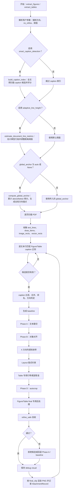

## 2. 预处理阶段

### 2.1 参数集合

两个入口都会先把用户传入的强制方向和跳过精裁参数转成集合：

- Figure：`below_figs`、`above_figs`、`no_refine_figs`。
- Table：`t_below`、`t_above`、`no_refine_tables`。

后续所有精裁阶段都会检查 `ident not in no_refine_set`。如果某个编号在 no-refine 集合内，它仍会按 baseline 保存，但跳过 Phase A/B/X/layout/autocrop/final 后处理等精裁步骤。

### 2.2 CaptionIndex 预扫描

启用 `smart_caption_detection` 时，会调用 `build_caption_index()`：

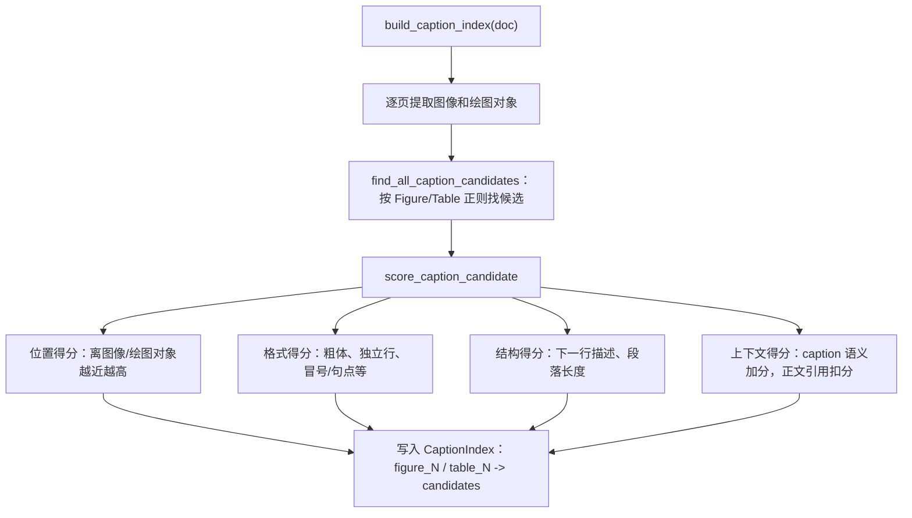

实际扫描到某个 caption 行后，还会用 `caption_index.get_best_for_page(kind, ident, page, min_score=25)` 做二次过滤：

- 如果同页没有得分足够高的最佳候选，跳过。
- 如果当前行与最佳候选的 y 距离大于 `30pt` 或 x 距离大于 `50pt`，跳过。
- 这样可以排除正文里的 “see Figure 3” 或 “Table 4, we compare...”。

### 2.3 自适应行高

启用 `adaptive_line_height` 时，`estimate_document_line_metrics()` 会估计 `typical_line_h`，并用它调整：

- `adjacent_th = 2.0 * typical_line_h`
- `far_text_th = 15.0 * typical_line_h`
- `text_trim_gap = 0.5 * typical_line_h`
- `far_side_min_dist = 3.0 * typical_line_h`

这些阈值直接影响 Phase A 文本裁切、远端正文检测和 Table 行带识别。

### 2.4 全局方向锚点

当 `global_anchor` 或 `global_anchor_table` 为 `auto/None` 时，会调用 `compute_global_anchor()`：

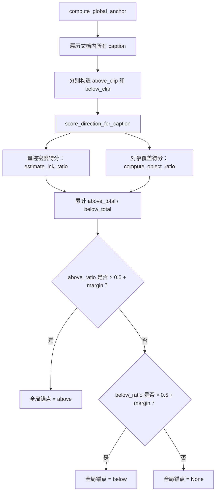

全局锚点只作为低置信局部方向的 tie-break，不会覆盖强局部证据。

## 3. Caption 扫描与候选过滤

页面扫描流程如下：

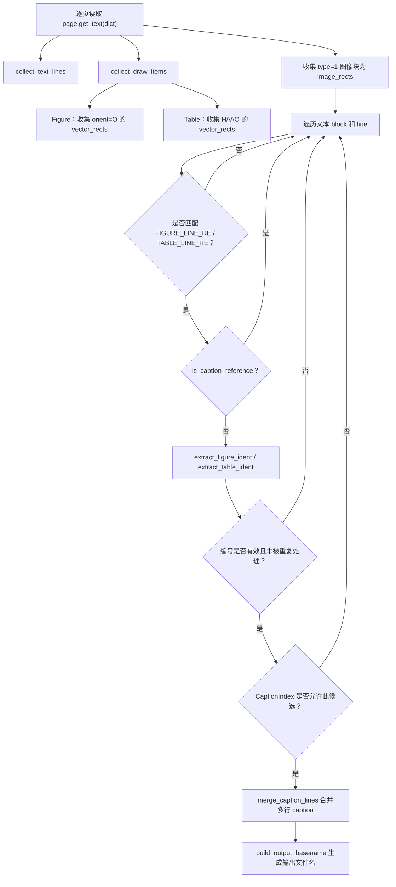

Figure 还会检查 `min_figure/max_figure` 范围；Table 当前没有对应编号范围检查。

`allow_continued=False` 时，同一编号只处理第一次；如果允许 continued，则后续同编号会标记 `continued=True`。

## 4. 方向判定逻辑

方向判定分为局部方向评分、最终方向决策和 Figure 裸 caption 特殊纠偏。

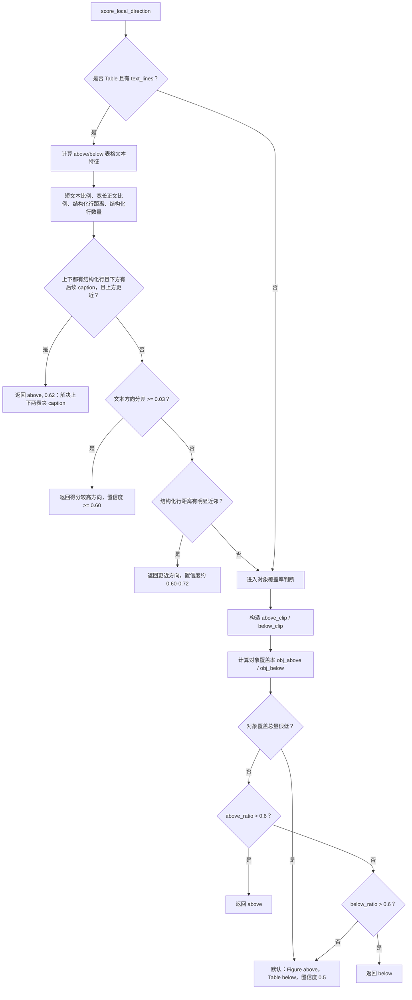

`determine_direction()` 的最终优先级：

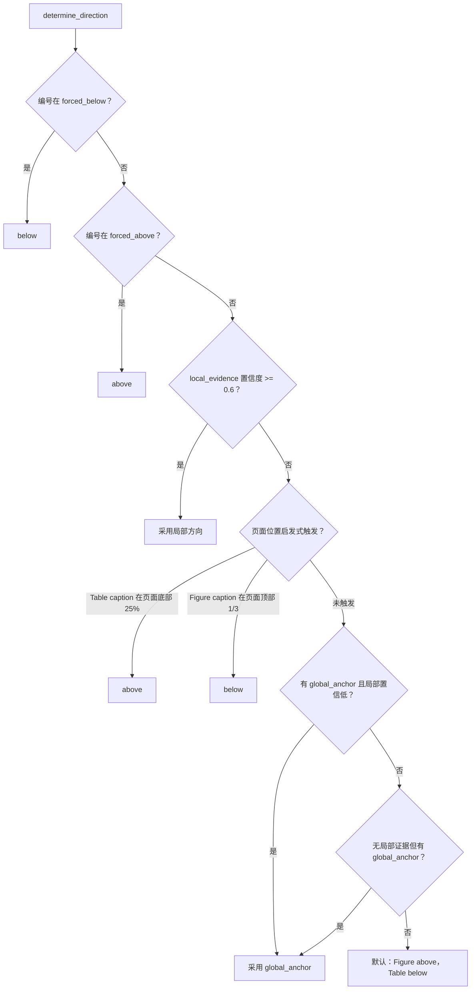

Figure 额外调用 `correct_bare_figure_caption_direction()`：

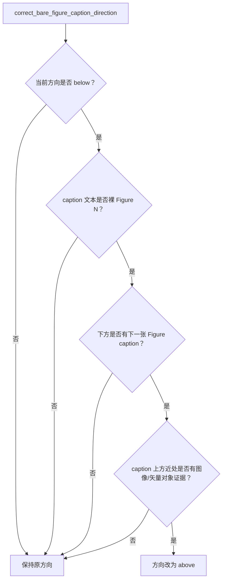

## 5. Baseline 窗口生成与版式预限制

基础窗口由 caption、方向、固定高度和左右 margin 决定：

- `direction == above`：从 `caption_bbox.y0 - gap` 向上取 `clip_height/table_clip_height`。
- `direction == below`：从 `caption_bbox.y1 + gap` 向下取固定高度。
- X 范围先取页面左右 margin 内的整宽区域。

之后会逐步限制或补回 baseline：

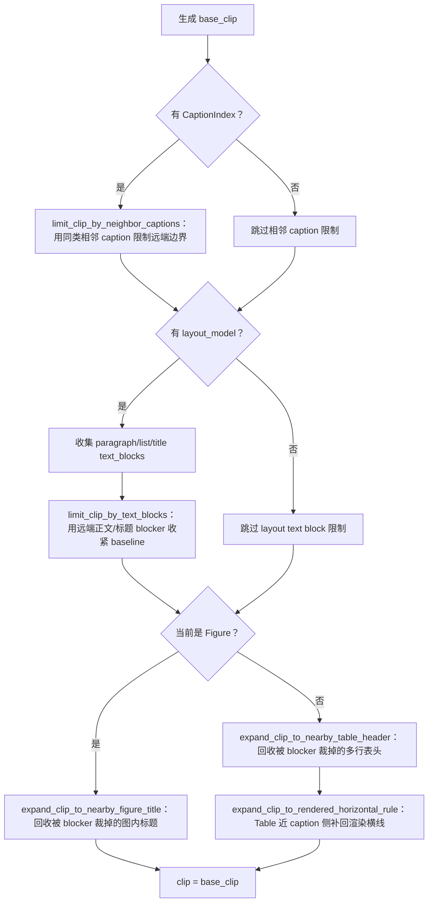

`limit_clip_by_text_blocks()` 的关键判断：

- 只限制远离 caption 的一侧，不动近 caption 边。
- 双栏窄 caption 会先判断文本块是否与当前栏相关。
- 短标题、数字短行、无句末标点短行更像图表内部内容，优先保护。
- 宽正文、长段落、孤立标题更像 blocker，用来裁掉远端正文或下一节标题。

## 6. Phase A：文本裁切

如果 `text_trim=True` 且编号不在 no-refine 集合内，执行 `trim_clip_head_by_text_v2()`。

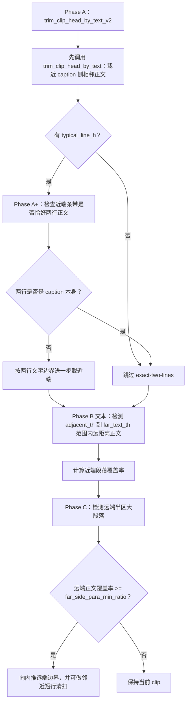

Table 调用该函数时设置 `skip_adjacent_sweep=True`，避免清扫逻辑误伤表头或表格内部短行。

## 7. Phase B：对象对齐

如果未 no-refine，执行 `refine_clip_by_objects()`：

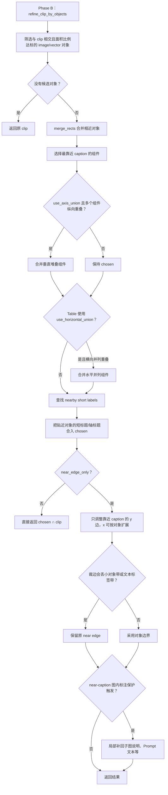

Figure 和 Table 的参数差异：

- Figure：`use_horizontal_union=False`，更偏向图主体对象。
- Table：`use_horizontal_union=True`，便于合并横向并列的表格线和单元格区域。
- Figure 传入 `text_lines`，用于保护竖排标签、低字号图内短标题和 near-caption 图内标注。

## 8. X 方向列感知收窄

`refine_clip_x_range()` 只改 X 范围：

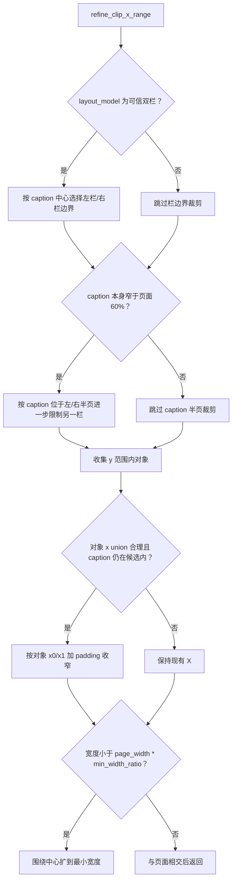

可信双栏需要同时满足：

- `layout_model.num_columns >= 2`
- `column_gap > 0`
- `column_gap <= 30% page_width`
- 如果 margin 几乎贴页边，`column_gap` 不能超过 `25% page_width`
- 推导出的列宽不能小于 `20% page_width`

这避免单栏 PDF 被伪双栏裁成窄条。

## 9. Layout 版式裁剪

如果存在 `layout_model` 且未 no-refine，会调用 `adjust_clip_with_layout()`。它利用文本块、留白区域、栏信息对当前 clip 做版式层面的边界调整。

Table 在调用后额外执行 `restore_table_tail_after_layout_trim()`：

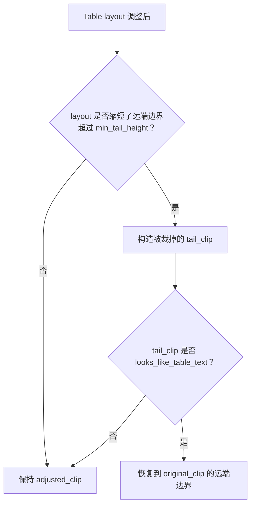

该分支专门防止 layout far-strip 把表格内部数字行误当正文裁掉。

## 10. Table 行带识别

Table 额外调用 `refine_clip_to_table_band()`，从文本行识别连续表格行带，并只收紧 y 范围。

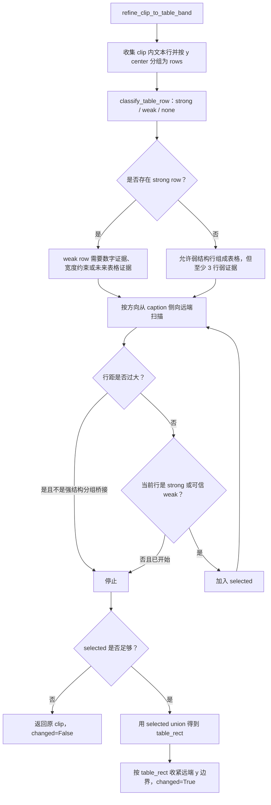

如果 `table_band_changed=True`，后续 Table autocrop 验收会更宽松：只要 autocrop 结果仍 `looks_like_table_text()`，即使高度比例偏低也可以保留。

## 11. Phase D：Autocrop

Figure 默认参数里 `autocrop=False`，Table 默认 `autocrop=True`。只要启用且未 no-refine，就进入像素裁剪。

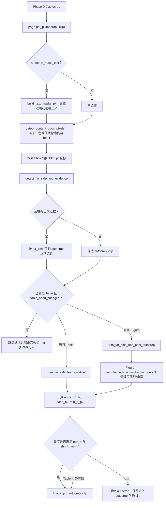

Figure 的 autocrop 后处理还会识别小写正文尾句，避免类似 `of such behaviors.` 被当作图内标题或内容保留。

## 12. Final 专用后处理

### 12.1 Figure final 图内标题回收

Figure 在 autocrop 后再次调用 `expand_clip_to_nearby_figure_title()`：

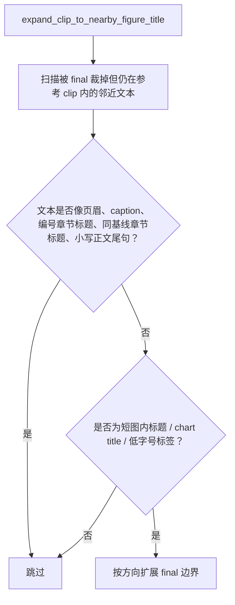

它负责恢复 Gemini 图内 chart title、Kearns 轴标题等，但用负例规则避免恢复 Qwen 章节标题和 GPT-5 正文尾句。

### 12.2 Table final 宽度恢复

`restore_table_clip_width()`：

- 只有 `table_band_changed=True` 时生效。
- 如果 final 宽度小于 baseline 宽度的 `40%`，认为对象裁切把表格缩成局部列，恢复 baseline X 范围。

### 12.3 Table final 文本 bbox 安全补边

`expand_table_clip_to_text_bounds()` 是 Table final 的核心收口函数：

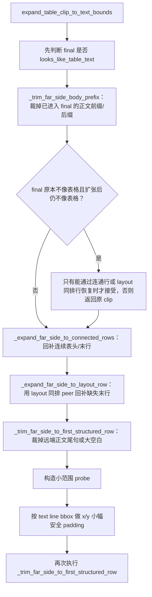

关键分支：

- 表格行判断可以接受多片段行、短数字行、短窄行。
- 但“正文后的安全起点”只接受 `part_count >= 2` 的强结构行，避免 `1/3 cases...` 这类数字正文被当成表格起点。
- 下方短换行尾行如果贴近多片段强结构行、宽度窄、词数少、不是章节编号，会作为表格单元格尾行保留。
- 宽长正文行作为 blocker，阻止连通行带跨正文段落扩张。

### 12.4 Table 远端章节标题裁除

有 `layout_model` 时，Table final 最后调用 `trim_table_far_side_section_heading()`：

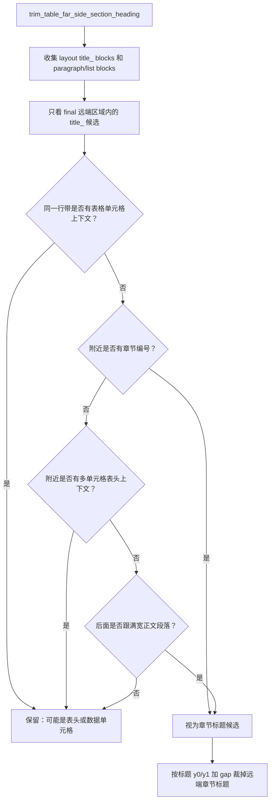

这个分支主要处理 Qwen3-Omni 一类“表格下方紧接章节标题”的问题，同时用同排表格上下文保护 Gemini/Kearns 表头和 Attention 最右侧数据单元格。

## 13. Refine Safe 验收与回退

Figure 和 Table 都有最终验收，但策略略有不同。

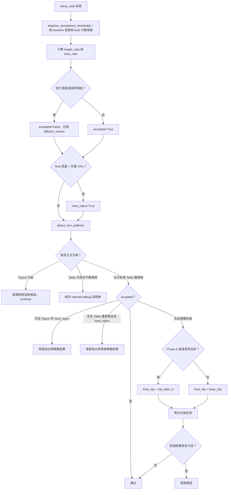

Figure 的低比例策略较软：只要不是硬拒绝且没有正文污染，会保留 refined clip，避免把正文重新带回 baseline。

Table 的低比例策略更依赖 `looks_like_table_text()`：如果 final 虽小但仍像表格，可以保留；如果不像表格且污染，则拒绝。

## 14. Debug visual 与最终保存

如果启用 `--debug-visual`：

- Figure 保存 `baseline`、`phase_a`、`phase_b`、`final` 四个阶段。
- Table 保存同样四个阶段；如果验收拒绝，会把 final 阶段标记为 `rejected` 并记录原因。
- `save_debug_visualization()` 会把阶段线框、caption bbox 和 layout model 信息画到 debug 图中。

最终保存：

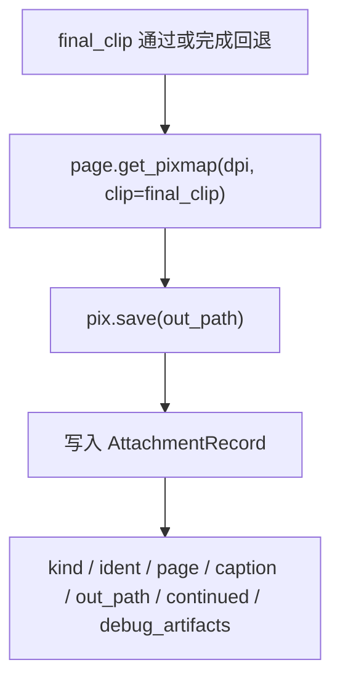

## 15. Figure 与 Table 的核心差异

| 阶段 | Figure | Table |
| --- | --- | --- |
| 默认方向 | `above` | `below` |
| 局部方向评分 | 主要看对象覆盖率 | 优先用表格文本结构，再看对象覆盖率 |
| baseline 补偿 | 图内标题回收 | 多行表头回收 + 渲染横线补偿 |
| Phase A | 相邻正文和远端正文裁切 | 跳过 adjacent sweep，保护表头 |
| Phase B | 保护小对象带、竖排标签、轴标题、near-caption 图内标注 | 支持水平并列对象 union |
| X 收窄 | 栏位/对象 x union | 同 Figure，但后续可恢复宽度 |
| Layout 后处理 | 普通 layout 调整 | layout 裁尾后可按表格文本恢复 |
| 行带识别 | 无 | `refine_clip_to_table_band()` |
| Autocrop | 默认关闭，开启后有 Figure far-side 噪声清理 | 默认开启，表格行带有效时放宽验收 |
| Final 后处理 | 图内标题二次回收，小写正文尾句排除 | 宽度恢复、文本 bbox 补边、正文前缀裁除、章节标题裁除 |
| 验收 | 低比例非硬拒绝时偏保留 | 低比例必须像表格才偏保留 |

## 16. 当前设计原则

这套流程的稳定性来自三个约束：

1. **Caption 是锚点，但不是唯一证据。** caption 先决定候选窗口，后续还要用对象、文本行、layout block 和像素内容交叉验证。
2. **裁剪只在有明确证据时推进。** 能识别正文、章节标题、相邻 caption 时才收紧；能识别图内标题、表头、末行时才补回。
3. **Figure 与 Table 分流。** Figure 更看重对象和图内标签，Table 更看重文本行带和多单元格结构。很多规则只在对应路径启用，避免互相干扰。

